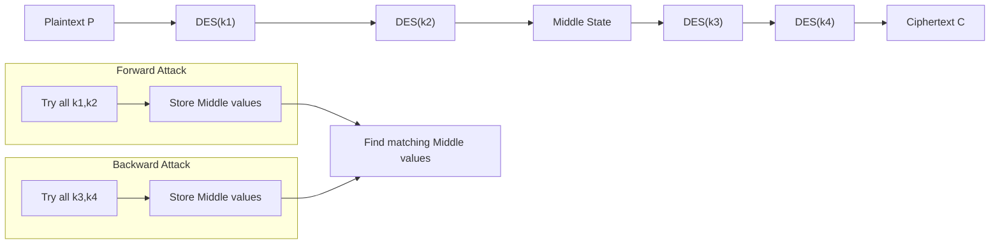
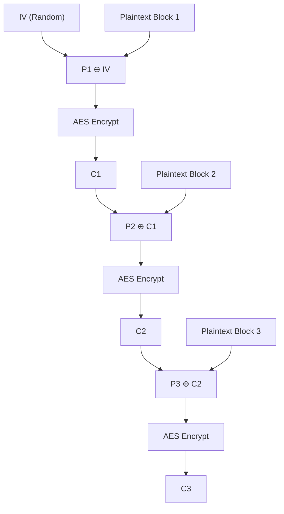
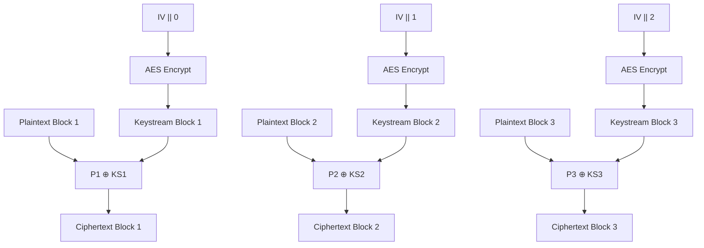
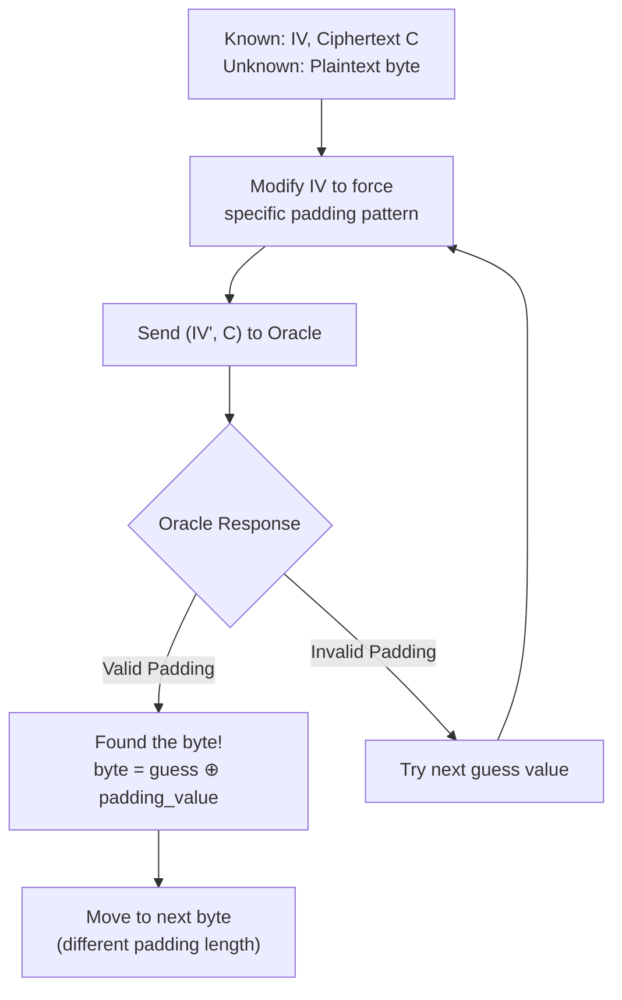

# Cryptography Tutorial Explanations: From My Perspective

Hey, I know cryptography can feel overwhelming at first, especially with all these terms like stream ciphers, block ciphers, modes of operation, and attacks. I've gone through the tutorial handout (`tut02-handout_conv.md`) and pulled out the key topics and methods. I'll explain everything step-by-step, from your point of view—like we're figuring this out together. I'll break it down into simple concepts, use analogies where it helps, and include diagrams (using Mermaid) to visualize things. For each topic, I'll label characteristics like how it works, constraints, security level, and any gotchas.

This is based on the questions in the handout, which cover stream ciphers, meet-in-the-middle attacks, AES modes (CBC and CTR), padding oracle attacks, and a real-world vulnerability. I'll refresh the core ideas and build on them so you can understand why things work the way they do.

## 0. Binary-Level Fundamentals: How Encryption Actually Works

Before diving into specific ciphers and modes, let's understand what "encryption" and "decryption" actually mean at the binary level, because this is where the real magic happens.

### What is a Block Cipher at the Binary Level?

A block cipher like AES is essentially a **mathematical function** that takes two inputs:
1. **Plaintext Block**: 128 bits (16 bytes) of data
2. **Key**: 128, 192, or 256 bits (16, 24, or 32 bytes)

And produces one output:
- **Ciphertext Block**: 128 bits (16 bytes) of seemingly random data

**The Function**: `Ciphertext = AES_Encrypt(Plaintext_Block, Key)`

### Binary Representation and Storage

**How Data is Actually Stored**:
```
Plaintext:  "Hello World!!!!!" (16 ASCII characters)
Binary:     01001000 01100101 01101100 01101100 01101111 00100000 01010111 01101111
           01110010 01101100 01100100 00100001 00100001 00100001 00100001 00100001
Hex:        48 65 6C 6C 6F 20 57 6F 72 6C 64 21 21 21 21 21
```

**Key Storage** (AES-128):
```
Key (hex): 2B 7E 15 16 28 AE D2 A6 AB F7 15 88 09 CF 4F 3C
Binary:    00101011 01111110 00010101 00010110 00101000 10101110 11010010 10100110
          10101011 11110111 00010101 10001000 00001001 11001111 01001111 00111100
```

**Initialization Vector (IV) Storage**:
```
IV (hex):  00 01 02 03 04 05 06 07 08 09 0A 0B 0C 0D 0E 0F
Binary:    00000000 00000001 00000010 00000011 00000100 00000101 00000110 00000111
          00001000 00001001 00001010 00001011 00001100 00001101 00001110 00001111
```

### The AES Encryption Algorithm: What Actually Happens

When you call `AES_Encrypt(plaintext, key)`, here's what happens inside:

**Step 1: Key Expansion**
- The 128-bit key is expanded into 11 round keys (176 bytes total)
- Each round key is derived using mathematical operations on the previous key

**Step 2: Initial Round**
- **AddRoundKey**: XOR the plaintext with the first round key
```
Plaintext:    48 65 6C 6C 6F 20 57 6F 72 6C 64 21 21 21 21 21
Round Key 0:  2B 7E 15 16 28 AE D2 A6 AB F7 15 88 09 CF 4F 3C
After XOR:    63 1B 79 7A 47 8E 85 C9 D9 9B 71 A9 28 EE 6E 1D
```

**Step 3: 10 Main Rounds** (for AES-128)
Each round performs 4 operations on the 128-bit state:

1. **SubBytes**: Replace each byte using S-box lookup table
2. **ShiftRows**: Cyclically shift rows of the 4×4 byte matrix
3. **MixColumns**: Matrix multiplication in Galois Field GF(2^8)
4. **AddRoundKey**: XOR with current round key

**Step 4: Final Round**
- Same as main rounds but without MixColumns

**Result**: 128 bits of ciphertext that looks completely random

### What Does "Decrypt(C1, Key)" Actually Mean?

**AES Decryption is the Mathematical Inverse**:
```
If: C = AES_Encrypt(P, K)
Then: P = AES_Decrypt(C, K)
```

**The Decryption Process**:
1. **Key Expansion**: Generate the same 11 round keys
2. **Inverse Operations**: Apply the mathematical inverses in reverse order:
   - InvShiftRows (reverse the row shifting)
   - InvSubBytes (use inverse S-box)
   - InvMixColumns (inverse matrix multiplication)
   - AddRoundKey (XOR is its own inverse)

**Critical Point**: Without the key, recovering plaintext from ciphertext is computationally infeasible. The S-box substitutions and matrix operations create an avalanche effect where changing one input bit affects ~50% of output bits.

### Binary-Level XOR Operations

**XOR Truth Table**:
```
A | B | A⊕B
0 | 0 |  0
0 | 1 |  1  
1 | 0 |  1
1 | 1 |  0
```

**Why XOR is Perfect for Cryptography**:
1. **Reversible**: A ⊕ B ⊕ B = A
2. **Uniform Distribution**: If B is random, A ⊕ B appears random regardless of A
3. **Fast**: Single CPU instruction for entire words

**Byte-level XOR Example**:
```
Byte A:    01001000 (0x48 = 'H')
Byte B:    10101100 (0xAC = random)
A ⊕ B:     11100100 (0xE4 = result)

To recover A: 0xE4 ⊕ 0xAC = 0x48
```

### Memory Layout and Data Structures

**How CBC State is Stored in Memory**:
```C
typedef struct {
    uint8_t key[32];          // AES key (up to 256-bit)
    uint8_t iv[16];           // Initialization vector
    uint8_t prev_block[16];   // Previous ciphertext block
    uint32_t key_schedule[60]; // Expanded round keys
    int key_length;           // 128, 192, or 256
} AES_CBC_Context;
```

**Block Processing Loop** (simplified C pseudocode):
```C
void aes_cbc_encrypt(uint8_t* plaintext, uint8_t* ciphertext, 
                     size_t length, AES_CBC_Context* ctx) {
    uint8_t block[16];
    uint8_t* prev = ctx->iv;  // First block XORs with IV
    
    for (int i = 0; i < length; i += 16) {
        // XOR plaintext block with previous ciphertext (or IV)
        for (int j = 0; j < 16; j++) {
            block[j] = plaintext[i + j] ^ prev[j];
        }
        
        // Encrypt the XORed result
        aes_encrypt_block(block, &ciphertext[i], ctx->key_schedule);
        
        // Current ciphertext becomes "previous" for next iteration
        prev = &ciphertext[i];
    }
}
```

### Endianness and Word Operations

**Little Endian vs Big Endian Storage**:
```
32-bit value: 0x12345678

Little Endian (Intel):  78 56 34 12
Big Endian (Network):   12 34 56 78
```

**AES Internal Operations on 32-bit Words**:
```C
uint32_t word = 0x12345678;
uint8_t bytes[4] = {
    (word >> 24) & 0xFF,  // 0x12
    (word >> 16) & 0xFF,  // 0x34  
    (word >> 8) & 0xFF,   // 0x56
    word & 0xFF           // 0x78
};
```

**Why This Matters**: Different implementations might store multi-byte values differently, but the AES standard specifies exact byte ordering for interoperability.

## 1. Stream Ciphers

### What It Is
A stream cipher is like a secret code generator that encrypts data one bit or byte at a time, as it streams through. It's different from block ciphers (which we'll get to later) because it doesn't wait for a whole "block" of data—it just keeps going.

### How It Works
Here's the step-by-step process:

1. **Key and IV Setup**: You start with a secret key (K) and an Initialization Vector (IV). The IV is like a "starting seed" that makes the encryption different each time, even with the same key and message.

2. **Keystream Generation**: The cipher feeds K and IV into a Pseudo-Random Generator (PRG). This PRG is a mathematical function that produces a long sequence of seemingly random bits called the "keystream". The keystream looks random but is actually deterministic—same K+IV always produces the same keystream.

3. **Encryption Process**: To encrypt, you take each bit of your plaintext (P) and XOR it with the corresponding bit from the keystream. XOR means "if bits are different, output 1; if same, output 0". So: Ciphertext = Plaintext ⊕ Keystream.

4. **Decryption Process**: To decrypt, you do the exact same operation—XOR the ciphertext with the same keystream. This works because XOR is its own inverse: (P ⊕ K) ⊕ K = P.

**Why XOR?** XOR has a special property: it's reversible. If you know A ⊕ B = C, then you can find A by computing C ⊕ B = A. This makes encryption and decryption use the same operation.

### Characteristics and Deep Dive on IV Reuse Problem

**Why is IV reuse catastrophic?** Let's say you encrypt two different messages with the same key and IV:
- Message 1: C1 = P1 ⊕ Keystream
- Message 2: C2 = P2 ⊕ Keystream (same keystream because same K+IV!)

If an attacker intercepts both C1 and C2, they can compute: C1 ⊕ C2 = (P1 ⊕ Keystream) ⊕ (P2 ⊕ Keystream) = P1 ⊕ P2

Now the attacker has P1 ⊕ P2, which reveals the XOR of the two original messages. **Why is this bad?**
1. If the attacker knows or can guess one plaintext (P1), they can immediately find P2 = P1 ⊕ (P1 ⊕ P2).
2. Even without knowing either plaintext, statistical analysis of P1 ⊕ P2 can reveal patterns, especially if the messages have structure (like English text or formatted data).
3. In Question 1, the attacker had a limited set of possible plaintexts, so they could try all combinations and see which P1 ⊕ P2 values were possible.

**Security Deep Dive:**
- **Good scenario**: Each message uses a unique IV. Even with the same key, different IVs produce different keystreams, so no information leaks between messages.
- **Bad scenario**: IV reuse creates the "two-time pad" vulnerability—you've essentially used the same one-time pad twice, which breaks the security completely.
- **Real-world impact**: This isn't theoretical—WEP WiFi encryption failed partly due to IV reuse patterns.

### Why No Padding?
Stream ciphers encrypt bit-by-bit, so they naturally handle any message length. If your message is 1000 bits, you generate exactly 1000 bits of keystream. No need to pad to block boundaries like block ciphers.

## 2. Meet-in-the-Middle Attack

### What It Is and When to Use It
This is a time-memory tradeoff attack used against cascaded encryption systems (where you apply the same cipher multiple times with different keys). **You use this attack when:**
- You have a known plaintext-ciphertext pair
- The system uses multiple iterations of the same cipher (like Triple DES, or in Question 2, Quadruple DES)
- You want to find the keys faster than brute force

### How It Works (Step-by-Step Mathematical Explanation)

Let's use the tutorial's 4-DES example: P → DES(k1) → DES(k2) → DES(k3) → DES(k4) → C

**The Naive Approach (Brute Force):**
Try all possible combinations of (k1, k2, k3, k4). Since each key is 56 bits, this means 2^(56×4) = 2^224 operations. Computationally infeasible.

**The Meet-in-the-Middle Insight:**
Instead of going all the way from P to C, we split the encryption chain and meet in the middle. Here's why this works:

1. **Split the Chain**: View the encryption as two parts:
   - Left side: P → DES(k1) → DES(k2) → Middle
   - Right side: Middle → DES(k3) → DES(k4) → C

2. **Forward Computation (Left Side)**: 
   - For every possible pair (k1, k2), compute: Middle = DES(k2, DES(k1, P))
   - Store these Middle values in a table with their corresponding (k1, k2)
   - This requires 2^56 × 2^56 = 2^112 operations

3. **Backward Computation (Right Side)**:
   - For every possible pair (k3, k4), compute: Middle = DES^-1(k3, DES^-1(k4, C))
   - This also requires 2^112 operations

4. **Finding the Match**:
   - Look for Middle values that appear in both tables
   - When you find a match, you have candidate (k1, k2) from the forward table and (k3, k4) from the backward table
   - **What are we matching?** We're matching intermediate values—the state of the data at the midpoint of the encryption process

**Why is this faster?** Instead of 2^224 operations, we do:
- 2^112 forward computations
- 2^112 backward computations  
- Table lookups (relatively fast)
- Total ≈ 2 × 2^112 = 2^113 operations

**The Mathematical Reduction:**
From 2^224 to 2^113 is a reduction factor of 2^111—that's astronomically faster!

**Memory Cost:** You need to store 2^112 intermediate values, which requires massive storage but is more feasible than the time cost of brute force.

### Why This Attack Works (The Deep Why)

The fundamental reason this works is **mathematical**: if you have a function f(x) = g(h(x)), and you know f(x) and x, you can find h and g more efficiently by:
1. Computing all possible h(x) values and storing them
2. Computing all possible g^-1(f(x)) values  
3. Finding where they intersect

This intersection gives you the intermediate value, which reveals both h and g.

In cryptographic terms, we're exploiting the fact that **the intermediate state must be consistent**—the output of the left half must equal the input of the right half.

### Calculating Operations for Different Cases

**General Formula**: For n applications of a cipher with k-bit keys:
- Brute force: 2^(n×k)
- Meet-in-the-middle: ≈ 2^((n/2)×k) + 2^((n/2)×k) = 2 × 2^((n/2)×k) ≈ 2^((n/2)×k + 1)

**Examples**:
- 2-DES: Brute force = 2^112, MITM = 2^57 (barely secure)
- 3-DES: Brute force = 2^168, MITM = 2^112 (still secure)
- 4-DES: Brute force = 2^224, MITM = 2^113 (tutorial answer)

### Diagram - Meet in the Middle Concept



### Limitations and Defenses

**Why doesn't everyone use this?**
1. **Memory requirements**: Need to store 2^(n/2 × k) values
2. **Known plaintext needed**: Must have plaintext-ciphertext pairs
3. **Diminishing returns**: Going from 3 to 4 rounds only adds 1 bit of security (2^112 to 2^113)

**Defense**: Use longer keys or different cipher designs (like AES with larger block/key sizes), or use modes that don't just iterate the same cipher.

## 3. Block Ciphers (AES and DES)

### What It Is
Block ciphers encrypt data in fixed-size "blocks" (e.g., 64 bits for DES, 128 for AES). They're the building blocks for many encryption systems.

### How It Works
- DES: 56-bit key, 64-bit blocks, uses Feistel network (rounds of substitution and permutation).
- AES: 128/192/256-bit keys, 128-bit blocks, uses substitution-permutation network.
- Alone, they're secure, but need modes for longer messages.

### Characteristics
- **Way It Encrypts**: Transforms blocks via key-dependent operations. No XOR with keystream; uses internal math.
- **Constraints**: Message must be multiple of block size—needs padding. Slow for large data without modes.
- **Security**: DES is outdated (56-bit key is weak); AES is strong (up to 256-bit). Vulnerable to brute force if key is short.
- **Pros**: Secure for blocks. Foundation for modes.
- **Cons**: Not for streaming data. Padding can leak info.

No diagram needed here—focus on modes below.

## 4. Modes of Operation: CBC (Cipher Block Chaining)

### What It Is
CBC is a mode that allows block ciphers (like AES) to securely encrypt messages longer than one block. It creates dependencies between blocks so that identical plaintext blocks produce different ciphertext blocks.

### How It Works (Detailed Step-by-Step)

**Binary-Level CBC Encryption Process:**

1. **Memory Setup**: 
```C
uint8_t iv[16] = {0x00, 0x01, 0x02, 0x03, 0x04, 0x05, 0x06, 0x07, 
                  0x08, 0x09, 0x0A, 0x0B, 0x0C, 0x0D, 0x0E, 0x0F};
uint8_t key[16] = {0x2B, 0x7E, 0x15, 0x16, 0x28, 0xAE, 0xD2, 0xA6, 
                   0xAB, 0xF7, 0x15, 0x88, 0x09, 0xCF, 0x4F, 0x3C};
uint8_t plaintext[16] = {'H','e','l','l','o',' ','W','o',
                         'r','l','d','!','!','!','!','!'};
```

2. **First Block Encryption**:
```
Step 1 - XOR with IV:
Plaintext:  48 65 6C 6C 6F 20 57 6F 72 6C 64 21 21 21 21 21
IV:         00 01 02 03 04 05 06 07 08 09 0A 0B 0C 0D 0E 0F
XOR Result: 48 64 6E 6F 6B 25 51 68 7A 65 6E 2A 2D 2C 2F 2E

Step 2 - AES Encryption:
AES_Input:  48 64 6E 6F 6B 25 51 68 7A 65 6E 2A 2D 2C 2F 2E
AES_Key:    2B 7E 15 16 28 AE D2 A6 AB F7 15 88 09 CF 4F 3C
AES_Output: [128-bit ciphertext block C1]
```

3. **What AES_Encrypt Actually Does**:
```
Internal AES State (4x4 byte matrix):
Initial:    48 6B 7A 2D
           64 25 65 2C  
           6E 51 6E 2F
           6F 68 2A 2E

After AddRoundKey (XOR with round key 0):
           63 11 D9 01
           1A 8B F2 E3
           ...

[10 rounds of SubBytes, ShiftRows, MixColumns, AddRoundKey]

Final State: [16 bytes of ciphertext C1]
```

4. **Subsequent Block Encryption**:
```C
// Pseudo-code for block N (N > 1)
for (int i = 0; i < 16; i++) {
    xor_input[i] = plaintext_block_N[i] ^ ciphertext_block_N_minus_1[i];
}
ciphertext_block_N = aes_encrypt(xor_input, key);
```

**Binary-Level CBC Decryption Process:**

1. **What AES_Decrypt(C1, Key) Actually Means**:
```
AES Decryption applies inverse operations:
Ciphertext C1: [16 bytes from encryption]

Internal Process:
- Apply inverse final round (AddRoundKey, InvShiftRows, InvSubBytes)
- Apply 9 inverse main rounds (AddRoundKey, InvMixColumns, InvShiftRows, InvSubBytes)  
- Apply inverse initial round (AddRoundKey)

Result: intermediate = 48 64 6E 6F 6B 25 51 68 7A 65 6E 2A 2D 2C 2F 2E
```

2. **XOR with IV to Recover Plaintext**:
```
AES_Decrypt(C1): 48 64 6E 6F 6B 25 51 68 7A 65 6E 2A 2D 2C 2F 2E
IV:              00 01 02 03 04 05 06 07 08 09 0A 0B 0C 0D 0E 0F  
XOR Result:      48 65 6C 6C 6F 20 57 6F 72 6C 64 21 21 21 21 21
ASCII:           'H' 'e' 'l' 'l' 'o' ' ' 'W' 'o' 'r' 'l' 'd' '!' '!' '!' '!' '!'
```

3. **Why This Works Mathematically**:
```
Encryption: C1 = AES_Encrypt(P1 ⊕ IV, Key)
Decryption: AES_Decrypt(C1, Key) = P1 ⊕ IV
Therefore:  P1 = AES_Decrypt(C1, Key) ⊕ IV
```

**Memory Access Patterns During CBC**:
```C
// CBC Encryption Memory Layout
Memory Address  |  Content  |  Description
0x1000         |  IV       |  16-byte initialization vector
0x1010         |  P1       |  First plaintext block  
0x1020         |  P2       |  Second plaintext block
0x1030         |  C1       |  First ciphertext block (output)
0x1040         |  C2       |  Second ciphertext block (output)

// Processing Flow:
1. temp = P1 ⊕ IV           // XOR at byte level
2. C1 = AES_Encrypt(temp)   // 10-round AES transformation
3. temp = P2 ⊕ C1           // Chain with previous ciphertext
4. C2 = AES_Encrypt(temp)   // Another AES transformation
```

**CPU-Level Operations for XOR**:
```assembly
; x86-64 assembly for XORing 16-byte blocks
movdqu  xmm0, [rsi]     ; Load plaintext block into XMM register
movdqu  xmm1, [rdi]     ; Load IV/previous ciphertext  
pxor    xmm0, xmm1      ; 128-bit XOR in single instruction
movdqu  [rdx], xmm0     ; Store result
```

**Why the Chaining Works**:
- Each ciphertext block depends on ALL previous plaintext blocks
- Changing one bit in P1 affects C1, which affects C2, C3, etc.
- This creates an avalanche effect that provides diffusion across the entire message

### Deep Dive: Why IV Reuse is Catastrophic in CBC

**The Problem**: If you encrypt two messages with the same key and IV:
- Message 1, Block 1: C1 = Encrypt(P1 ⊕ IV, Key)
- Message 2, Block 1: C1' = Encrypt(P1' ⊕ IV, Key)

If P1 = P1' (same first block in both messages), then C1 = C1' (same ciphertext). **Why is this bad?**

1. **Pattern Leakage**: An attacker can see when the same data appears in the same position across different messages.

2. **Known Plaintext Attack**: If the attacker knows P1, they can determine P1' by observing that C1 = C1'.

3. **Statistical Analysis**: Even without knowing plaintexts, repeated patterns reveal information about the underlying data structure.

**Real-world example**: If you encrypt database records with CBC and reuse IV, an attacker might notice that records with the same customer ID always produce the same first ciphertext block, revealing when the same customer appears in different encrypted datasets.

### Padding: Why and How

**Why Padding is Needed**: Block ciphers only work on fixed-size blocks. If your message isn't a perfect multiple of the block size, you need to add padding.

**Binary-Level PKCS#7 Padding Implementation**:

**Example 1: Message needs 3 bytes of padding**
```
Original message: "Hello World!" (12 bytes)
Hex representation: 48 65 6C 6C 6F 20 57 6F 72 6C 64 21

Block size: 16 bytes
Bytes needed: 16 - 12 = 4 bytes of padding
Padding bytes: 04 04 04 04

Final padded block:
48 65 6C 6C 6F 20 57 6F 72 6C 64 21 04 04 04 04
H  e  l  l  o     W  o  r  l  d  !  ♦  ♦  ♦  ♦
```

**Example 2: Message is exactly 16 bytes**
```
Original: "Hello World!!!!!" (16 bytes exactly)
Hex: 48 65 6C 6C 6F 20 57 6F 72 6C 64 21 21 21 21 21

PKCS#7 Rule: ALWAYS add padding, even if message is perfect block size
Padding needed: Full 16-byte block with value 16 (0x10)

Result: Two blocks
Block 1: 48 65 6C 6C 6F 20 57 6F 72 6C 64 21 21 21 21 21
Block 2: 10 10 10 10 10 10 10 10 10 10 10 10 10 10 10 10
```

**C Implementation of PKCS#7 Padding**:
```C
void pkcs7_pad(uint8_t* buffer, size_t data_len, size_t block_size) {
    size_t pad_len = block_size - (data_len % block_size);
    
    // If data_len is multiple of block_size, pad_len = block_size
    for (size_t i = 0; i < pad_len; i++) {
        buffer[data_len + i] = (uint8_t)pad_len;
    }
}

int pkcs7_unpad(uint8_t* buffer, size_t buffer_len) {
    if (buffer_len == 0) return -1;
    
    uint8_t pad_len = buffer[buffer_len - 1];
    
    // Validation: padding length must be 1-16 for AES
    if (pad_len == 0 || pad_len > 16) return -1;
    
    // Validation: all padding bytes must have same value
    for (size_t i = buffer_len - pad_len; i < buffer_len; i++) {
        if (buffer[i] != pad_len) return -1;  // Invalid padding
    }
    
    return buffer_len - pad_len;  // Return unpadded length
}
```

**Memory Layout During Padding**:
```
Before Padding:
Memory: [H][e][l][l][o][ ][W][o][r][l][d][!][?][?][?][?]
Bytes:   48 65 6C 6C 6F 20 57 6F 72 6C 64 21 ?? ?? ?? ??
Index:   0  1  2  3  4  5  6  7  8  9  10 11 12 13 14 15

After PKCS#7 Padding:
Memory: [H][e][l][l][o][ ][W][o][r][l][d][!][4][4][4][4]  
Bytes:   48 65 6C 6C 6F 20 57 6F 72 6C 64 21 04 04 04 04
Index:   0  1  2  3  4  5  6  7  8  9  10 11 12 13 14 15
```

**Why This Specific Padding Design?** 
1. **Unambiguous Removal**: The last byte always tells you exactly how many padding bytes to remove
2. **Validation Possible**: You can verify all padding bytes have the correct value
3. **No Ambiguity**: Even if the original message ends with bytes that look like padding, the padding is always identifiable

**Binary Validation Example**:
```
Received block: 48 65 6C 6C 6F 20 57 6F 72 6C 64 21 04 04 04 04

Validation process:
1. Last byte = 0x04, so expecting 4 padding bytes
2. Check bytes at positions 12, 13, 14, 15
3. All contain 0x04 ✓ Valid padding
4. Remove last 4 bytes
5. Original message: 48 65 6C 6C 6F 20 57 6F 72 6C 64 21
```

**Invalid Padding Examples**:
```
Invalid Case 1: 48 65 6C 6C 6F 20 57 6F 72 6C 64 21 04 04 04 05
                                                              ^ Wrong value

Invalid Case 2: 48 65 6C 6C 6F 20 57 6F 72 6C 64 21 17 17 17 17  
                                                    ^ 17 > 16 (impossible)

Invalid Case 3: 48 65 6C 6C 6F 20 57 6F 72 6C 64 21 00 00 00 00
                                                    ^ 0 is invalid
```

**Security Implications of Padding**:
- **Length Leakage**: Ciphertext length reveals approximate plaintext length
- **Oracle Attacks**: If system tells you when padding is invalid, it can be exploited (see Padding Oracle section)

### Error Propagation in CBC

**The Cascade Effect**: If one bit in ciphertext Cn gets corrupted:
1. Block n decrypts to garbage (affects entire block)
2. Block n+1 has one bit wrong (because Cn is XORed with Pn+1)
3. Blocks n+2 and beyond are fine

**Why This Happens**: The XOR operation means that a change in Cn directly affects the XOR input for Pn+1, but the encryption of Cn+1 → Pn+1 remains intact for subsequent blocks.

### Diagram - CBC Encryption Chain



### Security Analysis: Why CBC is Good (When Done Right)

**Strengths**:
1. **Diffusion**: Each ciphertext block depends on all previous plaintext blocks
2. **Pattern Hiding**: Identical plaintext blocks produce different ciphertext blocks (due to chaining)
3. **Tamper Evidence**: Modifying ciphertext affects multiple plaintext blocks during decryption

**Vulnerabilities**:
1. **IV Reuse**: Reveals when messages have identical prefixes
2. **Padding Oracles**: Systems that leak padding validity enable plaintext recovery
3. **Bit Flipping**: Controlled modifications to Cn can cause predictable changes in Pn+1
4. **No Authentication**: CBC provides confidentiality but not integrity—always use HMAC or authenticated encryption

## 5. Modes of Operation: CTR (Counter)

### What It Is
CTR mode transforms any block cipher (like AES) into a stream cipher by using the block cipher to generate keystream blocks, which are then XORed with plaintext.

### How It Works (Mathematical Detail)

**Binary-Level CTR Construction**:

**Counter Block Format** (128-bit total):
```
Typical CTR format:
Bytes 0-7:   Nonce/IV (64-bit) 
Bytes 8-15:  Counter (64-bit, big-endian)

Example:
Nonce:    12 34 56 78 9A BC DE F0 
Counter:  00 00 00 00 00 00 00 00  (Block 0)
Result:   12 34 56 78 9A BC DE F0 00 00 00 00 00 00 00 00

Next block:
Nonce:    12 34 56 78 9A BC DE F0 
Counter:  00 00 00 00 00 00 00 01  (Block 1) 
Result:   12 34 56 78 9A BC DE F0 00 00 00 00 00 00 00 01
```

**Step-by-Step CTR Encryption**:

1. **Initialize Counter Block**:
```C
uint8_t counter_block[16];
memcpy(counter_block, nonce, 8);           // Copy 8-byte nonce
memset(counter_block + 8, 0, 8);           // Zero the counter portion
```

2. **For Each Plaintext Block**:
```C
void ctr_encrypt_block(uint8_t* plaintext, uint8_t* ciphertext, 
                       uint8_t* counter_block, uint8_t* key) {
    uint8_t keystream[16];
    
    // Generate keystream by encrypting counter
    aes_encrypt(counter_block, keystream, key);
    
    // XOR plaintext with keystream  
    for (int i = 0; i < 16; i++) {
        ciphertext[i] = plaintext[i] ^ keystream[i];
    }
    
    // Increment counter (big-endian 64-bit increment)
    increment_counter(counter_block + 8);
}
```

3. **Counter Increment Implementation**:
```C
void increment_counter(uint8_t* counter) {
    // Big-endian 64-bit increment
    for (int i = 7; i >= 0; i--) {
        counter[i]++;
        if (counter[i] != 0) break;  // No carry needed
        // If counter[i] wrapped to 0, continue to increment next byte
    }
}
```

**Binary Example of CTR Encryption**:
```
Message: "Hello World!" (12 bytes)
Nonce:   12 34 56 78 9A BC DE F0
Key:     2B 7E 15 16 28 AE D2 A6 AB F7 15 88 09 CF 4F 3C

Block 0:
Counter Block: 12 34 56 78 9A BC DE F0 00 00 00 00 00 00 00 00
AES Encrypt:   [Result] → Keystream: E3 4F 2A 91 7C 8D 59 12 ...
Plaintext:     48 65 6C 6C 6F 20 57 6F 72 6C 64 21
XOR Result:    AB 2A 46 FD 13 AD 0E 7D ... (first 12 bytes used)

Final Ciphertext: AB 2A 46 FD 13 AD 0E 7D (only 12 bytes, no padding!)
```

**Memory Layout for CTR Mode**:
```
Memory Layout During CTR Processing:
Address     Content                Description
0x1000     12 34 56 78 9A BC DE F0  Nonce (8 bytes)
0x1008     00 00 00 00 00 00 00 00  Counter (8 bytes) - Block 0  
0x1010     E3 4F 2A 91 7C 8D 59 12  Keystream Block 0 (AES output)
0x1020     48 65 6C 6C 6F 20 57 6F  Plaintext (12 bytes)
0x1028     72 6C 64 21
0x1030     AB 2A 46 FD 13 AD 0E 7D  Ciphertext (12 bytes)
0x1038     [unused]
```

**Why CTR Works Mathematically**: The block cipher acts as a pseudo-random function. By encrypting sequential counter values, we generate a pseudo-random keystream that appears random to attackers who don't know the key.

### Deep Dive: Counter Overlap Attack (From Tutorial Question 3)

**The Vulnerability**: If two messages use overlapping counter values, they share keystream blocks.

**Scenario from Tutorial**: 
- Message 1: Uses counters IV, IV+1, IV+2 (3 blocks total including IV)
- Message 2: Uses counters IV+1, IV+2 (starts at IV+1)

**The Problem**: 
- Block 2 of Message 1 uses keystream from Encrypt(IV+2, Key)
- Block 1 of Message 2 uses keystream from Encrypt(IV+2, Key)
- **Same keystream!** This means: C1_block2 ⊕ C2_block1 = P1_block2 ⊕ P2_block1

**Why This is Exploitable**:
1. If you know the length of messages (CTR preserves length), you can deduce their types
2. If you know one plaintext block, you can derive the other: P1_block2 = P2_block1 ⊕ (C1_block2 ⊕ C2_block1)
3. Even without known plaintexts, statistical analysis of the XORed plaintexts can reveal information

**Real-world Impact**: This is exactly the same vulnerability as IV reuse in stream ciphers—because CTR essentially IS a stream cipher.

### Why CTR Reveals Exact Message Length

**No Padding Needed**: Unlike CBC, CTR can handle arbitrary message lengths:
- If your message is 100 bytes, generate exactly 100 bytes of keystream
- If your message is 1000 bytes, generate exactly 1000 bytes of keystream

**The Trade-off**: This flexibility comes at a cost:
1. **Length Leakage**: Ciphertext length = Plaintext length exactly
2. **Metadata Exposure**: In the tutorial example, attackers could immediately distinguish between "buy" (12 bytes), "sell" (13 bytes), "hold_and_see" (21 bytes), and "sell_everything" (24 bytes) just by looking at ciphertext length

**Why This Matters**: Length can reveal sensitive information:
- Database records with known schemas
- Protocol messages with predictable formats  
- File types with standard headers

### Counter Management: The Critical Implementation Detail

**Counter Space**: With 128-bit blocks and 64-bit counters, you can encrypt 2^64 blocks (≈16 exabytes) before counter wraps.

**Nonce Management**: 
- **Never reuse** (IV, Key) pairs
- Common approach: Use timestamp + random value as IV
- Alternative: Use random IV and ensure it's never repeated

**Implementation Mistakes**:
1. **Counter Reset**: Some implementations reset counter to 0 for each message with same IV—catastrophic!
2. **Predictable IVs**: Using sequential IVs with same key can enable attacks
3. **Counter Overflow**: What happens when counter reaches maximum value? Must use new key or IV.

### Diagram - CTR Mode Operation



### Security Analysis: CTR vs CBC Trade-offs

**CTR Advantages**:
1. **Parallelizable**: Each block can be encrypted/decrypted independently
2. **Random Access**: Can decrypt any block without processing previous blocks
3. **No Padding**: Handles arbitrary lengths naturally
4. **Error Isolation**: Corruption in one ciphertext block only affects that plaintext block

**CTR Disadvantages**:
1. **Length Leakage**: Exact message length is revealed
2. **Counter Reuse**: Catastrophic if (IV, Key) pair is reused
3. **No Integrity**: Like CBC, provides no authentication
4. **Implementation Complexity**: Counter management is error-prone

**When to Use Each**:
- **CTR**: When you need random access, parallel processing, or have no padding constraints
- **CBC**: When you want to hide approximate message length and can tolerate sequential processing

## 6. Padding Oracle Attack

### What It Is and When It's Used
A padding oracle attack exploits systems that reveal whether decrypted data has valid padding. It's a **chosen-ciphertext attack** where the attacker can send modified ciphertexts to a system (the "oracle") and learn whether the decryption resulted in valid padding. **You use this attack when:**
- The system uses CBC mode with padding (like PKCS#7)
- You can submit ciphertexts and get feedback about padding validity
- You want to decrypt ciphertext without knowing the key

### The Mathematical Foundation

**Binary-Level Control Mechanism**: In CBC mode, modifying the IV (or previous ciphertext block) causes predictable changes in the decrypted plaintext of the next block.

**Mathematical Relationship**:
```
CBC Decryption: Plaintext = AES_Decrypt(Ciphertext, Key) ⊕ Previous_Block

If we modify Previous_Block to Previous_Block':
New_Plaintext = AES_Decrypt(Ciphertext, Key) ⊕ Previous_Block'

Therefore: New_Plaintext ⊕ Original_Plaintext = Previous_Block ⊕ Previous_Block'
```

**Bit-Level Control Example**:
```
Original IV:     00 01 02 03 04 05 06 07 08 09 0A 0B 0C 0D 0E 0F
Modified IV:     00 01 02 03 04 05 06 07 FF FF FF FF FF FF FF FF
XOR Difference:  00 00 00 00 00 00 00 00 F7 F6 F5 F4 F3 F2 F1 F0

If original plaintext last 8 bytes were: b9 00 00 FF 04 04 04 04  
Then new plaintext last 8 bytes become: b9⊕F7 00⊕F6 00⊕F5 FF⊕F4 04⊕F3 04⊕F2 04⊕F1 04⊕F0
                                      = b9⊕F7 F6    F5    0B    F7    F6    F5    F4
```

**The Attacker's Control**: We can set the XOR difference to any value we want, which means we can force specific byte values in the decrypted plaintext!

### How the Attack Works (Step-by-Step)

Let's work through the tutorial example with complete binary details:

**Given Information**:
- Original plaintext: ⟨b1, b2, b3, b4, b5, b6, b7, b8, b9, 00, 00, FF, 04, 04, 04, 04⟩
- Original IV: ⟨IV1, IV2, IV3, IV4, IV5, IV6, IV7, IV8, IV9, IV10, IV11, IV12, IV13, IV14, IV15, IV16⟩
- We know bytes 10-16: ⟨00, 00, FF, 04, 04, 04, 04⟩
- We want to find byte b9 (position 9)

**Binary Attack Implementation**:

**Step 1: Calculate Target Padding Pattern**
To find b9, we'll force 8-byte padding: ⟨08, 08, 08, 08, 08, 08, 08, 08⟩

**Step 2: Calculate Required IV Modifications**
```
Position:  9   10  11  12  13  14  15  16
Original:  b9  00  00  FF  04  04  04  04  (unknown b9)
Target:    08  08  08  08  08  08  08  08  (desired padding)
XOR diff:  ?   08  08  F7  0C  0C  0C  0C  (original ⊕ target)

IV modifications needed:
IV9' = IV9 ⊕ (b9 ⊕ 08)  [unknown, will brute force]
IV10' = IV10 ⊕ 08
IV11' = IV11 ⊕ 08  
IV12' = IV12 ⊕ F7
IV13' = IV13 ⊕ 0C
IV14' = IV14 ⊕ 0C
IV15' = IV15 ⊕ 0C
IV16' = IV16 ⊕ 0C
```

**Step 3: Brute Force Implementation**
```C
uint8_t find_byte_b9(uint8_t* original_iv, uint8_t* ciphertext, 
                     oracle_function* oracle) {
    uint8_t modified_iv[16];
    memcpy(modified_iv, original_iv, 16);
    
    // Set known modifications (positions 10-16)
    modified_iv[9] ^= 0x08;   // Position 10: 00 → 08
    modified_iv[10] ^= 0x08;  // Position 11: 00 → 08  
    modified_iv[11] ^= 0xF7;  // Position 12: FF → 08
    modified_iv[12] ^= 0x0C;  // Position 13: 04 → 08
    modified_iv[13] ^= 0x0C;  // Position 14: 04 → 08
    modified_iv[14] ^= 0x0C;  // Position 15: 04 → 08
    modified_iv[15] ^= 0x0C;  // Position 16: 04 → 08
    
    // Brute force position 9
    for (uint8_t guess = 0; guess <= 255; guess++) {
        // Try this guess for b9
        modified_iv[8] = original_iv[8] ^ (guess ^ 0x08);
        
        // Query the oracle
        if (oracle(modified_iv, ciphertext) == VALID_PADDING) {
            return guess;  // Found b9!
        }
    }
    return 0xFF;  // Error - should never reach here
}
```

**Step 4: Binary Verification**
When we find the correct guess:
```
Correct guess: b9 = 0x41 (ASCII 'A')

IV9' = IV9 ⊕ (0x41 ⊕ 0x08) = IV9 ⊕ 0x49

Decrypted result at position 9: 0x41 ⊕ 0x49 = 0x08 ✓
All other positions also produce 0x08 ✓
Oracle returns: VALID_PADDING ✓
```

**Step 5: Extract Next Byte (b8)**
Once we know b9, we can find b8 by targeting 9-byte padding:
```
Position:  8   9   10  11  12  13  14  15  16
Target:    09  09  09  09  09  09  09  09  09

Known:     ?   41  00  00  FF  04  04  04  04
XOR diff:  ?   50  09  09  F6  0D  0D  0D  0D

// Brute force b8 with these IV modifications
```

**Memory Layout During Attack**:
```
Oracle Query Structure:
Address     Content                    Description
0x2000     [Modified IV - 16 bytes]   IV' with our calculated changes
0x2010     [Ciphertext - 16 bytes]    Original ciphertext block
0x2020     [Oracle Response]          VALID_PADDING or INVALID_PADDING

Modified IV for b9=0x41:
Position: 1  2  3  4  5  6  7  8  9  10 11 12 13 14 15 16
Original: IV1 IV2 IV3 IV4 IV5 IV6 IV7 IV8 IV9 IV10 IV11 IV12 IV13 IV14 IV15 IV16
Modified: IV1 IV2 IV3 IV4 IV5 IV6 IV7 IV8 IV9⊕49 IV10⊕08 IV11⊕08 IV12⊕F7 IV13⊕0C IV14⊕0C IV15⊕0C IV16⊕0C
```

**Why This Attack is Devastating**:
1. **Complete Plaintext Recovery**: Can recover every byte of every block
2. **No Key Required**: Attack works without knowing the encryption key  
3. **Automatic**: Can be fully automated with 256 queries per unknown byte
4. **Undetectable**: Looks like normal decryption requests to the server

### Deep Dive: Why Padding Validation is Dangerous

**The Information Leak**: Even though the oracle doesn't reveal the plaintext directly, the padding validity gives us **one bit of information** per query: "Is this valid padding or not?"

**The Amplification Effect**: That one bit, when combined with our ability to manipulate the IV, lets us:
1. Test specific byte values
2. Confirm when we've guessed correctly  
3. Work byte by byte to recover the entire block

**Why One Byte at a Time Works**:
- Once we know the last byte, we can set up 2-byte padding and find the second-to-last byte
- Then 3-byte padding for the third-to-last byte
- And so on...

This is why it's called "byte-by-byte" recovery—each byte we discover makes finding the next one easier.

### Finding Padding Length (Tutorial Question 5)

**The Challenge**: If we don't know how many padding bytes there are, we need to find the boundary between message and padding.

**The Method**:
1. **Flip bytes systematically**: Starting from the last byte of the previous ciphertext block, flip each byte one at a time
2. **Observe oracle response**: 
   - If flipping a byte still results in "valid padding" → that byte is part of the message (Region X)
   - If flipping a byte results in "invalid padding" → that byte affects padding (Region Y)
3. **Find the boundary**: The first byte that causes "invalid padding" when flipped is the start of the padding

**Why This Works**: 
- Changing a message byte doesn't affect padding validity (the padding bytes remain valid)
- Changing a padding byte breaks the padding structure

**Efficiency**: Use binary search instead of linear search—with 16 possible padding lengths, binary search needs at most 4 queries instead of up to 16.

### Diagram - Padding Oracle Attack Process



### Real-World Impact and Defenses

**Why This Attack is Practical**:
1. **Common Scenario**: Many web applications, APIs, and protocols use CBC with padding
2. **Subtle Information Leaks**: Developers often don't realize that error messages like "Padding Error" vs "Decryption Error" provide exploitable information
3. **Timing Attacks**: Even without explicit error messages, different processing times can reveal padding validity

**Defense Strategies**:
1. **Authenticated Encryption**: Use modes like GCM that provide both confidentiality and integrity
2. **Constant-Time Processing**: Always take the same time regardless of padding validity
3. **Generic Error Messages**: Never distinguish between padding errors and other decryption failures
4. **Input Validation**: Validate and authenticate ciphertext before decryption

**Historical Examples**: 
- **CVE-2023-2197 (HashiCorp Vault)**: Padding oracle in enterprise vault system
- **ASP.NET ViewState**: Classic padding oracle vulnerability in web applications
- **TLS/SSL**: Various implementations have been vulnerable to padding oracle attacks

The key lesson: **Never expose padding validity information to potential attackers!**

## 7. Initialization Vector (IV)

### What It Is
A random value added to encryption to make it unique, even with same key/plaintext.

### How It Works
- Prepended or used in mode. Ensures same P with same K produces different C.

### Characteristics
- **Way It Works**: XORed or fed into cipher. Unique per message.
- **Constraints**: Must be random, never reused. Sent in clear (not secret).
- **Security**: Prevents replay attacks. Reuse weakens modes (e.g., stream cipher attack).
- **Pros**: Adds randomness.
- **Cons**: If predictable, attacks possible.

## 8. Padding in General

### What It Is
Extra bytes added to make data fit block size.

### How It Works
- PKCS#7: Add N bytes of value N (e.g., 03 03 03 for 3 bytes).
- Removed after decryption.

### Characteristics
- **Way It Works**: Appends bytes. Valid if last byte = N and previous N-1 = N.
- **Constraints**: Must be correct or decryption fails.
- **Security**: Can leak length. Oracle attacks exploit validation.
- **Pros**: Allows variable-length messages.
- **Cons**: Overhead, potential leaks.

## Real-World Example: CVE-2023-2197
This is a padding oracle in HashiCorp Vault using AES-CBC with padding. Attacker modifies ciphertext to derive root key. Shows how theory becomes practice—always check for oracles in code!

If something's still fuzzy, point it out, and I'll clarify. This should cover the handout's topics from your POV!
