# CS2107 Topic 1: Encryption for Confidentiality (Proper Notes)

---

## 1. Introduction to Encryption

Encryption is a process that transforms plaintext (readable data) into ciphertext (unreadable data) using a secret key, to ensure confidentiality. Decryption reverses this process using the same (symmetric) or a different (asymmetric) key.

**Key Concepts:**
- **Plaintext:** The original message (e.g., `HELLO`)
- **Ciphertext:** The encrypted message (e.g., `XKCDQ`)
- **Key:** Secret value used for encryption/decryption
- **Correctness:** Decrypting an encrypted message with the correct key always returns the original plaintext

---

## 2. Threat Models and Types of Attacks

### 2.1 Attacker's Goals
- **Total Break:** Recover the secret key
- **Partial Break:** Recover some information about the plaintext
- **Distinguishability:** Distinguish between ciphertexts of two chosen plaintexts

### 2.2 Attacker's Capabilities
- **Ciphertext-Only Attack (COA):** Attacker only sees ciphertexts
- **Known-Plaintext Attack (KPA):** Attacker knows some plaintext-ciphertext pairs
- **Chosen-Plaintext Attack (CPA):** Attacker can choose plaintexts and obtain ciphertexts (encryption oracle)
- **Chosen-Ciphertext Attack (CCA):** Attacker can choose ciphertexts and obtain plaintexts (decryption oracle)

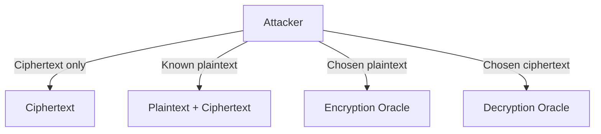

**Example:**
- In Wi-Fi, attackers may know packet headers (KPA)
- In web servers, attackers may submit chosen data (CPA)
- Padding oracle attacks exploit CCA-like scenarios

---

## 3. Classical Ciphers

### 3.1 Substitution Cipher

A substitution cipher replaces each symbol in the plaintext with another symbol according to a fixed substitution table. This is one of the oldest encryption methods.

#### Detailed Procedure:

**Encryption Process:**
1. **Create substitution table**: Design a one-to-one mapping from each symbol in the alphabet to another symbol
2. **Apply substitution**: For each character in the plaintext, look up its replacement in the table
3. **Generate ciphertext**: Replace each plaintext character with its corresponding ciphertext character

**Decryption Process:**
1. **Use inverse table**: Create the reverse mapping of the substitution table
2. **Apply reverse substitution**: For each character in the ciphertext, look up its original character
3. **Recover plaintext**: Replace each ciphertext character with its corresponding plaintext character

**Example Implementation:**
```
Substitution Table:
Plain:  a b c d e f g h i j k l m n o p q r s t u v w x y z
Cipher: g v w b n e f h d a t l u c q m z i r s j x o y k _

Encryption: "hello" → "hnllq"
h → h, e → n, l → l, l → l, o → q
```

**Keyspace Analysis:**
- For an alphabet of size n, there are n! possible substitution tables
- For English alphabet (26 letters): 26! ≈ 2^88 possible keys
- This seems secure against brute force, but other attacks exist

#### Attack Methods:

**1. Known-Plaintext Attack (KPA (Known-Plaintext Attack)) Procedure:**
1. **Collect plaintext-ciphertext pairs**: Obtain several known plaintext messages and their corresponding ciphertexts
2. **Build partial substitution table**: For each known character pair (plaintext_char, ciphertext_char), record the mapping
3. **Fill remaining entries**: Use frequency analysis or guess common words to complete unknown mappings
4. **Verify consistency**: Check that the reconstructed table correctly encrypts all known plaintext-ciphertext pairs
5. **Apply to unknown ciphertexts**: Use the recovered table to decrypt new ciphertexts

**Example of KPA (Known-Plaintext Attack):**
```
Known: plaintext "hello" → ciphertext "hnllq"
Learned mappings: h→h, e→n, l→l, o→q
If we see ciphertext "hnlq" later, we can decrypt it as "helo"
```

**2. Frequency Analysis Attack (Ciphertext-Only) Procedure:**
1. **Count character frequencies**: Analyze the frequency of each character in the ciphertext
2. **Compare with language statistics**: Match frequent ciphertext characters with frequent plaintext language characters (e.g., 'E', 'T', 'A' in English)
3. **Create initial mapping**: Map the most frequent ciphertext character to 'E', second most frequent to 'T', etc.
4. **Look for patterns**: Identify common letter combinations (digrams, trigrams) and match them to common English patterns
5. **Iterative refinement**: Try different word possibilities and refine the mapping until readable text emerges
6. **Validation**: Check if the resulting plaintext makes linguistic sense

**Frequency Analysis Example:**
```
Ciphertext: "WKLV LV D VHFUHW"
Character frequencies: V=4, L=3, K=2, others=1 each
Since 'E' is most common in English, guess V=E
Since 'T' is second most common, guess L=T
Try decrypting: "THE? T? ? ?E?RE?"
Recognize pattern and refine mapping
```


### 3.2 Permutation (Transposition) Cipher

A permutation cipher rearranges the order of characters in the plaintext according to a secret permutation pattern, without changing the actual characters themselves.

#### Detailed Procedure:

**Encryption Process:**
1. **Choose block size**: Determine the size t of each block (e.g., t=5 characters per block)
2. **Define permutation**: Create a secret permutation of positions {1,2,3,...,t} → {π(1),π(2),π(3),...,π(t)}
3. **Divide plaintext**: Split the plaintext into blocks of size t characters
4. **Apply permutation**: For each block, move the character at position i to position π(i)
5. **Concatenate results**: Join all permuted blocks to form the ciphertext

**Decryption Process:**
1. **Use inverse permutation**: Create the inverse of the encryption permutation
2. **Divide ciphertext**: Split ciphertext into blocks of size t
3. **Apply inverse permutation**: For each block, move character at position π(i) back to position i
4. **Reconstruct plaintext**: Join all restored blocks

**Example Implementation:**
```
Block size: t = 5
Permutation: (1,2,3,4,5) → (3,1,5,2,4)
This means: position 1 → position 3, position 2 → position 1, etc.

Plaintext block: "HELLO"
Positions:       1 2 3 4 5
                 H E L L O
Apply permutation to get positions: 3 1 5 2 4
Result:          L H O E L
Ciphertext block: "LHOEL"
```

#### Attack Methods:

**1. Known-Plaintext Attack (KPA (Known-Plaintext Attack)) Procedure:**
1. **Obtain plaintext-ciphertext pair**: Get a known plaintext block and its corresponding ciphertext block
2. **Determine block size**: If unknown, try different block sizes until patterns emerge
3. **Analyze character movements**: For each character in the plaintext, find where it appears in the ciphertext
4. **Reconstruct permutation**: Map each input position to its output position to recover the permutation
5. **Verify permutation**: Apply the discovered permutation to other known blocks to confirm correctness
6. **Apply to unknown ciphertexts**: Use the recovered permutation to decrypt new ciphertexts

**KPA (Known-Plaintext Attack) Example:**
```
Known plaintext:  "HELLO"
Known ciphertext: "LHOEL"
Analysis:
H (position 1) → appears at position 2 in ciphertext
E (position 2) → appears at position 4 in ciphertext  
L (position 3) → appears at position 1 in ciphertext
L (position 4) → appears at position 5 in ciphertext
O (position 5) → appears at position 3 in ciphertext
Recovered permutation: (1,2,3,4,5) → (3,1,5,2,4)
```

**2. Frequency Analysis Attack (Ciphertext-Only) Procedure:**
1. **Analyze character frequencies**: Count frequency of each character in the ciphertext
2. **Compare with expected frequencies**: Check if frequencies match the expected language distribution
3. **Look for anagrams**: Examine if ciphertext blocks are anagrams of common words or phrases
4. **Try different block sizes**: Experiment with various block sizes to see which produces meaningful anagrams
5. **Pattern recognition**: Look for repeated patterns or common letter combinations within blocks
6. **Dictionary matching**: Try to match permuted blocks against dictionary words
7. **Systematic testing**: For promising block sizes, try different permutations until readable text emerges

**Frequency Analysis Example:**
```
Ciphertext blocks: "EHLLO", "DLROW"
Notice: Same characters as "HELLO", "WORLD" (anagrams!)
Try different permutations of positions until "HELLO WORLD" emerges
```


### 3.3 One-Time Pad (OTP (One-Time Pad))

The One-Time Pad (OTP (One-Time Pad)) is a theoretically unbreakable encryption method that XORs the plaintext with a truly random key of equal length. It provides perfect secrecy when used correctly.

#### Detailed Procedure:

**Key Generation Process:**
1. **Generate truly random key**: Create a random bit sequence exactly as long as the message to be encrypted
2. **Ensure true randomness**: Use a physical random source (not pseudo-random), such as radioactive decay or thermal noise
3. **Secure key distribution**: Safely transport the key to the recipient through a secure channel
4. **Key storage**: Store the key securely until needed, protecting it from unauthorized access

**Encryption Process:**
1. **Convert plaintext to binary**: Transform the message into a binary representation
2. **Align key with plaintext**: Ensure the random key has exactly the same length as the plaintext
3. **Perform XOR (Exclusive OR) operation**: For each bit position i, compute ciphertext_bit[i] = plaintext_bit[i] ⊕ key_bit[i]
4. **Transmit ciphertext**: Send the resulting ciphertext through any communication channel
5. **Destroy used key**: Immediately and securely delete the key after use (never reuse!)

**Decryption Process:**
1. **Receive ciphertext**: Obtain the transmitted ciphertext
2. **Retrieve corresponding key**: Access the same key used for encryption
3. **Perform XOR (Exclusive OR) operation**: For each bit position i, compute plaintext_bit[i] = ciphertext_bit[i] ⊕ key_bit[i]
4. **Convert to readable format**: Transform the recovered binary back to the original message format
5. **Destroy used key**: Securely delete the key portion after successful decryption

**Mathematical Foundation:**
```
Encryption: C = P ⊕ K
Decryption: P = C ⊕ K (since P ⊕ K ⊕ K = P ⊕ (K ⊕ K) = P ⊕ 0 = P)

Example:
Plaintext:  1 0 1 1 0 1 0
Key:        0 1 1 0 1 1 1  
Ciphertext: 1 1 0 1 1 0 1 (XOR each bit)

Decryption:
Ciphertext: 1 1 0 1 1 0 1
Key:        0 1 1 0 1 1 1
Plaintext:  1 0 1 1 0 1 0 (XOR each bit)
```

#### Security Properties and Requirements:

**Perfect Secrecy Requirements:**
1. **Key length equals message length**: |K| = |M| for every message M
2. **True randomness**: Key must be generated from a truly random source
3. **One-time use**: Each key bit can only be used once across all messages
4. **Key secrecy**: The key must be kept completely secret from attackers

**Why OTP (One-Time Pad) is "Unbreakable":**
1. **Information-theoretic security**: Even with infinite computational power, an attacker learns nothing about the plaintext
2. **All plaintexts equally likely**: For any given ciphertext, every possible plaintext of the same length is equally probable
3. **No statistical patterns**: The random key masks all statistical properties of the plaintext

#### Attack Analysis:

**1. Key Reuse Attack (Critical Vulnerability):**

**Attack Procedure when Key is Reused:**
1. **Obtain two ciphertexts**: Get C₁ = P₁ ⊕ K and C₂ = P₂ ⊕ K (same key K used)
2. **XOR (Exclusive OR) the ciphertexts**: Compute C₁ ⊕ C₂ = (P₁ ⊕ K) ⊕ (P₂ ⊕ K) = P₁ ⊕ P₂
3. **Key cancellation**: The key K cancels out, leaving only P₁ ⊕ P₂
4. **Language analysis**: Apply frequency analysis and language patterns to P₁ ⊕ P₂
5. **Recover plaintexts**: Use knowledge of one plaintext to recover the other, or use language patterns to recover both

**Key Reuse Example:**
```
Message 1: "ATTACK AT DAWN"
Message 2: "RETREAT NOW"
Key (reused): random sequence R

C₁ = "ATTACK AT DAWN" ⊕ R
C₂ = "RETREAT NOW" ⊕ R

Attacker computes: C₁ ⊕ C₂ = "ATTACK AT DAWN" ⊕ "RETREAT NOW"
This reveals relationships between the plaintexts without knowing R!
```

**2. Known-Plaintext Attack (When Key Reused):**
1. **Obtain one plaintext-ciphertext pair**: Get a known (P₁, C₁) where C₁ = P₁ ⊕ K
2. **Recover key**: Compute K = P₁ ⊕ C₁
3. **Decrypt other messages**: For any other ciphertext C₂ = P₂ ⊕ K, compute P₂ = C₂ ⊕ K
4. **Complete break**: All messages encrypted with the same key are now compromised

#### Practical Limitations:

**1. Key Distribution Problem:**
- Must securely transport keys as long as the messages
- Requires secure communication channel (defeats the purpose if we already have secure channels)

**2. Key Storage Problem:**
- Need massive storage for long communications
- 1 GB message requires 1 GB key storage

**3. Key Synchronization:**
- Sender and receiver must use exactly the same key portions
- Any synchronization error makes decryption impossible

**4. Key Management:**
- Must track which key portions have been used
- Secure deletion of used keys is critical

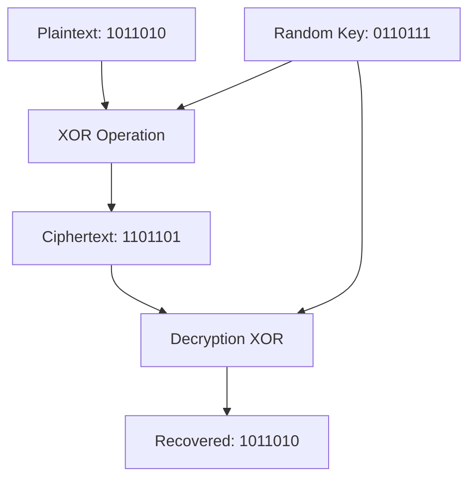

---

## 4. Modern Ciphers and Block Cipher Modes

### 4.1 Block Ciphers (e.g., AES (Advanced Encryption Standard), DES (Data Encryption Standard))

Block ciphers encrypt fixed-size blocks of plaintext (e.g., 128 bits for AES (Advanced Encryption Standard)) using multiple rounds of substitution and permutation operations.

#### Block Cipher Structure:

**Substitution-Permutation Network (SPN (Substitution-Permutation Network)):**
1. **S-Box (Substitution Box)**: Non-linear transformation that provides confusion
2. **P-Box (Permutation Box)**: Linear transformation that provides diffusion  
3. **Round Key Addition**: XOR (Exclusive OR) with round-specific key
4. **Multiple Rounds**: Repeat the above steps multiple times

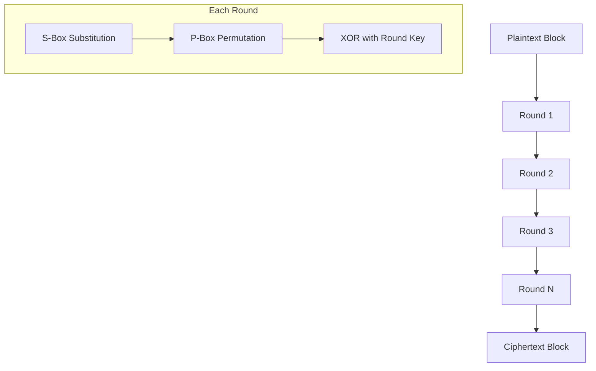

### 4.2 Block Cipher Modes of Operation

Since block ciphers only handle fixed-size blocks, we need modes of operation to encrypt longer messages.

#### ECB (Electronic Codebook) Mode

**Encryption Procedure:**
1. **Divide plaintext**: Split the message into blocks of the cipher's block size
2. **Pad if necessary**: Add padding to the last block if it's not complete
3. **Encrypt independently**: Apply the block cipher to each block using the same key
4. **Concatenate results**: Join all encrypted blocks to form the final ciphertext

**Decryption Procedure:**
1. **Divide ciphertext**: Split into blocks of the cipher's block size
2. **Decrypt independently**: Apply the block cipher decryption to each block using the same key
3. **Remove padding**: Strip any padding from the last block
4. **Concatenate results**: Join all decrypted blocks to recover the plaintext

**Critical Security Flaw:**
- Identical plaintext blocks always produce identical ciphertext blocks
- This reveals patterns in the plaintext structure
- Famous example: ECB (Electronic Codebook) encryption of images shows the original image outline

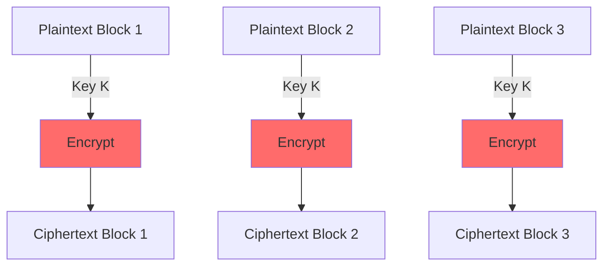

#### CBC (Cipher Block Chaining) Mode

**Encryption Procedure:**
1. **Generate random IV (Initialization Vector)**: Create a random value the same size as one block
2. **Initialize chaining**: XOR (Exclusive OR) the first plaintext block with the IV (Initialization Vector)
3. **Encrypt first block**: Apply block cipher to (P₁ ⊕ IV (Initialization Vector)) to get C₁
4. **Chain subsequent blocks**: For block i > 1, XOR (Exclusive OR) plaintext block Pᵢ with previous ciphertext block Cᵢ₋₁
5. **Encrypt chained result**: Apply block cipher to (Pᵢ ⊕ Cᵢ₋₁) to get Cᵢ
6. **Include IV (Initialization Vector)**: Prepend the IV (Initialization Vector) to the final ciphertext

**Decryption Procedure:**
1. **Extract IV (Initialization Vector)**: Remove the IV (Initialization Vector) from the beginning of the ciphertext
2. **Decrypt first block**: Apply block cipher decryption to C₁, then XOR (Exclusive OR) with IV (Initialization Vector) to get P₁
3. **Decrypt subsequent blocks**: For block i > 1, decrypt Cᵢ and XOR (Exclusive OR) with Cᵢ₋₁ to get Pᵢ
4. **Remove padding**: Strip any padding from the last plaintext block

**Security Properties:**
- Identical plaintext blocks encrypt to different ciphertext blocks (due to chaining)
- Secure against CPA (Chosen Plaintext Attack) if IV (Initialization Vector) is random
- Error propagation: One bit error affects current and next block

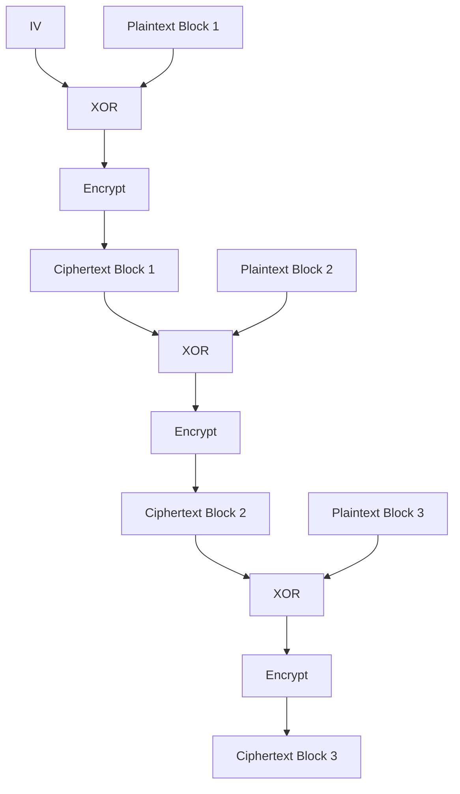

#### CTR (Counter Mode)

**Encryption Procedure:**
1. **Choose unique nonce/IV (Initialization Vector)**: Select a value that will never be reused with the same key
2. **Initialize counter**: Set counter = 0 (or counter = 1, depending on implementation)
3. **Generate keystream**: For each block i, encrypt (IV (Initialization Vector) || counter+i) to get keystream block Kᵢ
4. **XOR (Exclusive OR) with plaintext**: Compute Cᵢ = Pᵢ ⊕ Kᵢ for each plaintext block
5. **Include IV (Initialization Vector)/nonce**: Prepend the IV (Initialization Vector) to the ciphertext

**Decryption Procedure:**
1. **Extract IV (Initialization Vector)/nonce**: Remove the IV (Initialization Vector) from the ciphertext
2. **Regenerate keystream**: For each block i, encrypt (IV (Initialization Vector) || counter+i) to get the same keystream block Kᵢ
3. **XOR (Exclusive OR) with ciphertext**: Compute Pᵢ = Cᵢ ⊕ Kᵢ to recover each plaintext block
4. **Remove padding**: Strip any padding from the recovered plaintext

**Advantages:**
- Parallelizable encryption and decryption
- Random access to any block without decrypting previous blocks
- No error propagation
- Turns block cipher into stream cipher

**Critical Requirement:**
- Never reuse the same (key, IV (Initialization Vector)) pair
- If IV (Initialization Vector) is reused, attackers can XOR (Exclusive OR) ciphertexts to get plaintext relationships

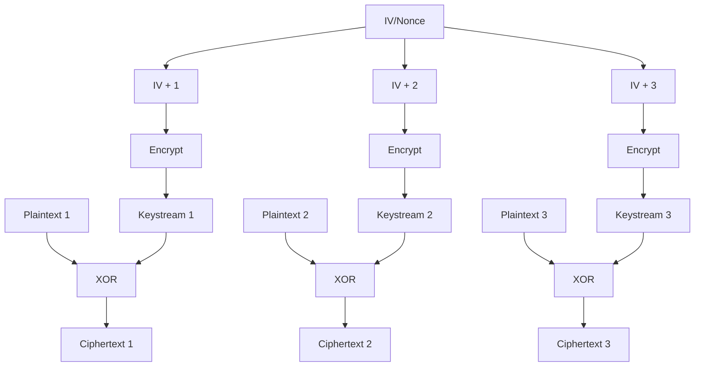

#### GCM (Galois/Counter Mode)

**Overview:**
GCM (Galois/Counter Mode) combines CTR (Counter Mode) encryption with Galois field multiplication for authentication, providing both confidentiality and integrity.

**Encryption Procedure:**
1. **CTR (Counter Mode) encryption**: Encrypt the plaintext using CTR (Counter Mode) as described above
2. **Authentication data processing**: Process any additional authenticated data (AAD) that should be authenticated but not encrypted
3. **Generate authentication tag**: Use Galois field operations to compute a tag over the ciphertext and AAD
4. **Output**: Return ciphertext concatenated with the authentication tag

**Decryption and Verification Procedure:**
1. **Separate components**: Extract the ciphertext and authentication tag
2. **Verify authenticity**: Recompute the authentication tag and compare with the received tag
3. **Abort if verification fails**: If tags don't match, reject the message (possible tampering)
4. **Decrypt if authentic**: If verification succeeds, use CTR (Counter Mode) decryption to recover plaintext

**Security Properties:**
- Provides both confidentiality (via CTR (Counter Mode)) and authenticity (via authentication tag)
- Secure against CCA (Chosen Ciphertext Attack) attacks
- Widely recommended for modern applications
- Used in TLS (Transport Layer Security) 1.2+ and many other protocols

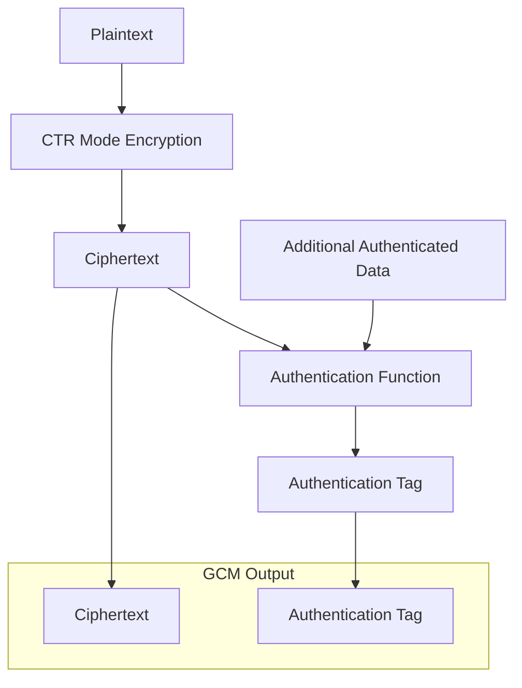

---

## 5. The Role of IV (Initialization Vector)

### 5.1 Purpose and Importance

The Initialization Vector (IV (Initialization Vector)) is a crucial component that ensures the same plaintext encrypts to different ciphertexts each time, providing semantic security.

#### Why IV (Initialization Vector) is Necessary:

**Without IV (Initialization Vector) - The Problem:**
1. **Deterministic encryption**: Same plaintext always produces same ciphertext
2. **Pattern revelation**: Repeated messages become obvious to attackers
3. **Statistical attacks**: Frequency analysis becomes possible on encrypted data
4. **Two-time pad problem**: In stream ciphers, identical keystreams reveal plaintext relationships

**With IV (Initialization Vector) - The Solution:**
1. **Probabilistic encryption**: Same plaintext produces different ciphertext each time
2. **Pattern concealment**: No visible patterns even with repeated messages
3. **Semantic security**: Attackers cannot distinguish between encryptions of different messages

### 5.2 IV (Initialization Vector) Requirements by Mode

#### CBC (Cipher Block Chaining) Mode IV (Initialization Vector) Requirements:
1. **Unpredictability**: IV (Initialization Vector) must be cryptographically random for each encryption
2. **Uniqueness**: Never reuse the same IV (Initialization Vector) with the same key
3. **Size**: Must be exactly one block size (e.g., 128 bits for AES (Advanced Encryption Standard))
4. **Transmission**: IV (Initialization Vector) can be sent in the clear (typically prepended to ciphertext)

**CBC (Cipher Block Chaining) IV (Initialization Vector) Generation Procedure:**
1. **Generate random value**: Use a cryptographically secure random number generator
2. **Check uniqueness**: Ensure this IV (Initialization Vector) hasn't been used before with the current key
3. **Prepend to ciphertext**: Include the IV (Initialization Vector) at the beginning of the encrypted message
4. **Use for first block**: XOR (Exclusive OR) the IV (Initialization Vector) with the first plaintext block before encryption

#### CTR (Counter Mode) Nonce Requirements:
1. **Uniqueness**: Absolutely never reuse the same nonce with the same key
2. **Size**: Typically half the block size (e.g., 64 bits for AES (Advanced Encryption Standard))
3. **Generation methods**: Can be random, sequential counter, or timestamp-based
4. **Collision prevention**: Must ensure no two encryptions use the same (key, nonce) pair

**CTR (Counter Mode) Nonce Generation Procedures:**

**Method 1 - Random Nonce:**
1. **Generate random value**: Use cryptographically secure random number generator
2. **Check collision probability**: Ensure birthday paradox doesn't cause collisions
3. **Store or transmit**: Include nonce with the ciphertext

**Method 2 - Counter-based Nonce:**
1. **Initialize counter**: Start with counter = 0 or 1
2. **Increment for each encryption**: counter = counter + 1
3. **Ensure no wraparound**: Plan for maximum number of encryptions
4. **Synchronize**: Both parties must maintain the same counter

**Method 3 - Timestamp-based Nonce:**
1. **Use high-resolution timestamp**: Ensure sufficient precision to avoid duplicates
2. **Add randomness**: Combine with random value if timestamps might collide
3. **Verify ordering**: Ensure timestamps are strictly increasing

### 5.3 IV (Initialization Vector) Reuse Attacks

#### Stream Cipher IV (Initialization Vector) Reuse Attack (applies to CTR (Counter Mode)):

**Attack Scenario:**
- Attacker obtains two ciphertexts C₁ and C₂ encrypted with the same key and IV (Initialization Vector)
- This means the same keystream K was used for both encryptions

**Attack Procedure:**
1. **Obtain ciphertexts**: C₁ = P₁ ⊕ K and C₂ = P₂ ⊕ K (same keystream K)
2. **XOR (Exclusive OR) ciphertexts**: Compute C₁ ⊕ C₂ = (P₁ ⊕ K) ⊕ (P₂ ⊕ K) = P₁ ⊕ P₂
3. **Keystream cancellation**: The common keystream K cancels out completely
4. **Analyze plaintext relationship**: Use language patterns, known formats, or frequency analysis on P₁ ⊕ P₂
5. **Recover plaintexts**: If one plaintext is known or guessed, immediately recover the other

**Real-world Example - Two-Time Pad:**
```
Message 1: "Transfer $1000 to Alice"
Message 2: "Transfer $2000 to Bob"
Same IV used, so same keystream K generated

C₁ = "Transfer $1000 to Alice" ⊕ K
C₂ = "Transfer $2000 to Bob" ⊕ K

Attacker computes: 
C₁ ⊕ C₂ = "Transfer $1000 to Alice" ⊕ "Transfer $2000 to Bob"

Since both start with "Transfer $", attacker can deduce:
- Both are monetary transfers
- First involves $1000, second involves $2000
- Recipients are Alice and Bob
```

#### CBC (Cipher Block Chaining) IV (Initialization Vector) Reuse Attack:

**Attack Scenario:**
- Same IV (Initialization Vector) is used with the same key for different messages
- First blocks of ciphertext reveal information about first blocks of plaintext

**Attack Procedure:**
1. **Obtain ciphertexts with same IV (Initialization Vector)**: C₁ = E(P₁ ⊕ IV (Initialization Vector)) and C₂ = E(P₂ ⊕ IV (Initialization Vector))
2. **Compare first blocks**: If C₁₍₁₎ = C₂₍₁₎, then P₁₍₁₎ = P₂₍₁₎ (first blocks of plaintext are identical)
3. **Partial information leakage**: Even if blocks aren't identical, statistical analysis may reveal patterns
4. **Chosen plaintext attacks**: If attacker can influence one plaintext, they can learn about the other

### 5.4 Best Practices for IV (Initialization Vector) Management

#### Secure IV (Initialization Vector) Generation:
1. **Use cryptographic RNG (Random Number Generator)**: Never use predictable sources like system time alone
2. **Sufficient entropy**: Ensure the random source has enough entropy
3. **Proper seeding**: Seed the RNG (Random Number Generator) with high-quality random data
4. **Regular reseeding**: Periodically reseed the RNG (Random Number Generator) to maintain entropy

#### IV (Initialization Vector) Storage and Transmission:
1. **Store with ciphertext**: Typically prepend IV (Initialization Vector) to the encrypted data
2. **No confidentiality needed**: IV (Initialization Vector) can be transmitted in plaintext
3. **Integrity protection**: Consider protecting IV (Initialization Vector) integrity in some applications
4. **Proper indexing**: In systems with many encryptions, ensure proper IV (Initialization Vector) tracking

#### Key Rotation and IV (Initialization Vector) Management:
1. **Key rotation**: Change encryption keys periodically to limit IV (Initialization Vector) reuse risk
2. **IV (Initialization Vector) space monitoring**: Track how many IVs (Initialization Vectors) have been used with each key
3. **Birthday paradox awareness**: For random IVs (Initialization Vectors), be aware of collision probability
4. **System design**: Design systems to handle IV (Initialization Vector) management automatically

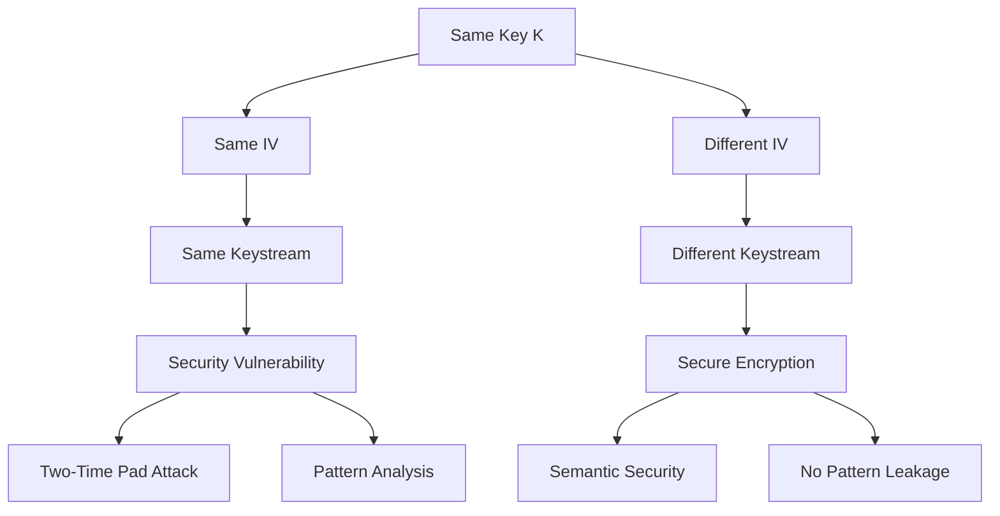

---

## 6. Real-World Application Examples and Attack Scenarios

### 6.1 Wi-Fi Security Evolution

#### WEP (Wired Equivalent Privacy) - A Case Study in IV (Initialization Vector) Reuse

**Background:**
WEP (Wired Equivalent Privacy) was the original Wi-Fi security protocol that used RC4 stream cipher with a 24-bit IV (Initialization Vector).

**Implementation Details:**
1. **Short IV (Initialization Vector)**: Only 24 bits = 16,777,216 possible values
2. **IV (Initialization Vector) reuse**: With busy networks, IVs (Initialization Vectors) were reused within hours
3. **Weak key scheduling**: RC4's key scheduling algorithm had known vulnerabilities
4. **Predictable IVs (Initialization Vectors)**: Many implementations used sequential IVs (Initialization Vectors)

**Attack Procedure (Fluhrer-Mantin-Shamir Attack):**
1. **Collect packets**: Monitor Wi-Fi traffic to collect packets with weak IVs (Initialization Vectors)
2. **Identify weak IVs (Initialization Vectors)**: Look for IVs (Initialization Vectors) that make RC4 leak key information
3. **Statistical analysis**: Use the leaked information to recover key bytes one by one
4. **Key recovery**: After collecting enough weak packets, reconstruct the entire WEP (Wired Equivalent Privacy) key
5. **Complete break**: Use recovered key to decrypt all traffic

**Timeline of Attack:**
- 2001: Attack published, requires ~1 million packets
- 2004: Improved attacks need only ~40,000 packets  
- 2007: Tools like aircrack-ng can break WEP (Wired Equivalent Privacy) in minutes

#### WPA2/WPA3 - Modern Solutions

**WPA2 Improvements:**
1. **AES (Advanced Encryption Standard)-CCMP (Counter Mode with CBC-MAC Protocol)**: Uses AES (Advanced Encryption Standard) in CTR (Counter Mode) with authentication
2. **48-bit IV (Initialization Vector)**: Much larger IV (Initialization Vector) space prevents quick reuse
3. **Key hierarchy**: Separate keys for different purposes
4. **Perfect forward secrecy**: Session keys change regularly

**Implementation Procedure:**
1. **4-way handshake**: Establish session keys securely
2. **Unique session keys**: Generate fresh encryption keys for each session
3. **IV (Initialization Vector) management**: Use packet counter as IV (Initialization Vector) to ensure uniqueness
4. **Authentication**: Add message authentication codes to prevent tampering

### 6.2 File Encryption Systems

#### ZIP File Encryption - Multiple Approaches

**Traditional ZIP Crypto (ZipCrypto) - Broken:**
1. **Weak stream cipher**: Uses a custom stream cipher based on CRC32
2. **Known plaintext attack**: If attacker knows part of a file, they can recover the key
3. **Attack procedure**:
   - Obtain encrypted ZIP file
   - Know or guess part of the plaintext (e.g., common file headers)
   - Use known plaintext to recover the internal state
   - Decrypt the entire archive

**Modern ZIP with AES (Advanced Encryption Standard):**
1. **AES (Advanced Encryption Standard)-256 in CTR (Counter Mode)**: Uses strong encryption
2. **PBKDF2 key derivation**: Converts password to encryption key securely
3. **Salt usage**: Prevents rainbow table attacks on passwords
4. **HMAC (Hash-based Message Authentication Code) authentication**: Detects tampering

**Secure ZIP Encryption Procedure:**
1. **Password input**: User provides password
2. **Salt generation**: Generate random salt value
3. **Key derivation**: Use PBKDF2 with salt to derive encryption key
4. **File encryption**: Encrypt each file with AES (Advanced Encryption Standard)-CTR (Counter Mode)
5. **Authentication**: Add HMAC (Hash-based Message Authentication Code) for integrity verification

### 6.3 Padding Oracle Attacks

#### Attack Scenario
Many web applications decrypt user-provided data and return different error messages based on whether decryption succeeds.

**Vulnerable System Design:**
```
User sends: Encrypted data
Server: 
1. Decrypts data
2. Checks padding validity
3. Returns specific error messages:
   - "Invalid padding"
   - "Valid padding but invalid data format"
   - "Success"
```

**Padding Oracle Attack Procedure:**

**Phase 1 - Oracle Discovery:**
1. **Submit test ciphertexts**: Send various encrypted payloads to the application
2. **Analyze responses**: Look for differences in error messages, timing, or behavior
3. **Identify oracle**: Determine which responses indicate padding validity vs invalidity
4. **Confirm oracle**: Verify that the application consistently behaves as a padding oracle

**Phase 2 - Byte-by-byte Decryption:**
1. **Target last byte**: Focus on the last byte of a ciphertext block
2. **Systematic guessing**: Try all 256 possible values for the last ciphertext byte
3. **Monitor oracle responses**: Submit each modified ciphertext to the oracle
4. **Identify valid padding**: When oracle indicates valid padding, deduce the plaintext byte
5. **Work backwards**: Repeat for second-to-last byte, third-to-last, etc.
6. **Block completion**: Decrypt entire blocks byte by byte

**Example Attack Flow:**
```
Original ciphertext: C₁ || C₂
Target: Decrypt plaintext block P₂

For each possible byte value b (0-255):
  Modified ciphertext: C₁' || C₂ where C₁'[15] = b
  Submit to oracle
  If oracle says "valid padding":
    We've found a relationship between b and P₂[15]
    Calculate P₂[15] using CBC relationship
```

**Phase 3 - Full Message Recovery:**
1. **Apply to all blocks**: Use the same technique on every ciphertext block
2. **Handle block dependencies**: Account for CBC (Cipher Block Chaining) chaining in calculations
3. **Reconstruct message**: Combine all decrypted blocks to recover the full plaintext
4. **Verify results**: Check if decrypted content makes sense (language, format, etc.)

#### Defense Against Padding Oracle Attacks:

**Mitigation Strategies:**
1. **Authenticated encryption**: Use GCM (Galois/Counter Mode) or similar modes that provide integrity
2. **Uniform error handling**: Return identical error messages for all decryption failures
3. **Constant-time operations**: Ensure all error paths take the same amount of time
4. **Input validation**: Validate and sanitize all user inputs before decryption

### 6.4 Database Encryption in Practice

#### Column-Level Encryption Example

**Scenario**: Hospital database storing patient records

**Implementation Procedure:**
1. **Identify sensitive columns**: Determine which data needs encryption (SSN, medical history)
2. **Key management setup**: Establish key hierarchy and access controls
3. **Encryption implementation**:
   - Generate unique key for each patient or record type
   - Use AES (Advanced Encryption Standard)-GCM (Galois/Counter Mode) for confidentiality and integrity
   - Store encrypted data in database columns
4. **Application-level decryption**: Decrypt data only when authorized users access it
5. **Audit logging**: Log all encryption/decryption operations

**Security Considerations:**
- **Key rotation**: Periodically change encryption keys
- **Access control**: Restrict key access to authorized applications/users
- **Backup encryption**: Ensure database backups are also encrypted
- **Performance impact**: Monitor encryption overhead on database operations

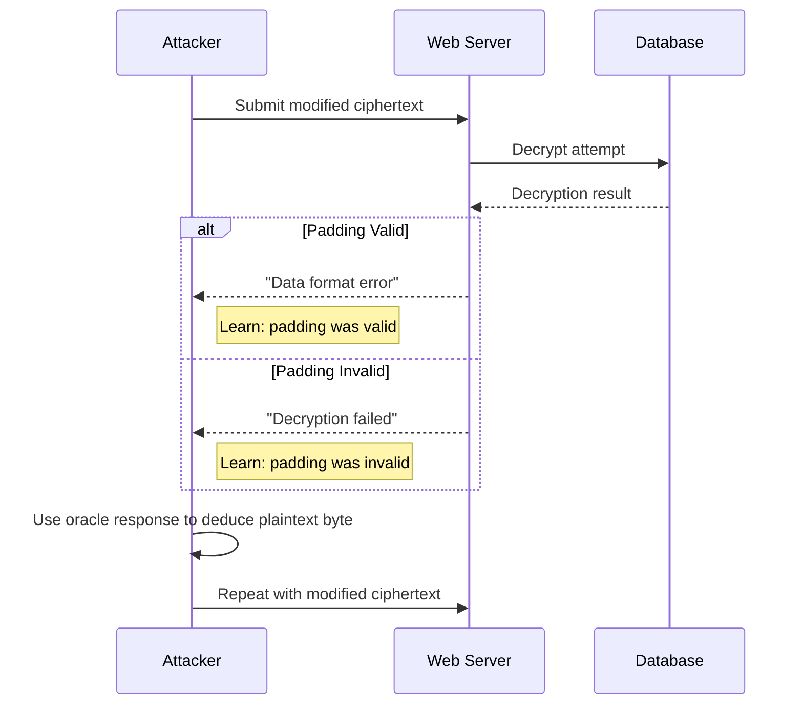

### 6.5 Key Management in Practice

#### Enterprise Key Management System

**Key Lifecycle Management:**
1. **Key generation**: Use hardware security modules (HSMs) for secure key generation
2. **Key distribution**: Securely distribute keys to authorized systems
3. **Key storage**: Store keys in encrypted form with access controls
4. **Key rotation**: Regularly replace keys according to security policy
5. **Key revocation**: Immediately revoke compromised keys
6. **Key destruction**: Securely delete keys when no longer needed

**Real-world Implementation:**
- **HSM (Hardware Security Module) integration**: Use dedicated hardware for key operations
- **Role-based access**: Different personnel have access to different key types
- **Audit trails**: Log all key management operations
- **Disaster recovery**: Maintain secure key backups and recovery procedures
- **Compliance**: Meet regulatory requirements (FIPS 140-2, Common Criteria)

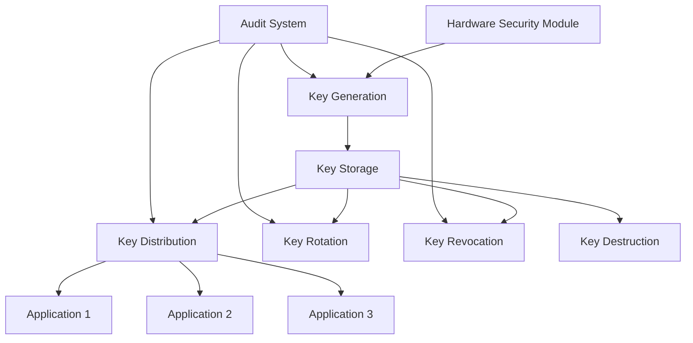

---

## 7. Comprehensive Cipher Comparison and Analysis

### 7.1 Detailed Security Analysis Table

| Cipher Type         | Key Reuse Safe? | VULNERABLE Against | Main Weakness         | Key Length | Practical Use |
|---------------------|-----------------|-------------------|----------------------|------------|---------------|
| Substitution        | Yes             | COA, KPA, CPA, CCA | Frequency analysis   | ~88 bits   | Historical only |
| Permutation         | Yes             | COA, KPA, CPA, CCA | Block patterns       | Variable   | Historical only |
| OTP (One-Time Pad)  | No              | None (Perfect)    | Key management       | = Message  | Very limited |
| Block Cipher (AES)  | Yes             | None (if mode is secure) | Mode misuse | 128-256 bits | Standard today |

### 7.2 Detailed Explanations

#### Substitution Cipher Analysis

**Key Reuse Safe: YES**
- **Explanation**: The same substitution table can be used to encrypt multiple different messages safely
- **Reason**: Each character is independently substituted, so using the same key multiple times doesn't create mathematical relationships between ciphertexts
- **Example**: Using the same substitution table to encrypt "HELLO" and "WORLD" doesn't reveal any connection between the messages from the ciphertexts alone

**VULNERABLE Against: COA, KPA, CPA, CCA (All Attack Types)**
- **COA (Ciphertext-Only Attack) Vulnerability**: 
  - **What it means**: NOT secure against ciphertext-only attacks
  - **Why vulnerable**: Frequency analysis can break substitution ciphers when plaintext has known statistical properties
  - **Attack method**: Count character frequencies in ciphertext and match to expected language frequencies
  - **Example**: In English, 'E' appears ~12.7% of the time. If 'Q' appears most frequently in ciphertext, likely Q→E substitution

- **KPA (Known-Plaintext Attack) Vulnerability**:
  - **What it means**: NOT secure against known-plaintext attacks  
  - **Why vulnerable**: Even a small amount of known plaintext reveals the substitution table
  - **Attack method**: Use plaintext-ciphertext pairs to reconstruct the entire substitution table
  - **Example**: Knowing "HELLO" encrypts to "XKCCZ" immediately reveals 5 substitution pairs

- **CPA (Chosen-Plaintext Attack) Vulnerability**:
  - **What it means**: NOT secure against chosen-plaintext attacks
  - **Why vulnerable**: Attacker can strategically choose plaintexts to reveal the substitution table
  - **Attack method**: Choose plaintexts like "AAAA", "BBBB", "ABAB" to systematically map each character
  - **Example**: Encrypting "ABCDEFGHIJKLMNOPQRSTUVWXYZ" immediately reveals the entire substitution table

- **CCA (Chosen-Ciphertext Attack) Vulnerability**:
  - **What it means**: NOT secure against chosen-ciphertext attacks  
  - **Why vulnerable**: Attacker can choose ciphertexts to decrypt and learn the inverse substitution
  - **Attack method**: Submit chosen ciphertexts for decryption to build the reverse mapping
  - **Example**: Decrypting single-character ciphertexts reveals the complete inverse substitution table

**Main Weakness: Frequency Analysis**
- **Statistical patterns preserved**: Substitution doesn't change frequency patterns of the underlying language
- **Language characteristics exploited**: Common letters, digrams, trigrams remain detectable
- **Scalability of attack**: Longer ciphertexts become easier to break as statistical patterns stabilize
- **Historical significance**: This weakness made substitution ciphers obsolete by the Renaissance

#### Permutation Cipher Analysis

**Key Reuse Safe: YES**
- **Explanation**: The same permutation pattern can be safely applied to multiple message blocks
- **Reason**: Permutation only rearranges characters within blocks, doesn't create inter-message dependencies
- **Limitation**: Each block must be permuted independently for safety
- **Example**: Using permutation (3,1,4,2) on blocks "HELLO" and "WORLD" is safe

**VULNERABLE Against: COA, KPA, CPA, CCA (All Attack Types)**
- **COA (Ciphertext-Only Attack) Vulnerability**:
  - **What it means**: NOT secure against ciphertext-only attacks
  - **Why vulnerable**: Anagram analysis can reveal the permutation
  - **Attack method**: Look for blocks that are anagrams of common words
  - **Example**: Ciphertext block "EHLLO" is an anagram of "HELLO"

- **KPA (Known-Plaintext Attack) Vulnerability**:
  - **What it means**: NOT secure against known-plaintext attacks
  - **Why vulnerable**: Single known plaintext-ciphertext block pair reveals the entire permutation
  - **Attack method**: Compare positions of characters between known plaintext and ciphertext blocks
  - **Example**: "HELLO"→"LOHEL" immediately shows the permutation mapping

- **CPA (Chosen-Plaintext Attack) Vulnerability**:
  - **What it means**: NOT secure against chosen-plaintext attacks
  - **Why vulnerable**: Attacker can choose specific plaintexts to reveal the permutation pattern
  - **Attack method**: Encrypt blocks with known patterns to determine the permutation
  - **Example**: Encrypting "ABCDE" reveals the exact permutation: if result is "CAEBD", permutation is (1→3, 2→1, 3→5, 4→2, 5→4)

- **CCA (Chosen-Ciphertext Attack) Vulnerability**:
  - **What it means**: NOT secure against chosen-ciphertext attacks
  - **Why vulnerable**: Attacker can submit chosen ciphertext blocks for decryption to learn the inverse permutation
  - **Attack method**: Choose ciphertext blocks and observe their decryption to map the reverse permutation
  - **Example**: Submitting permuted alphabet blocks reveals the complete inverse permutation

**Main Weakness: Block Patterns**
- **Character preservation**: All original characters remain in the ciphertext, just rearranged
- **Anagram vulnerability**: Ciphertext blocks are anagrams of plaintext blocks
- **Limited diffusion**: Permutation within small blocks doesn't obscure larger patterns
- **Dictionary attacks**: Common words can be recognized even when permuted

#### OTP (One-Time Pad) Analysis

**Key Reuse Safe: NO**
- **Explanation**: Each key bit can only be used once across all messages - this is the fundamental requirement
- **Critical vulnerability**: Reusing any portion of the key completely breaks security
- **Mathematical proof**: C₁ ⊕ C₂ = P₁ ⊕ P₂ when same key is reused, revealing plaintext relationships
- **Example**: If same OTP (One-Time Pad) key encrypts "ATTACK" and "DEFEND", attacker gets "ATTACK" ⊕ "DEFEND" and can recover both messages

**Secure Against: ALL**
- **Perfect secrecy**: Provides information-theoretic security against all possible attacks
- **Unlimited computational power**: Even with infinite computing resources, attackers learn nothing about plaintext
- **All attack models**: Secure against COA (Ciphertext-Only Attack), KPA (Known-Plaintext Attack), CPA (Chosen-Plaintext Attack), CCA (Chosen-Ciphertext Attack)
- **Mathematical guarantee**: For any ciphertext, all possible plaintexts of the same length are equally likely

**Main Weakness: Key Management**
- **Key length requirement**: Key must be as long as the total of all messages ever encrypted
- **Key distribution problem**: Must securely transport massive amounts of key material
- **Key storage challenge**: Need secure storage for enormous quantities of key data
- **Key synchronization**: Sender and receiver must perfectly coordinate which key portions to use
- **One-time use enforcement**: Must track and prevent any key reuse
- **Practical impossibility**: These requirements make OTP (One-Time Pad) impractical for most real-world applications

#### Block Cipher (AES (Advanced Encryption Standard)) Analysis

**Key Reuse Safe: YES**
- **Explanation**: Same AES (Advanced Encryption Standard) key can safely encrypt many different messages
- **Requirement**: Must use proper modes of operation (not ECB (Electronic Codebook))
- **Mode dependency**: Safety depends on the mode providing proper randomization (via IV (Initialization Vector))
- **Example**: Same AES (Advanced Encryption Standard) key with different random IVs (Initialization Vectors) in CBC (Cipher Block Chaining) mode is safe

**Secure Against: ALL (if mode is secure)**
- **Mode-dependent security**: Security level depends entirely on the chosen mode of operation
- **GCM (Galois/Counter Mode) mode**: Provides security against all attack types including CCA (Chosen-Ciphertext Attack)
- **CBC (Cipher Block Chaining) mode**: Secure against CPA (Chosen-Plaintext Attack) but vulnerable to padding oracle attacks
- **CTR (Counter Mode) mode**: Secure against CPA (Chosen-Plaintext Attack) but provides no authentication
- **ECB (Electronic Codebook) mode**: Insecure against all attack types - reveals patterns

**Main Weakness: Mode Misuse**
- **ECB (Electronic Codebook) mode vulnerability**: Using ECB (Electronic Codebook) reveals patterns in plaintext
- **IV (Initialization Vector) reuse**: Reusing IVs (Initialization Vectors) in CBC (Cipher Block Chaining)/CTR (Counter Mode) breaks semantic security
- **Padding oracle vulnerabilities**: Improper error handling in CBC (Cipher Block Chaining) creates decryption oracles
- **Authentication absence**: Modes like CTR (Counter Mode) provide no integrity protection
- **Implementation errors**: Weak random number generation, improper key derivation, side-channel vulnerabilities

### 7.3 Practical Security Recommendations

#### For Historical Understanding:
- **Substitution/Permutation ciphers**: Study for understanding attack principles, never use in practice
- **Educational value**: Demonstrate why modern cryptography is necessary

#### For Maximum Security:
- **OTP (One-Time Pad)**: Only for extremely high-value, low-volume communications where perfect secrecy is required
- **Use cases**: Diplomatic communications, nuclear command systems, emergency protocols

#### For General Use:
- **AES (Advanced Encryption Standard) with GCM (Galois/Counter Mode)**: Standard recommendation for most applications
- **AES (Advanced Encryption Standard) with CBC (Cipher Block Chaining)**: Acceptable if implemented carefully with proper padding and IV (Initialization Vector) handling
- **Never use ECB (Electronic Codebook)**: Always avoid ECB (Electronic Codebook) mode for any multi-block encryption

### 7.4 Attack Resistance Comparison

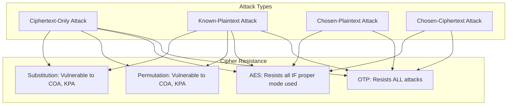

---

## 8. Key Takeaways
- Always use secure, modern ciphers (e.g., AES (Advanced Encryption Standard)) with proper modes (e.g., GCM (Galois/Counter Mode))
- Never reuse keys or IVs (Initialization Vectors) in stream/block cipher modes
- Understand the threat model and attacker capabilities
- Implementation mistakes (e.g., weak passwords, reused IVs, error messages) can break even strong cryptography

---

*All abbreviations are defined on every use. Diagrams are provided for clarity. For more, see the official lecture slides and recommended readings.*
