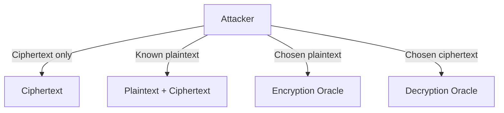
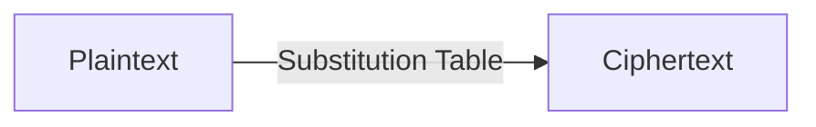
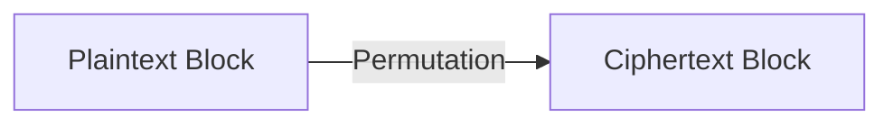
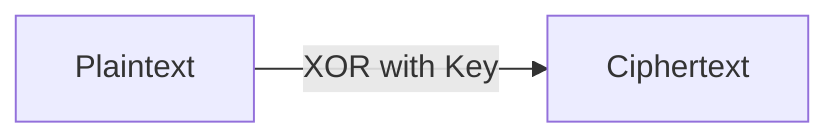
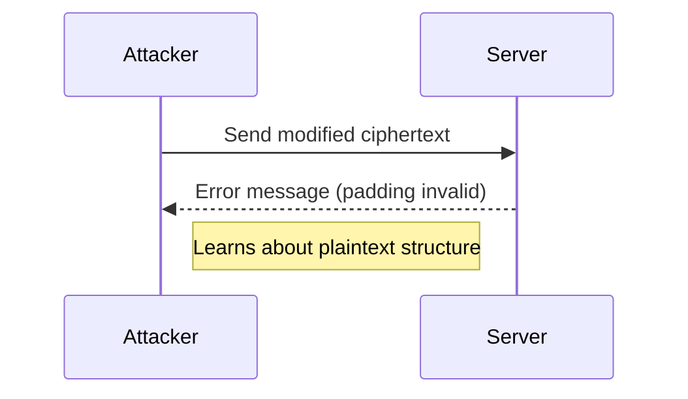

# CS2107 Topic 1: Encryption for Confidentiality (Proper Notes)

---

## 1. Introduction to Encryption

Encryption is a process that transforms plaintext (readable data) into ciphertext (unreadable data) using a secret key, to ensure confidentiality. Decryption reverses this process using the same (symmetric) or a different (asymmetric) key.

**Key Concepts:**
- **Plaintext:** The original message (e.g., `HELLO`)
- **Ciphertext:** The encrypted message (e.g., `XKCDQ`)
- **Key:** Secret value used for encryption/decryption
- **Correctness:** Decrypting an encrypted message with the correct key always returns the original plaintext

---

## 2. Threat Models and Types of Attacks

### 2.1 Attacker's Goals
- **Total Break:** Recover the secret key
- **Partial Break:** Recover some information about the plaintext
- **Distinguishability:** Distinguish between ciphertexts of two chosen plaintexts

### 2.2 Attacker's Capabilities
- **Ciphertext-Only Attack (COA):** Attacker only sees ciphertexts
- **Known-Plaintext Attack (KPA):** Attacker knows some plaintext-ciphertext pairs
- **Chosen-Plaintext Attack (CPA):** Attacker can choose plaintexts and obtain ciphertexts (encryption oracle)
- **Chosen-Ciphertext Attack (CCA):** Attacker can choose ciphertexts and obtain plaintexts (decryption oracle)



**Example:**
- In Wi-Fi, attackers may know packet headers (KPA)
- In web servers, attackers may submit chosen data (CPA)
- Padding oracle attacks exploit CCA-like scenarios

---

## 3. Classical Ciphers

### 3.1 Substitution Cipher
- Each symbol in the plaintext is replaced by another symbol according to a secret substitution table (key)
- **Keyspace:** All possible permutations of the alphabet (very large)
- **Vulnerabilities:**
  - **KPA:** If attacker knows enough plaintext-ciphertext pairs, they can reconstruct the table
  - **COA:** Frequency analysis can break the cipher if plaintext is in a natural language

**Example Table:**
| Plain | a | b | c | d | ... |
|-------|---|---|---|---|-----|
| Subst | g | v | w | b | ... |

**Encryption:** `HELLO` → `HNLLO` (using the table)

**Mermaid Diagram:**


### 3.2 Permutation (Transposition) Cipher
- Plaintext is divided into blocks; each block's symbols are rearranged according to a secret permutation
- **Key:** The permutation order
- **Vulnerabilities:**
  - **KPA:** Easy to recover permutation with a known plaintext-ciphertext pair
  - **COA:** Patterns may be revealed if plaintext is structured

**Example:**
- Block size 5, permutation (1,5,2,4,3): `HELLO` → `HOELL`

**Mermaid Diagram:**


### 3.3 One-Time Pad (OTP (One-Time Pad))
- Each bit/character of plaintext is XORed with a truly random key of the same length
- **Perfect secrecy**: Even with infinite computing power, attacker learns nothing about plaintext from ciphertext
- **Key requirements:**
  - Key must be as long as the message
  - Key must be truly random
  - Key must never be reused
- **Impracticality:** Key distribution and management

**Example:**
- Plaintext: `1010`
- Key:      `1100`
- Ciphertext: `0110` (XOR each bit)

**Mermaid Diagram:**


---

## 4. Modern Ciphers and Block Cipher Modes

### 4.1 Block Ciphers (e.g., AES (Advanced Encryption Standard), DES (Data Encryption Standard))
- Encrypts fixed-size blocks (e.g., 128 bits)
- Uses rounds of substitution (S-box) and permutation (P-box)

**Mermaid Diagram:**
```mermaid
graph TD
    P[Plaintext Block] --> S[S-box (Substitution)] --> Pbox[P-box (Permutation)] --> RK[Round Key XOR] --> ... --> C[Ciphertext Block]
```

### 4.2 Block Cipher Modes

#### ECB (Electronic Codebook)
- Each block encrypted independently
- **Weakness:** Identical plaintext blocks yield identical ciphertext blocks (pattern leakage)

#### CBC (Cipher Block Chaining)
- Each plaintext block is XORed with previous ciphertext block before encryption
- **Requires IV (Initialization Vector)** for first block
- **Improves security**: identical plaintext blocks encrypt differently

#### CTR (Counter Mode)
- Encrypts a counter value, XORs with plaintext
- **Acts like a stream cipher**
- **Requires unique IV (Initialization Vector)/nonce**

#### GCM (Galois/Counter Mode)
- Like CTR (Counter Mode) but adds authentication (integrity)
- **Recommended for modern applications**

**Mermaid Diagram:**
```mermaid
graph TD
    subgraph CBC
        IV[IV (Initialization Vector)] --> XOR1
        XOR1 --XOR--> P1[Plaintext Block 1]
        XOR1 --> E1[Encrypt] --> C1[Ciphertext 1]
        C1 --> XOR2
        XOR2 --XOR--> P2[Plaintext Block 2]
        XOR2 --> E2[Encrypt] --> C2[Ciphertext 2]
    end
```

---

## 5. The Role of IV (Initialization Vector)
- IV (Initialization Vector) ensures that encrypting the same plaintext twice yields different ciphertexts
- Must be random/unique for each encryption
- If IV (Initialization Vector) is reused, attackers can learn relationships between plaintexts (see stream cipher attacks)

---

## 6. Real-World Application Examples

### Example 1: Wi-Fi Encryption
- WPA2 uses AES (Advanced Encryption Standard) in CCMP (Counter Mode with CBC-MAC Protocol) mode
- IV (Initialization Vector) is called a nonce; must never repeat

### Example 2: File Encryption
- WinZip uses AES (Advanced Encryption Standard) with a password-derived key
- If password is weak or reused, security is compromised

### Example 3: Padding Oracle Attack
- Web server leaks error messages about padding
- Attacker uses CCA (Chosen Ciphertext Attack) to decrypt data without the key

**Mermaid Diagram:**


---

## 7. Summary Table

| Cipher Type         | Key Reuse Safe? | Secure Against | Main Weakness         |
|---------------------|-----------------|---------------|----------------------|
| Substitution        | Yes             | COA, KPA      | Frequency analysis   |
| Permutation         | Yes             | COA, KPA      | Block patterns       |
| OTP (One-Time Pad)  | No              | All           | Key management       |
| Block Cipher (AES)  | Yes             | All (if mode is secure) | Mode misuse         |

---

## 8. Key Takeaways
- Always use secure, modern ciphers (e.g., AES (Advanced Encryption Standard)) with proper modes (e.g., GCM (Galois/Counter Mode))
- Never reuse keys or IVs (Initialization Vectors) in stream/block cipher modes
- Understand the threat model and attacker capabilities
- Implementation mistakes (e.g., weak passwords, reused IVs, error messages) can break even strong cryptography

---

*All abbreviations are defined on every use. Diagrams are provided for clarity. For more, see the official lecture slides and recommended readings.*
