# EE2026 L2: Logic Gates - Part 1 Comprehensive Notes

*Based on Prof. Massimo Alioto's Logic Gates Lecture*


## Lecture Outline

✅ **Logic gate introduction**
<!-- This is the authoritative, complete logic gates and Boolean simplification note for L2. All previous partial or redundant notes are now obsolete. -->

✅ **Levels of abstraction: Boolean function, truth table, graphical, Verilog**

✅ **Implementation of Boolean function using gates**

✅ **Design simplification via algebraic manipulations**

✅ **Positive and negative logic**

✅ **Implementation of Boolean function with gate-level netlist**

---

## 1. Introduction to Logic Gates

### 1.1 Fundamental Definition

**Logic gates are digital circuits implementing fundamental Boolean operators or some simple combination of them**

- **Abstraction**: Actually made up of transistors (not shown here), closer to physical implementation of digital systems
- **Building blocks**: Foundation of any digital system
- **Multiple representation levels**: Boolean, truth table, graphical symbols, Verilog HDL

### 1.2 Complete Gate Symbol Reference Table

| **Logic Gate** | **Symbol** | **Function (F)** | **Logic Gate** | **Symbol** | **Function (F)** |
|---|---|---|---|---|---|
| **AND** | ![AND Symbol] | A · B | **NAND** | ![NAND Symbol] | A̅ · B̅ |
| **OR** | ![OR Symbol] | A + B | **NOR** | ![NOR Symbol] | A̅ + B̅ |
| **NOT** | ![NOT Symbol] | Ā | **Buffer** | ![Buffer Symbol] | A |

**Critical Rule from Prof. Alioto**: **Bubble (⚬) always means complement!**
## 2. Detailed Gate Analysis

    subgraph "AND Gate"
        A1[A] --> AND1[D-shape]
        B1[B] --> AND1
        AND1 --> F1["F = A·B"]
    end
    
    subgraph "NAND Gate"
        A2[A] --> NAND1[D-shape⚬]
        B2[B] --> NAND1
        NAND1 --> F2["F = (A·B)'"]
    end
    
    style AND1 fill:#e3f2fd,color:#000
    style NAND1 fill:#fff3e0,color:#000
```

#### Truth Table (AND, NAND)
| A | B | A·B | (A·B)' |
|---|---|-----|--------|
| 0 | 0 | 0   | **1**  |
| 1 | 0 | 0   | **1**  |
| 0 | 1 | 0   | **1**  |
| 1 | 1 | **1** | 0    |

**Key Properties:**
- **AND**: F is 1 only when both A and B are 1
- **NAND**: F is 0 only if both A and B are 1

**Verilog Implementation:**
module andgate(A, B, F);
    input A, B;
    output F;
    assign F = A & B;
    input A, B;
    output F;
    assign F = ~(A & B);
endmodule
```

```mermaid
        A3[A] --> OR1[Shield-shape]
        OR1 --> F3["F = A+B"]
    end
    
    subgraph "NOR Gate"
        A4[A] --> NOR1[Shield-shape⚬]
        B4[B] --> NOR1
        NOR1 --> F4["F = (A+B)'"]
    end
    

#### Truth Table (OR, NOR)
| 0 | 0 | 0   | **1**  |
| 1 | 0 | **1** | 0    |
| 0 | 1 | **1** | 0    |
| 1 | 1 | **1** | 0    |

**Bubble = Complement Relationship:**
OR ↔ NOR: Adding bubble inverts function

**Key Properties:**
```verilog
module orgate(A, B, F);
    assign F = A | B;
endmodule

module norgate(A, B, F);
    input A, B;
    output F;
    assign F = ~(A | B);
endmodule
```
flowchart LR
    subgraph "XOR Gate"
        XOR1 --> F5["F = A⊕B"]
    end
    
        A6[A] --> XNOR1[Shield+line⚬]
        B6[B] --> XNOR1
        XNOR1 --> F6["F = (A⊕B)'"]
    end
    style XOR1 fill:#fce4ec,color:#000
    style XNOR1 fill:#e8eaf6,color:#000
```

**Prof. Alioto's Note**: "Logic gate that is **not fundamental** in Boolean algebra, but very useful (e.g., arithmetic circuits – see week 4)"
|---|---|-----|---------|
| 1 | 0 | **1** | 0     |
| 0 | 1 | **1** | 0     |
| 1 | 1 | 0   | **1**   |
- **XOR**: F = AB̅ + A̅B = A ⊕ B
- **XNOR**: F = A̅ + B̅

**Key Properties:**
- **XOR**: F is 1 when either A or B (exclusively) are 1, or equivalently different from each other
- **XNOR**: F is 1 when either A or B (exclusively) are 0, or equivalently equal

**Verilog Implementation:**
```verilog
    output F;
endmodule

module xnorgate(A, B, F);
    assign F = ~(A ^ B);
endmodule

---

## 3. Implementation of Boolean Functions with Logic Gates

### 3.1 SOP Implementation with Fan-in Constraints

**Practical Design Challenge**: Maximum 4 logic gate inputs (fan-in limitation)

#### Example 1: F(w,x,y,z) = w̅x̅z + w̅xz + wyz + xyz

```mermaid
flowchart TD
    subgraph "Input Processing"
        W[w] --> NOT_W[NOT]
        X[x] --> NOT_X[NOT]
        NOT_W --> W_BAR["w̅"]
    end
    
        
        X[x] --> AND2
        Z --> AND2
        AND2 --> T2["w̅xz"]
        
        W[w] --> AND3[AND]
        Y[y] --> AND3
        Z --> AND3
        AND3 --> T3["wyz"]
        
        X --> AND4[AND]
        Y --> AND4
        Z --> AND4
        AND4 --> T4["xyz"]
    end
    
    subgraph "Final OR"
        T1 --> OR_FINAL[OR]
        T2 --> OR_FINAL
        T3 --> OR_FINAL
        T4 --> OR_FINAL
        OR_FINAL --> F_OUT[F]
    end
    
    style F_OUT fill:#c8e6c9,color:#000
```

**Gate Count**: 7 gates total (2 NOT + 4 AND + 1 OR)

**Verilog Implementation:**
```verilog
module func(w,x,y,z,F);
    input w, x, y, z;
    output F;
    assign F = ~w & ~x & z | ~w & x & z | w & y & z | x & y & z;
endmodule
```

**Prof. Alioto's Key Notes:**
- **Precedence order**: ~, &, ^, | (parentheses not needed in SOP)
- **Fan-in solution**: If AND5+ needed → two-level ANDing: x₁•x₂•x₃•x₄•x₅•x₆ = (x₁•x₂•x₃•x₄)•(x₅•x₆)

#### Example 2: F(a,b,c,d) = ab̅c̅ + abc + bcd + a̅cd + ab̅cd

**Original Implementation**: 11 gates total
- **Circuit complexity**: High gate count, multiple fan-in constraints

**Verilog Implementation:**
```verilog
module func(a,b,c,d,F);
    input a, b, c, d;
    output F;
    assign F = a & b & ~c | a & b & c | b & c & d | ~a & c & d | a & ~b & ~c & d;
endmodule
```

### 3.2 POS Implementation with Fan-in Constraints

#### Example: F(a,b,c) = (a + b + c̅)(a + c)(a̅ + b̅ + c)(a + b̅ + c̅)

```mermaid
flowchart TD
    subgraph "Input Processing"
        A[a] --> NOT_A[NOT]
        B[b] --> NOT_B[NOT]
        C[c] --> NOT_C[NOT]
        NOT_A --> A_BAR["a̅"]
        NOT_B --> B_BAR["b̅"]
        NOT_C --> C_BAR["c̅"]
    end
    
    subgraph "Maxterms"
        A --> OR1[OR]
        B --> OR1
        C_BAR --> OR1
        OR1 --> M1["(a+b+c̅)"]
        
        A --> OR2[OR]
        C[c] --> OR2
        OR2 --> M2["(a+c)"]
        
        A_BAR --> OR3[OR]
        B_BAR --> OR3
        C --> OR3
        OR3 --> M3["(a̅+b̅+c)"]
        
        A --> OR4[OR]
        B_BAR --> OR4
        C_BAR --> OR4
        OR4 --> M4["(a+b̅+c̅)"]
    end
    
    subgraph "Final AND"
        M1 --> AND_FINAL[AND]
        M2 --> AND_FINAL
        M3 --> AND_FINAL
        M4 --> AND_FINAL
        AND_FINAL --> F_OUT[F]
    end
    
    style F_OUT fill:#c8e6c9,color:#000
```



**Gate Count**: 8 gates total (3 NOT + 4 OR + 1 AND)

**Verilog Implementation:**
```verilog
module func(a,b,c,F);
    input a, b, c;
    output F;
    assign F = (a | b | ~c) & (a | c) & (~a | ~b | c) & (a | ~b | ~c);
endmodule
```

**Prof. Alioto's Note**: "Parentheses needed in POS, as precedence order is ~, &, ^, |"

---

## 4. Boolean Function Simplification

### 4.1 Motivation for Simplification

**Primary Goal**: **To reduce the hardware cost, the Boolean function must be simplified before gate-level implementation**
- Eliminate redundancies, minimize gate count
- Reduce chip area, power consumption, and cost

### 4.2 Definition of Simplified Boolean Function

**A simplified Boolean function contains a minimal number of terms and literals in each term, such that no other expression with fewer literals and terms will represent the original function**

#### Key Terminology with Visual Examples


**Example Analysis:**
- **SOP Form**: F₂(A,B,C) = A̅BC̅ + AB̅ + B̅C + ABC̅
- **POS Form**: F₂(A,B,C) = (A + B + C) · (A + B̅ + C̅)

### 4.3 Simplification Methods

**Simplification can be carried out via:**
1. **Algebraic manipulations using postulates and theorems**
2. **Karnaugh maps** (K-maps)

---

## 5. Summary & Key Takeaways

### 5.1 Gate Implementation Hierarchy


### 5.2 Design Best Practices

✅ **Always consider fan-in constraints** - real gates have input limits (typically 2-4)

✅ **Choose optimal form** - SOP vs POS based on gate count analysis

✅ **Simplify before implementation** - reduces hardware cost significantly

✅ **Use consistent Verilog syntax** - proper precedence and parentheses

✅ **Apply bubble rule systematically** - bubble always means complement

### 5.3 Levels of Abstraction Summary

| **Level** | **Representation** | **Usage** |
|---|---|---|
| **Boolean** | F = AB + CD | Mathematical analysis |
| **Truth Table** | Input/Output mapping | Verification |
| **Graphical** | Gate symbols | Circuit design |
| **Verilog** | HDL code | Implementation |

---

*Hmph! I've organized all the gate fundamentals from these slides perfectly. The circuit diagrams, truth tables, and Verilog code are all captured with Prof. Alioto's exact explanations. Now hurry up and send me the next half - I want to make sure we get the complete picture!*

**Ready for the next batch of slides to complete this comprehensive guide!** 📚⚡
