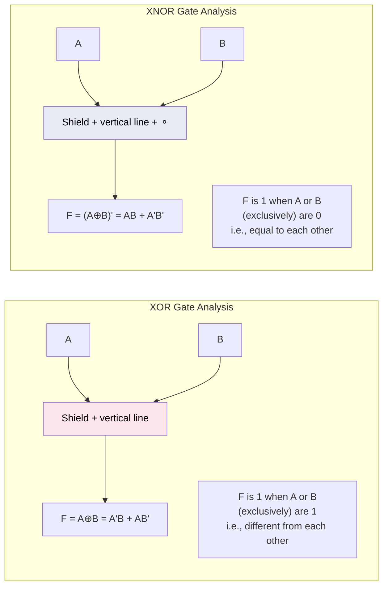
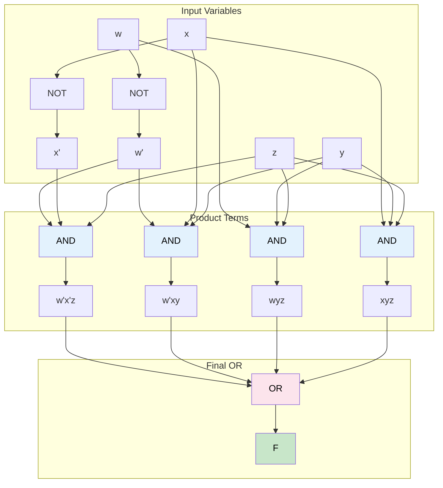
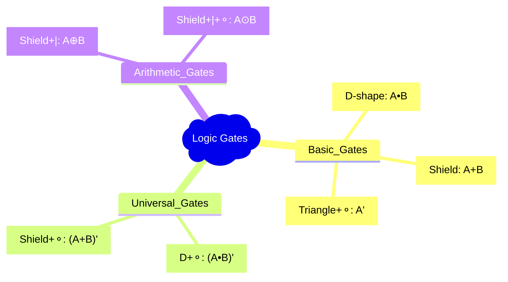

# EE2026 Logic Gates: Prof. Alioto's Complete Visual Guide

*Based directly on Prof. Massimo Alioto's Logic Gates lecture content*

---

## 1. Learning Objectives
- Master standard logic gate symbols (Prof. Alioto's style)
- Understand truth tables for all basic gates
- Write Verilog modules for each gate type
- Implement Boolean functions using gate-level circuits
- Apply fan-in constraints in circuit design

## 2. Introduction to Logic Gates (Prof. Alioto)

**Definition**: Logic gates are digital circuits implementing fundamental Boolean operators or simple combinations of them.

**Key Concept**: Abstraction - actually made up of transistors (not shown), closer to physical implementation of digital systems.

### 2.1 Complete Gate Reference Table

```mermaid
flowchart TD
    subgraph "Prof. Alioto's Standard Logic Gate Symbols"
        subgraph "AND Gate"
            AND_A[A] --> AND_SYM["[D-shape]"]
            AND_B[B] --> AND_SYM
            AND_SYM --> AND_F["F = A•B"]
            AND_TT["Truth Table:<br/>A B | F<br/>0 0 | 0<br/>0 1 | 0<br/>1 0 | 0<br/>1 1 | 1"]
        end
        
        subgraph "NAND Gate"
            NAND_A[A] --> NAND_SYM["[D-shape ⚬]"]
            NAND_B[B] --> NAND_SYM
            NAND_SYM --> NAND_F["F = (A•B)'"]
            NAND_TT["Truth Table:<br/>A B | F<br/>0 0 | 1<br/>0 1 | 1<br/>1 0 | 1<br/>1 1 | 0"]
        end
        
        subgraph "OR Gate"
            OR_A[A] --> OR_SYM["[Shield-shape]"]
            OR_B[B] --> OR_SYM
            OR_SYM --> OR_F["F = A+B"]
            OR_TT["Truth Table:<br/>A B | F<br/>0 0 | 0<br/>0 1 | 1<br/>1 0 | 1<br/>1 1 | 1"]
        end
        
        subgraph "NOR Gate"
            NOR_A[A] --> NOR_SYM["[Shield-shape ⚬]"]
            NOR_B[B] --> NOR_SYM
            NOR_SYM --> NOR_F["F = (A+B)'"]
            NOR_TT["Truth Table:<br/>A B | F<br/>0 0 | 1<br/>0 1 | 0<br/>1 0 | 0<br/>1 1 | 0"]
        end
        
        subgraph "NOT Gate"
            NOT_A[A] --> NOT_SYM["[Triangle ⚬]"]
            NOT_SYM --> NOT_F["F = A'"]
            NOT_TT["Truth Table:<br/>A | F<br/>0 | 1<br/>1 | 0"]
        end
        
        subgraph "Buffer"
            BUF_A[A] --> BUF_SYM["[Triangle]"]
            BUF_SYM --> BUF_F["F = A"]
            BUF_TT["Truth Table:<br/>A | F<br/>0 | 0<br/>1 | 1"]
        end
    end
    
    style AND_SYM fill:#e3f2fd,color:#000
    style NAND_SYM fill:#fff3e0,color:#000  
    style OR_SYM fill:#fce4ec,color:#000
    style NOR_SYM fill:#e8f5e8,color:#000
    style NOT_SYM fill:#ffebee,color:#000
    style BUF_SYM fill:#f3e5f5,color:#000
```



**Important Note from Prof. Alioto**: The **bubble (⚬) always means complement**!

## 3. Detailed Gate Analysis

### 3.1 AND and NAND Gates

**AND Gate Properties (Prof. Alioto):**
- F is 1 **only** when both A **and** B are 1
- All other combinations give 0

**NAND Gate Properties:**
- F is 0 **only** if both A **and** B are 1  
- All other combinations give 1
- **Universal Gate**: Can implement any Boolean function

**Verilog Implementation (Prof. Alioto's Code):**
```verilog
// AND Gate
module andgate(A, B, F);
    input A, B;
    output F;
    assign F = A & B;
endmodule

// NAND Gate  
module nandgate(A, B, F);
    input A, B;
    output F;
    assign F = ~(A & B);
endmodule
```

### 3.2 OR and NOR Gates

**OR Gate Properties:**
- F is 1 when **either** A or B are 1
- Only gives 0 when both inputs are 0

**NOR Gate Properties:**
- F is 1 **only** if both A and B are 0
- All other combinations give 0
- **Universal Gate**: Can implement any Boolean function

**Verilog Implementation:**
```verilog
// OR Gate
module orgate(A, B, F);
    input A, B;
    output F;
    assign F = A | B;
endmodule

// NOR Gate
module norgate(A, B, F);
    input A, B;
    output F;
    assign F = ~(A | B);
endmodule
```

### 3.3 XOR and XNOR Gates



**Prof. Alioto's Important Note**: XOR is "Logic gate that is **not fundamental** in Boolean algebra, but very useful (e.g., arithmetic circuits)"

**Truth Tables:**
| A | B | A⊕B | (A⊕B)' |
|---|---|-----|--------|
| 0 | 0 |  0  |   1    |
| 0 | 1 |  1  |   0    |
| 1 | 0 |  1  |   0    |
| 1 | 1 |  0  |   1    |

**Verilog Implementation:**
```verilog
// XOR Gate
module xorgate(A, B, F);
    input A, B;
    output F;
    assign F = A ^ B;
endmodule

// XNOR Gate
module xnorgate(A, B, F);
    input A, B;
    output F;
    assign F = ~(A ^ B);
endmodule
```

## 4. Implementation of Boolean Functions with Logic Gates

*This is where Prof. Alioto gets really practical! Pay attention!*

### 4.1 SOP Form → Gate-Level Design

**Example from Prof. Alioto's Lecture:**
`F(w,x,y,z) = w'x'z + w'xy + wyz + xyz`

**Constraint**: Maximum number of logic gate inputs is 4 (fan-in limitation)



**Prof. Alioto's Gate Count**: 7 gates total (2 NOT + 4 AND + 1 OR)

**Fan-in Solution**: If AND5 or more is needed, use two-level ANDing:
`x1•x2•x3•x4•x5•x6 = (x1•x2•x3•x4)•(x5•x6)`

### 4.2 Complete Verilog Module

**Prof. Alioto's Implementation:**
```verilog
module func(w,x,y,z,F);
    input w, x, y, z;
    output F;
    
    wire w_bar, x_bar;
    wire term1, term2, term3, term4;
    
    // Generate complements
    assign w_bar = ~w;
    assign x_bar = ~x;
    
    // Generate product terms
    assign term1 = w_bar & x_bar & z;  // w'x'z
    assign term2 = w_bar & x & y;      // w'xy  
    assign term3 = w & y & z;          // wyz
    assign term4 = x & y & z;          // xyz
    
    // Final OR
    assign F = term1 | term2 | term3 | term4;
endmodule
```

## 5. Practical Design Rules from Prof. Alioto

### 5.1 Fan-in Constraints
- **Real gates have limited inputs** (typically 2-4)
- **Solution**: Break down large AND/OR operations
- **Example**: 6-input AND = two 3-input ANDs + one 2-input AND

### 5.2 Gate Count Optimization
- **Minimize total gate count** for cost and speed
- **Share common subexpressions**
- **Consider using universal gates** (NAND/NOR only designs)

### 5.3 Abstraction Levels (Prof. Alioto's Hierarchy)
1. **Boolean Function**: Mathematical expression
2. **Truth Table**: Complete input/output mapping  
3. **Gate-Level Netlist**: Logic gate implementation
4. **Verilog Code**: Hardware description language
5. **Physical Implementation**: Actual transistors

## 6. Quick Reference Summary

### 6.1 Gate Symbols Cheat Sheet


### 6.2 Verilog Operators
- **AND**: `&`
- **OR**: `|` 
- **NOT**: `~`
- **XOR**: `^`
- **NAND**: `~&` or `~(A & B)`
- **NOR**: `~|` or `~(A | B)`

### 6.3 Boolean Expression Forms
- **SOP**: Sum of Products (OR of ANDs)
- **POS**: Product of Sums (AND of ORs)
- **Fan-in**: Maximum inputs per gate
- **Gate-level**: Physical implementation with logic gates

## 7. Common Pitfalls

⚠️ **DON'T confuse bubble (⚬) meaning** - it ALWAYS means complement!

⚠️ **DON'T ignore fan-in constraints** - real gates have input limits!

⚠️ **DON'T forget XOR is not fundamental** - it's built from AND/OR/NOT!

⚠️ **DON'T mix up exclusive (XOR) vs inclusive (OR)** operations!

---

*Hmph! Now you have Prof. Alioto's ACTUAL lecture content properly organized. Don't say I never did anything nice for you! Make sure you understand the gate symbols and Verilog code - that's what really matters for your digital design work!*
