# EE2026 Week 2: Boolean Algebra & Logic Gates - Complete Visual Guide
*Based on Prof. Massimo Alioto's Lectures*

## 1. Learning Objectives
- Master Boolean algebra postulates and theorems
- Understand all fundamental logic gates and their truth tables
- Apply algebraic manipulations for function simplification
- Convert between Boolean expressions, truth tables, and gate implementations
- Use bubble pushing rules for gate transformations
- Implement circuits with gate-level netlists and Verilog

## 2. Key Terminology & Definitions

**Boolean Algebra**: Mathematical system developed by George Boole (1854) and formalized by Huntington (1904) for analyzing digital circuits using binary values (0 and 1)

**Logic Gate**: Electronic circuit implementing Boolean operations, built from transistors but abstracted for design purposes

**Truth Table**: Complete specification showing all possible input combinations and corresponding outputs

**Combinational Logic**: Circuit where outputs depend only on current inputs (no memory/feedback)

**SOP (Sum of Products)**: Boolean expression as OR of AND terms (e.g., AB + A'C)

**POS (Product of Sums)**: Boolean expression as AND of OR terms (e.g., (A+B)(A'+C))

**Fan-in**: Maximum number of inputs a logic gate can accept (typically 4 in practice)

## 3. Boolean Algebra Foundations

### 3.1 Huntington's Postulates (1904)

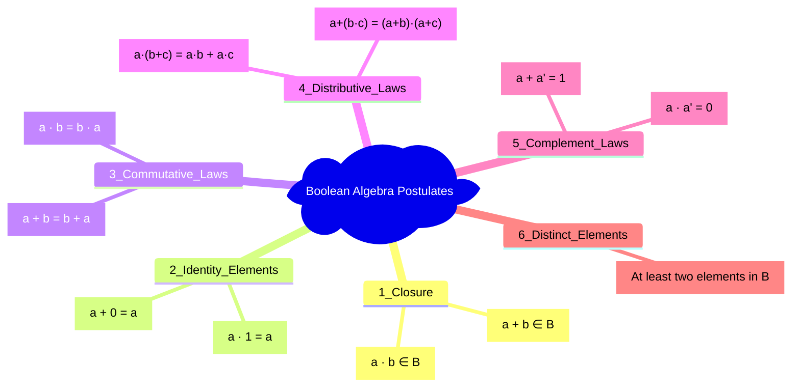

### 3.2 Boolean vs Elementary Algebra

| Boolean Algebra | Elementary Algebra |
|----------------|-------------------|
| `a + a = a` (Idempotent) | `a + a = 2a` |
| `a · a = a` (Idempotent) | `a · a = a²` |  
| `a + (b·c) = (a+b)·(a+c)` | Not valid |
| Variables: only {0,1} | Variables: ℝ |
| Priority: NOT → AND → OR | Exponent → × → + |

## 4. Core Logic Gates with Implementations

### 4.1 Basic Gates

#### AND Gate
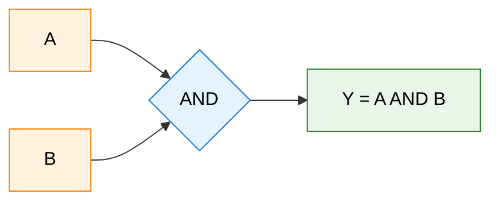

**Truth Table & Verilog:**
| A | B | Y |
|---|---|---|
| 0 | 0 | 0 |
| 0 | 1 | 0 |
| 1 | 0 | 0 |
| 1 | 1 | 1 |

```verilog
module andgate(A, B, F);
    input A, B;
    output F;
    assign F = A & B;
endmodule
```

#### OR Gate
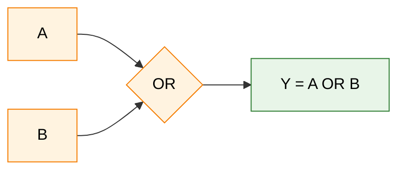

**Truth Table & Verilog:**
| A | B | Y |
|---|---|---|
| 0 | 0 | 0 |
| 0 | 1 | 1 |
| 1 | 0 | 1 |
| 1 | 1 | 1 |

```verilog
module orgate(A, B, F);
    input A, B;
    output F;
    assign F = A | B;
endmodule
```

#### NOT Gate (Inverter)
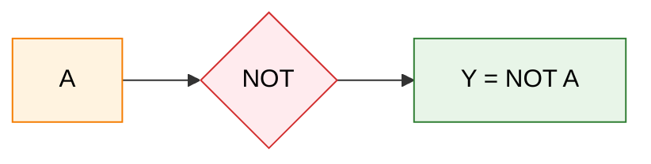

### 4.2 Compound Gates

#### NAND Gate (Universal Gate)
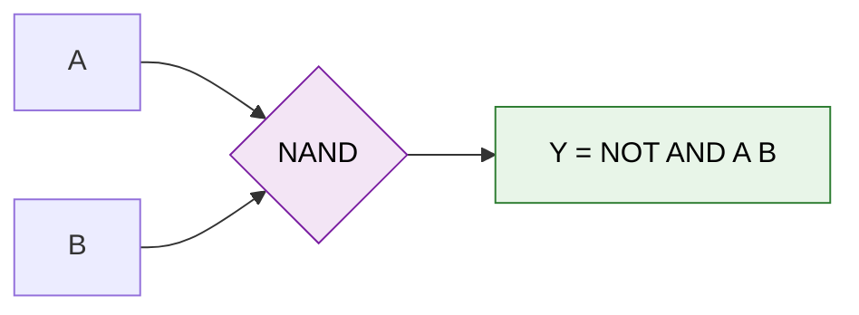

**Truth Table & Verilog:**
| A | B | Y |
|---|---|---|
| 0 | 0 | 1 |
| 0 | 1 | 1 |
| 1 | 0 | 1 |
| 1 | 1 | 0 |

```verilog
module nandgate(A, B, F);
    input A, B;
    output F;
    assign F = ~(A & B);
endmodule
```

#### XOR Gate (Exclusive OR)
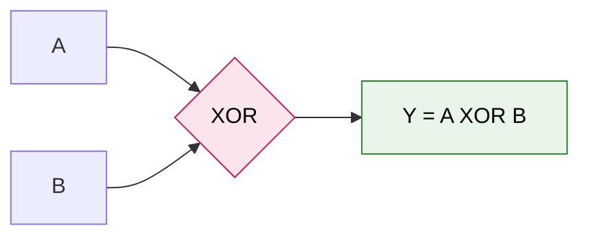

**Key Properties:**
- **Different Detection**: Outputs 1 when inputs are different
- **Useful for**: Arithmetic circuits, parity checking, comparisons
- **Expression**: `F = A'B + AB' = A ⊕ B`

## 5. Boolean Algebra Theorems with Proofs

### 5.1 Essential Theorems
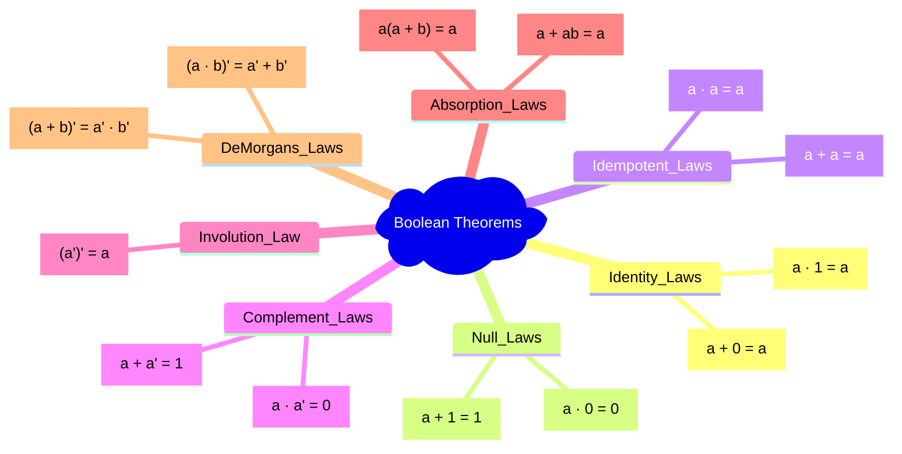

### 5.2 De Morgan's Laws - Memory Aid
**"Break the line, change the sign"**

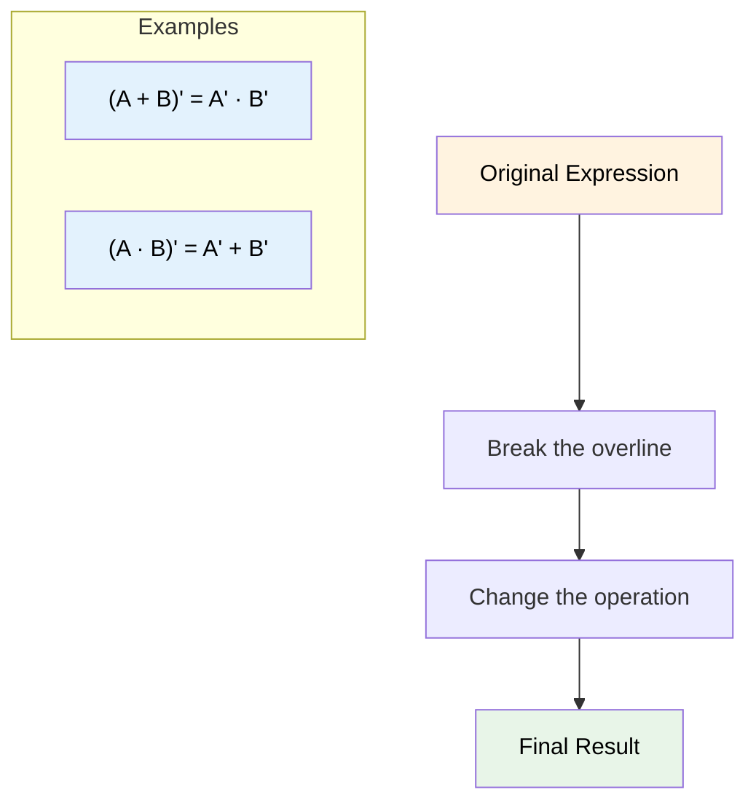

## 6. Worked Examples from Lecture

### Example 1: Algebraic Simplification
**Problem**: `F(a,b,c,d) = a'b'c' + a'bc'd' + a'bc'd`

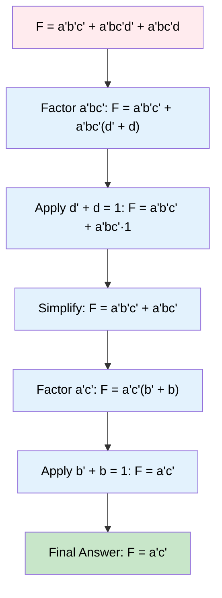

**Gate Count Reduction**: 8 gates → 3 gates (62.5% reduction!)

### Example 2: Consensus Theorem Application
**Problem**: `F(w,x,y,z) = w'xz + w'yz + xyz + wyz`

**Solution Steps:**
1. **Factor common terms**: `F = w'z(x + y) + yz(x + w)`
2. **Apply consensus theorem**: `AB + A'C + BC = AB + A'C`
3. **Simplify**: `F = w'z + wyx`

**Result**: 7 gates → 4 gates (43% reduction)

## 7. Gate Implementation Examples

### 7.1 SOP Implementation with Fan-in Constraints
**Function**: `F(w,x,y,z) = w'x'z + w'xy + wyz + xyz`
**Constraint**: Maximum 4 inputs per gate

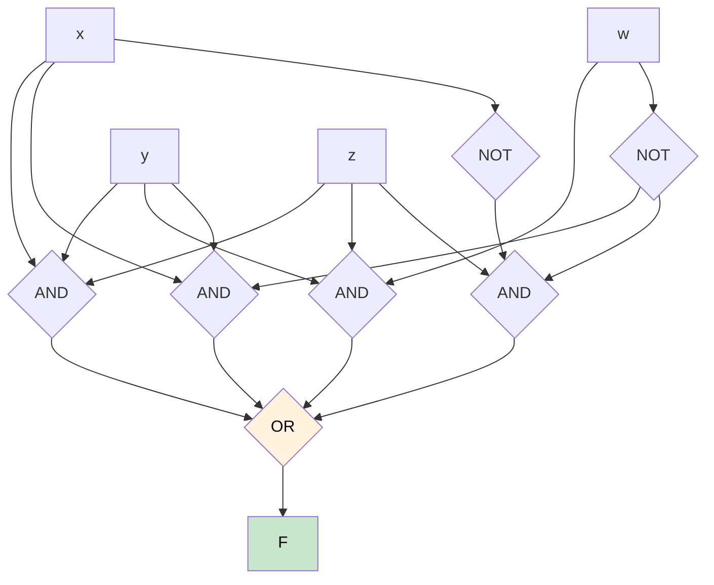

### 7.2 POS Implementation
**Function**: `F(a,b,c) = (a + b + c')(a + c)(a' + b' + c)(a + b' + c')`

**Verilog Implementation:**
```verilog
module func(a,b,c,F);
    input a, b, c;
    output F;
    assign F = (a | b | ~c) & (a | c) & (~a | ~b | c) & (a | ~b | ~c);
endmodule
```

## 3. Core Logic Gates with Visual Diagrams

### 3.1 Basic Gates

#### AND Gate
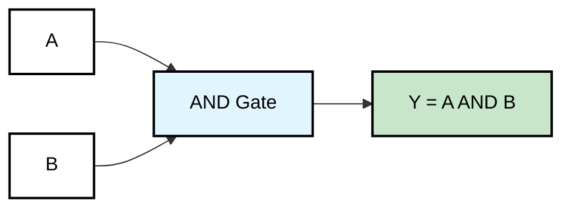

**Truth Table:**
| A | B | Y = A·B |
|---|---|---------|
| 0 | 0 |    0    |
| 0 | 1 |    0    |
| 1 | 0 |    0    |
| 1 | 1 |    1    |

**Symbol:** AND gate outputs 1 only when ALL inputs are 1

#### OR Gate
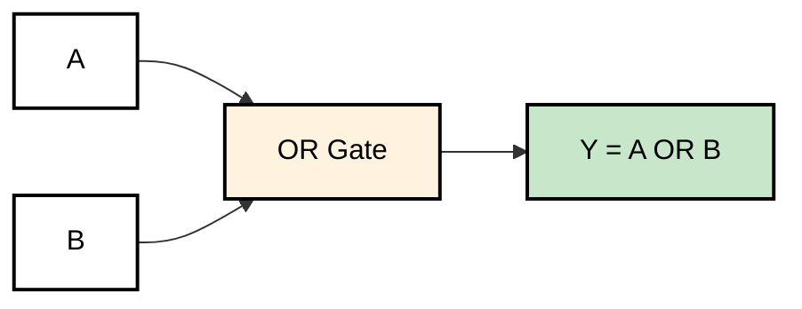

**Truth Table:**
| A | B | Y = A+B |
|---|---|---------|
| 0 | 0 |    0    |
| 0 | 1 |    1    |
| 1 | 0 |    1    |
| 1 | 1 |    1    |

**Symbol:** OR gate outputs 1 when ANY input is 1

#### NOT Gate (Inverter)
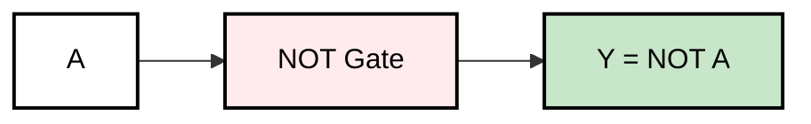

**Truth Table:**
| A | Y = A' |
|---|--------|
| 0 |   1    |
| 1 |   0    |

**Symbol:** NOT gate inverts the input

### 3.2 Compound Gates

#### NAND Gate (Universal Gate)
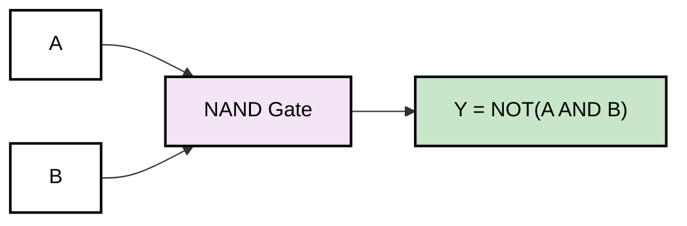

**Truth Table:**
| A | B | Y = (A·B)' |
|---|---|------------|
| 0 | 0 |     1      |
| 0 | 1 |     1      |
| 1 | 0 |     1      |
| 1 | 1 |     0      |

**Key Point:** NAND is universal - can implement ANY Boolean function!

#### NOR Gate (Universal Gate)
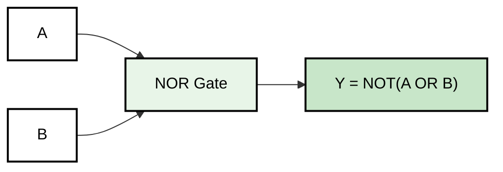

**Truth Table:**
| A | B | Y = (A+B)' |
|---|---|------------|
| 0 | 0 |     1      |
| 0 | 1 |     0      |
| 1 | 0 |     0      |
| 1 | 1 |     0      |

#### XOR Gate (Exclusive OR)
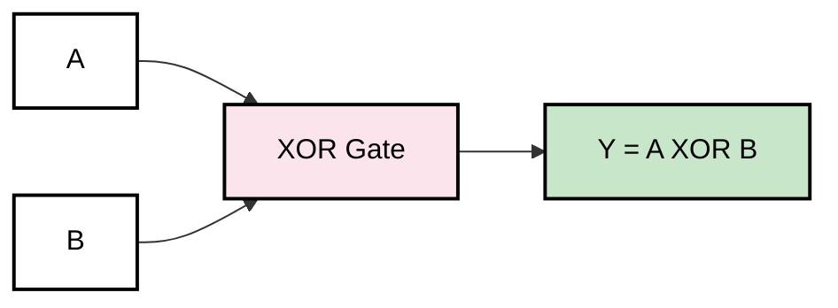

**Truth Table:**
| A | B | Y = A⊕B |
|---|---|---------|
| 0 | 0 |    0    |
| 0 | 1 |    1    |
| 1 | 0 |    1    |
| 1 | 1 |    0    |

**Usage:** XOR outputs 1 when inputs are DIFFERENT

## 4. Boolean Algebra Laws - Visual Representation

### 4.1 Basic Laws
```mermaid
mindmap
  root)Boolean Laws(
    Identity Laws
      A + 0 = A
      A · 1 = A
    Null Laws
      A + 1 = 1
      A · 0 = 0
    Idempotent Laws
      A + A = A
      A · A = A
    Complement Laws
      A + A' = 1
      A · A' = 0
    Involution Law
      (A')' = A
```

### 4.2 Advanced Laws
```mermaid
mindmap
  root)Advanced Laws(
    Commutative
      A + B = B + A
      A · B = B · A
    Associative
      A+(B+C) = (A+B)+C
      A·(B·C) = (A·B)·C
    Distributive
      A·(B+C) = A·B + A·C
      A+(B·C) = (A+B)·(A+C)
    DeMorgan's Laws
      (A+B)' = A'·B'
      (A·B)' = A'+B'
```

## 5. Worked Examples with Circuit Diagrams

### Example 1: Simplify F = A·B + A·B' + A'·B

**Step-by-step Visual Simplification:**

```mermaid
graph TD
    Start[F = A·B + A·B' + A'·B] --> Step1
    Step1[Factor out A: F = A(B + B') + A'·B] --> Step2
    Step2[Apply B + B' = 1: F = A·1 + A'·B] --> Step3
    Step3[Apply Identity: F = A + A'·B] --> Step4
    Step4[Apply Absorption: F = A + B] --> Final[Final Answer: F = A + B]
    
    style Start fill:#ffebee
    style Final fill:#c8e6c9
```

**Circuit Representation:**
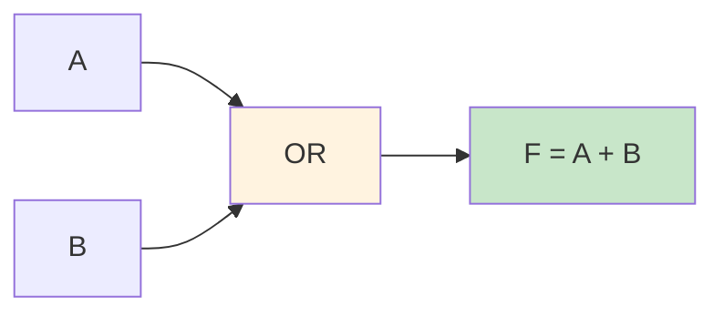

### Example 2: Implement F = (A + B)·(A' + C) using NAND gates only

**Original Circuit:**
```mermaid
graph TD
    A[A] --> OR1[OR]
    B[B] --> OR1
    A --> NOT1[NOT]
    NOT1 --> OR2[OR]
    C[C] --> OR2
    OR1 --> AND1[AND]
    OR2 --> AND1
    AND1 --> F[F]
    
    style OR1 fill:#fff3e0
    style OR2 fill:#fff3e0
    style AND1 fill:#e1f5fe
    style F fill:#c8e6c9
```

**NAND-only Implementation:**
Apply De Morgan's: (A + B) = (A'·B')'

```mermaid
graph TD
    A[A] --> NAND1[NAND]
    A --> NAND1
    NAND1 --> NAND3[NAND]
    
    B[B] --> NAND2[NAND]
    B --> NAND2
    NAND2 --> NAND3
    
    A --> NAND4[NAND]
    A --> NAND4
    NAND4 --> NAND6[NAND]
    
    C[C] --> NAND5[NAND]
    C --> NAND5
    NAND5 --> NAND6
    
    NAND3 --> NAND7[NAND]
    NAND6 --> NAND7
    NAND7 --> F[F]
    
    style F fill:#c8e6c9
```

## 6. Truth Table to Logic Circuit Conversion

### Example: 3-Input Majority Voter
**Problem:** Output 1 when majority of inputs are 1

**Truth Table:**
| A | B | C | F |
|---|---|---|---|
| 0 | 0 | 0 | 0 |
| 0 | 0 | 1 | 0 |
| 0 | 1 | 0 | 0 |
| 0 | 1 | 1 | 1 |
| 1 | 0 | 0 | 0 |
| 1 | 0 | 1 | 1 |
| 1 | 1 | 0 | 1 |
| 1 | 1 | 1 | 1 |

**Sum of Products (SOP):** F = A'BC + AB'C + ABC' + ABC

**Simplified:** F = BC + AC + AB

**Circuit Implementation:**
```mermaid
graph TD
    A[A] --> AND1[AND]
    B[B] --> AND1
    AND1 --> OR1[OR]
    
    A[A] --> AND2[AND]
    C[C] --> AND2
    AND2 --> OR1
    
    B[B] --> AND3[AND]
    C[C] --> AND3
    AND3 --> OR1
    
    OR1 --> F[F = Majority Vote]
    
    style AND1 fill:#e1f5fe
    style AND2 fill:#e1f5fe
    style AND3 fill:#e1f5fe
    style OR1 fill:#fff3e0
    style F fill:#c8e6c9
```

## 7. Karnaugh Maps (K-Maps) - Visual Simplification

### 3-Variable K-Map Template
```mermaid
graph TD
    subgraph "K-Map for F(A,B,C)"
        K00[A'B'C': 0]
        K01[A'B'C: 1]
        K11[A'BC: 3]
        K10[A'BC': 2]
        K20[AB'C': 4]
        K21[AB'C: 5]
        K31[ABC: 7]
        K30[ABC': 6]
    end
    
    style K00 fill:#ffebee
    style K01 fill:#ffebee
    style K11 fill:#ffebee
    style K10 fill:#ffebee
    style K20 fill:#ffebee
    style K21 fill:#ffebee
    style K31 fill:#ffebee
    style K30 fill:#ffebee
```

### K-Map Grouping Rules
```mermaid
mindmap
  root)K-Map Rules(
    Group Sizes
      Must be powers of 2
      1, 2, 4, 8 cells
    Adjacency
      Horizontal neighbors
      Vertical neighbors
      Wrap-around edges
    Optimization
      Largest groups first
      Minimal terms
      Cover all 1s
```

## 8. Applications & Real-World Examples

### 8.1 Digital Security System
**Scenario:** Vault opens when Manager AND (Day OR Emergency)

```mermaid
graph LR
    Manager[Manager Key] --> AND1[AND]
    Day[Day Sensor] --> OR1[OR]
    Emergency[Emergency Override] --> OR1
    OR1 --> AND1
    AND1 --> Vault[Vault Opens]
    
    style AND1 fill:#e1f5fe
    style OR1 fill:#fff3e0
    style Vault fill:#c8e6c9
```

**Boolean Expression:** Vault = Manager · (Day + Emergency)

### 8.2 Traffic Light Controller
**Scenario:** Green light when no pedestrians AND (timer ready OR manual override)

```mermaid
graph TD
    Pedestrian[Pedestrian Button] --> NOT1[NOT]
    NOT1 --> AND1[AND]
    Timer[Timer Ready] --> OR1[OR]
    Manual[Manual Override] --> OR1
    OR1 --> AND1
    AND1 --> Green[Green Light]
    
    style NOT1 fill:#ffebee
    style AND1 fill:#e1f5fe
    style OR1 fill:#fff3e0
    style Green fill:#c8e6c9
```

## 9. Common Pitfalls & How to Avoid Them

### 9.1 De Morgan's Law Confusion
```mermaid
graph TD
    Wrong[❌ (A+B)' = A'+B'] --> Correct[✅ (A+B)' = A'·B']
    Wrong2[❌ (A·B)' = A'·B'] --> Correct2[✅ (A·B)' = A'+B']
    
    style Wrong fill:#ffcdd2
    style Wrong2 fill:#ffcdd2
    style Correct fill:#c8e6c9
    style Correct2 fill:#c8e6c9
```

**Memory Aid:** "Break the line, change the sign"

### 9.2 Gate Symbol Recognition
```mermaid
graph LR
    subgraph "Correct Symbols"
        AND_Good[AND: D-shape]
        OR_Good[OR: Arrow-shape]
        NOT_Good[NOT: Triangle with bubble]
    end
    
    style AND_Good fill:#c8e6c9
    style OR_Good fill:#c8e6c9
    style NOT_Good fill:#c8e6c9
```

## 10. Practice Problems with Visual Solutions

### Problem 1: Simplify F = AB + AB' + A'B
```mermaid
graph TD
    Problem[F = AB + AB' + A'B] --> Solution1[Factor A: F = A(B + B') + A'B]
    Solution1 --> Solution2[F = A·1 + A'B]
    Solution2 --> Solution3[F = A + A'B]
    Solution3 --> Final[F = A + B by Absorption Law]
    
    style Problem fill:#fff3e0
    style Final fill:#c8e6c9
```

### Problem 2: Convert to NAND-only
**Given:** F = A + BC

**Step 1:** Apply De Morgan's twice
F = ((A + BC)')'  = ((A)' · (BC)')'

**NAND Circuit:**
```mermaid
graph TD
    A[A] --> NAND1[NAND]
    A --> NAND1
    
    B[B] --> NAND2[NAND]
    C[C] --> NAND2
    
    NAND1 --> NAND3[NAND]
    NAND2 --> NAND3
    NAND3 --> F[F]
    
    style F fill:#c8e6c9
```

## 11. Quick Reference Summary

### Essential Formulas
```mermaid
mindmap
  root)Quick Reference(
    Basic Operations
      AND: A·B
      OR: A+B
      NOT: A'
    De Morgan's
      (A+B)' = A'·B'
      (A·B)' = A'+B'
    Simplification
      A+AB = A
      A(A+B) = A
      A+A'B = A+B
    Universal Gates
      NAND can do everything
      NOR can do everything
```

### Gate Count for Implementation
| Function | Direct | NAND-only | NOR-only |
|----------|--------|-----------|----------|
| AND      | 1      | 2         | 3        |
| OR       | 1      | 3         | 2        |
| NOT      | 1      | 1         | 1        |

## 12. Review Questions

1. **What is the output of (A⊕B)·(A+B) when A=1, B=0?**
2. **Simplify: F = A'B'C + A'BC + AB'C + ABC**
3. **Convert F = A + B'C to use only NAND gates**
4. **Draw the K-map for F(A,B,C) = Σ(1,3,5,7)**
5. **Design a circuit that outputs 1 when exactly two of three inputs are 1**

---

*This visual guide uses Mermaid diagrams that render interactively in VS Code with the Markdown Preview Enhanced extension. Each diagram is clickable and helps visualize the logic flow!*
