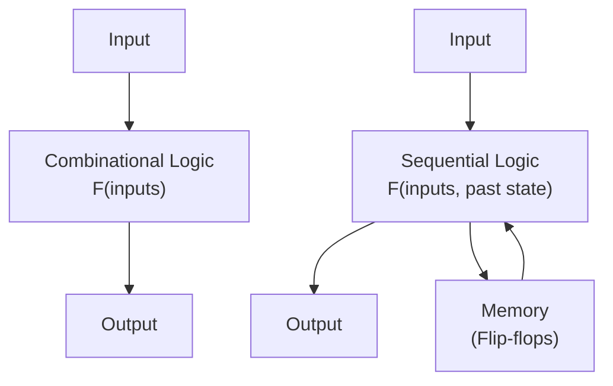

# EE2026 Digital Design - Comprehensive Notes: Combinational Logic & Building Blocks

## Table of Contents
1. [Fundamentals](#fundamentals)
2. [Verilog Coding Styles](#verilog-coding-styles)
3. [Combinational Building Blocks](#combinational-building-blocks)
4. [Advanced Topics](#advanced-topics)
5. [Design Examples & Best Practices](#design-examples--best-practices)

---

## Fundamentals

### Combinational vs Sequential Logic

**Combinational Logic:**
- Output depends **only** on current inputs
- No memory elements
- Output changes immediately when inputs change (ignoring gate delays)
- Examples: Gates, adders, multiplexers, decoders

**Sequential Logic:**
- Output depends on **current inputs AND past inputs** (state)
- Contains memory elements (flip-flops, registers)
- Output can change based on clock signals or state transitions
- Examples: Counters, state machines, memory



**Key Insight:** Understanding this distinction is crucial because it determines:
- What Verilog constructs to use (`assign` vs `always` with clock)
- How the circuit behaves in simulation
- What hardware is synthesized

---

## Verilog Coding Styles

### 1. Continuous Assignment (Dataflow)

**Purpose:** Models combinational logic using `assign` statements.

**Syntax:**
```verilog
assign output_signal = expression;
```

**Key Characteristics:**
- Uses `wire` data type for outputs
- Executes concurrently (order doesn't matter)
- Automatically updates when any input changes
- Cannot be used with `reg` data type

**Example - 2:1 Multiplexer:**
```verilog
module mux21(input s, input [1:0] d, output y);
    assign y = s ? d[1] : d[0];
endmodule
```

**Common Error:**
```verilog
// ❌ WRONG - Cannot assign to reg
module bad_example(input a, b, output reg z);
    assign z = a | b;  // ERROR!
endmodule

// ✅ CORRECT
module good_example(input a, b, output z);
    assign z = a | b;  // Works with wire (default)
endmodule
```

### 2. Procedural Assignment (Behavioral)

**Purpose:** Models combinational logic using `always` blocks with more complex control structures.

**Syntax:**
```verilog
always @(sensitivity_list) begin
    // Sequential statements
end
```

**Key Characteristics:**
- Uses `reg` data type for outputs
- Statements execute sequentially within the block
- Multiple `always` blocks execute concurrently
- Must include ALL inputs in sensitivity list for combinational logic

**Example - 2:1 Multiplexer:**
```verilog
module mux21(input s, input [1:0] d, output reg y);
    always @(s, d) begin  // or always @(*)
        if (s == 1'b0)
            y = d[0];
        else
            y = d[1];
    end
endmodule
```

**Critical Rules for Combinational Logic in always blocks:**
1. **Complete Sensitivity List:** Include ALL inputs that are read
2. **Complete Output Assignment:** Assign output for ALL possible input combinations
3. **Use Blocking Assignments (`=`)** for combinational logic

### 3. Structural Modeling

**Purpose:** Instantiate and connect existing modules/primitives.

**Two Connection Methods:**

**By Position:**
```verilog
module top(input a, b, output y);
    wire intermediate;
    and_gate u1(intermediate, a, b);  // (output, input1, input2)
    not_gate u2(y, intermediate);     // (output, input)
endmodule
```

**By Name (Recommended):**
```verilog
module top(input a, b, output y);
    wire intermediate;
    and_gate u1(.out(intermediate), .in1(a), .in2(b));
    not_gate u2(.out(y), .in(intermediate));
endmodule
```

### Operators Reference

| Category | Operator | Description | Example |
|----------|----------|-------------|---------|
| **Bitwise** | `&`, `|`, `^`, `~` | AND, OR, XOR, NOT | `a & b` |
| **Logical** | `&&`, `||`, `!` | Logical AND, OR, NOT | `a && b` (returns 1-bit) |
| **Reduction** | `&`, `|`, `^` | Reduces vector to single bit | `&a` (AND all bits) |
| **Comparison** | `==`, `!=`, `<`, `>` | Equality, inequality | `a == b` |
| **Arithmetic** | `+`, `-`, `*`, `/`, `%` | Math operations | `a + b` |
| **Shift** | `<<`, `>>` | Left/right shift | `a << 2` |
| **Concatenation** | `{,}` | Join signals | `{a, b}` |
| **Replication** | `{n{}}` | Repeat pattern | `{4{1'b1}}` = `4'b1111` |
| **Conditional** | `?:` | Ternary operator | `sel ? a : b` |

**Examples with a = 4'b1010, b = 4'b0110:**
```verilog
// Bitwise operations
a & b    // 4'b0010 (bit-by-bit AND)
a | b    // 4'b1110 (bit-by-bit OR)
a ^ b    // 4'b1100 (bit-by-bit XOR)

// Logical operations  
a && b   // 1'b1 (both non-zero)
!a       // 1'b0 (a is non-zero)

// Reduction operations
&a       // 1'b0 (not all bits are 1)
|a       // 1'b1 (at least one bit is 1)
^a       // 1'b0 (even number of 1s)

// Concatenation and replication
{a, b}      // 8'b10100110
{2{a}}      // 8'b10101010
```

### Control Flow Statements

**if-else (Priority Logic):**
```verilog
always @(*) begin
    if (condition1)
        output = value1;
    else if (condition2)
        output = value2;
    else
        output = default_value;
end
```

**case (Parallel Logic):**
```verilog
always @(*) begin
    case (select)
        2'b00: output = input0;
        2'b01: output = input1;
        2'b10: output = input2;
        2'b11: output = input3;
        default: output = 1'b0;
    endcase
end
```

**Key Difference:**
- `if-else`: Creates priority logic (more complex hardware)
- `case`: Creates parallel logic (simpler hardware when conditions are mutually exclusive)

---

## Combinational Building Blocks

### 1. Binary Adders

#### Half Adder
**Function:** Adds two 1-bit numbers without carry input.

**Truth Table:**
| A | B | Sum | Carry |
|---|---|-----|-------|
| 0 | 0 |  0  |   0   |
| 0 | 1 |  1  |   0   |
| 1 | 0 |  1  |   0   |
| 1 | 1 |  0  |   1   |

**Boolean Equations:**
- Sum = A ⊕ B
- Carry = A · B

**Verilog Implementation:**
```verilog
module half_adder(input A, B, output Sum, Carry);
    assign Sum = A ^ B;
    assign Carry = A & B;
endmodule
```

#### Full Adder
**Function:** Adds two 1-bit numbers with carry input.

**Truth Table:**
| A | B | Cin | Sum | Cout |
|---|---|-----|-----|------|
| 0 | 0 |  0  |  0  |  0   |
| 0 | 0 |  1  |  1  |  0   |
| 0 | 1 |  0  |  1  |  0   |
| 0 | 1 |  1  |  0  |  1   |
| 1 | 0 |  0  |  1  |  0   |
| 1 | 0 |  1  |  0  |  1   |
| 1 | 1 |  0  |  0  |  1   |
| 1 | 1 |  1  |  1  |  1   |

**Boolean Equations:**
- Sum = A ⊕ B ⊕ Cin  
- Cout = AB + Cin(A ⊕ B)

**Verilog Implementation:**
```verilog
module full_adder(input A, B, Cin, output Sum, Cout);
    assign Sum = A ^ B ^ Cin;
    assign Cout = (A & B) | (Cin & (A ^ B));
endmodule
```

#### Ripple Carry Adder
**Function:** Adds two n-bit numbers by cascading full adders.

```verilog
module ripple_carry_adder #(parameter N = 4)(
    input [N-1:0] A, B,
    input Cin,
    output [N-1:0] Sum,
    output Cout
);
    wire [N:0] carry;
    assign carry[0] = Cin;
    assign Cout = carry[N];
    
    genvar i;
    generate
        for (i = 0; i < N; i = i + 1) begin : adder_stage
            full_adder FA(
                .A(A[i]),
                .B(B[i]), 
                .Cin(carry[i]),
                .Sum(Sum[i]),
                .Cout(carry[i+1])
            );
        end
    endgenerate
endmodule
```

**Timing Analysis:**
- Critical path: Carry propagation through all stages
- Delay = N × (Full Adder Delay)
- Alternative: Carry Look-Ahead Adders (faster but more complex)

### 2. Magnitude Comparator

**Function:** Compares two n-bit numbers and outputs relationship.

**Simple Implementation:**
```verilog
module magnitude_comparator #(parameter N = 4)(
    input [N-1:0] A, B,
    output A_greater_B,
    output A_equal_B, 
    output A_less_B
);
    assign A_greater_B = (A > B);
    assign A_equal_B = (A == B);
    assign A_less_B = (A < B);
    
    // Alternative to save hardware:
    // assign A_less_B = ~A_greater_B & ~A_equal_B;
endmodule
```

### 3. Decoders

**Function:** Converts n-bit input to 2^n outputs (only one output active).

**2-to-4 Decoder with Enable:**
```verilog
module decoder_2to4(
    input [1:0] A,
    input E,
    output [3:0] Z
);
    assign Z = E ? (4'b0001 << A) : 4'b0000;
    
    // Alternative implementation:
    // assign Z[0] = E & ~A[1] & ~A[0];
    // assign Z[1] = E & ~A[1] &  A[0];
    // assign Z[2] = E &  A[1] & ~A[0];
    // assign Z[3] = E &  A[1] &  A[0];
endmodule
```

**Parameterized Decoder:**
```verilog
module decoder #(parameter N = 2)(
    input [N-1:0] A,
    input E,
    output [(1<<N)-1:0] Z
);
    assign Z = E ? (1 << A) : {(1<<N){1'b0}};
endmodule
```

**BCD to 7-Segment Decoder:**
```verilog
module bcd_to_7seg(
    input [3:0] bcd,
    output reg [6:0] seg  // segments a-g
);
    always @(*) begin
        case (bcd)
            4'h0: seg = 7'b1111110;  // 0
            4'h1: seg = 7'b0110000;  // 1
            4'h2: seg = 7'b1101101;  // 2
            4'h3: seg = 7'b1111001;  // 3
            4'h4: seg = 7'b0110011;  // 4
            4'h5: seg = 7'b1011011;  // 5
            4'h6: seg = 7'b1011111;  // 6
            4'h7: seg = 7'b1110000;  // 7
            4'h8: seg = 7'b1111111;  // 8
            4'h9: seg = 7'b1111011;  // 9
            default: seg = 7'b0000000;  // blank
        endcase
    end
endmodule
```

### 4. Encoders

**Function:** Converts 2^n inputs to n-bit output (inverse of decoder).

**8-to-3 Priority Encoder:**
```verilog
module priority_encoder_8to3(
    input [7:0] I,
    output reg [2:0] Y,
    output reg valid
);
    always @(*) begin
        casez (I)  // casez treats 'z' as don't care
            8'b1???????: begin Y = 3'd7; valid = 1'b1; end
            8'b01??????: begin Y = 3'd6; valid = 1'b1; end
            8'b001?????: begin Y = 3'd5; valid = 1'b1; end
            8'b0001????: begin Y = 3'd4; valid = 1'b1; end
            8'b00001???: begin Y = 3'd3; valid = 1'b1; end
            8'b000001??: begin Y = 3'd2; valid = 1'b1; end
            8'b0000001?: begin Y = 3'd1; valid = 1'b1; end
            8'b00000001: begin Y = 3'd0; valid = 1'b1; end
            default:     begin Y = 3'd0; valid = 1'b0; end
        endcase
    end
endmodule
```

### 5. Multiplexers

**Function:** Selects one of 2^n inputs based on n select lines.

**4-to-1 Multiplexer:**
```verilog
module mux_4to1 #(parameter WIDTH = 1)(
    input [1:0] sel,
    input [WIDTH-1:0] in0, in1, in2, in3,
    input enable,
    output [WIDTH-1:0] out
);
    assign out = enable ? 
                 (sel[1] ? (sel[0] ? in3 : in2) : 
                          (sel[0] ? in1 : in0)) : 
                 {WIDTH{1'b0}};
endmodule
```

**Structural Implementation using 2:1 MUXes:**
```verilog
module mux_4to1_structural(
    input [1:0] sel,
    input [3:0] data,
    output out
);
    wire out1, out2;
    
    mux_2to1 u1(.sel(sel[0]), .in({data[3], data[2]}), .out(out1));
    mux_2to1 u2(.sel(sel[0]), .in({data[1], data[0]}), .out(out2));
    mux_2to1 u3(.sel(sel[1]), .in({out1, out2}), .out(out));
endmodule

module mux_2to1(input sel, input [1:0] in, output out);
    assign out = sel ? in[1] : in[0];
endmodule
```

### 6. Demultiplexers

**Function:** Routes single input to one of 2^n outputs based on select lines.

**1-to-4 Demultiplexer:**
```verilog
module demux_1to4 #(parameter WIDTH = 1)(
    input [WIDTH-1:0] data_in,
    input [1:0] sel,
    output [WIDTH-1:0] out0, out1, out2, out3
);
    assign out0 = (sel == 2'b00) ? data_in : {WIDTH{1'b0}};
    assign out1 = (sel == 2'b01) ? data_in : {WIDTH{1'b0}};
    assign out2 = (sel == 2'b10) ? data_in : {WIDTH{1'b0}};
    assign out3 = (sel == 2'b11) ? data_in : {WIDTH{1'b0}};
endmodule
```

### 7. Tri-State Logic

**Function:** Allows multiple drivers on the same wire by providing high-impedance state.

**Tri-State Buffer:**
```verilog
module tristate_buffer(
    input data,
    input enable,
    output out
);
    assign out = enable ? data : 1'bz;
endmodule
```

**Tri-State Bus System:**
```verilog
module tristate_bus_system(
    input [7:0] data0, data1, data2, data3,
    input [1:0] select,
    output [7:0] bus
);
    assign bus = (select == 2'b00) ? data0 : 8'bz;
    assign bus = (select == 2'b01) ? data1 : 8'bz;
    assign bus = (select == 2'b10) ? data2 : 8'bz;
    assign bus = (select == 2'b11) ? data3 : 8'bz;
endmodule
```

**Important Note:** Only one driver should be enabled at a time to avoid bus contention.

---

## Advanced Topics

### Parameterized Design

**Benefits:**
- Reusable modules
- Scalable designs
- Reduced code duplication

**Example - Parameterized Adder:**
```verilog
module parameterized_adder #(
    parameter WIDTH = 8,
    parameter STYLE = "RIPPLE"  // "RIPPLE" or "CLA"
)(
    input [WIDTH-1:0] a, b,
    input cin,
    output [WIDTH-1:0] sum,
    output cout
);
    generate
        if (STYLE == "RIPPLE") begin : ripple_impl
            // Ripple carry implementation
            wire [WIDTH:0] carry;
            assign carry[0] = cin;
            assign cout = carry[WIDTH];
            
            genvar i;
            for (i = 0; i < WIDTH; i = i + 1) begin : bit_stage
                assign sum[i] = a[i] ^ b[i] ^ carry[i];
                assign carry[i+1] = (a[i] & b[i]) | (carry[i] & (a[i] ^ b[i]));
            end
        end else begin : cla_impl
            // Carry look-ahead implementation would go here
            assign {cout, sum} = a + b + cin;
        end
    endgenerate
endmodule
```

### Generate Statements

**Purpose:** Create repetitive hardware structures.

**Types:**
1. **Generate for:** Create arrays of instances
2. **Generate if:** Conditional compilation
3. **Generate case:** Multi-way conditional compilation

**Example - Barrel Shifter:**
```verilog
module barrel_shifter #(parameter WIDTH = 8)(
    input [WIDTH-1:0] data_in,
    input [$clog2(WIDTH)-1:0] shift_amount,
    input direction,  // 0=left, 1=right
    output [WIDTH-1:0] data_out
);
    wire [WIDTH-1:0] stage [0:$clog2(WIDTH)];
    assign stage[0] = data_in;
    
    genvar i;
    generate
        for (i = 0; i < $clog2(WIDTH); i = i + 1) begin : shift_stage
            localparam SHIFT_VAL = 1 << i;
            
            assign stage[i+1] = shift_amount[i] ? 
                               (direction ? 
                                {stage[i][SHIFT_VAL-1:0], stage[i][WIDTH-1:SHIFT_VAL]} :  // right
                                {stage[i][WIDTH-SHIFT_VAL-1:0], stage[i][WIDTH-1:WIDTH-SHIFT_VAL]}) : // left
                               stage[i];
        end
    endgenerate
    
    assign data_out = stage[$clog2(WIDTH)];
endmodule
```

---

## Design Examples & Best Practices

### Complete ALU Design

```verilog
module alu #(parameter WIDTH = 8)(
    input [WIDTH-1:0] a, b,
    input [3:0] opcode,
    output reg [WIDTH-1:0] result,
    output zero, carry, negative, overflow
);
    reg [WIDTH:0] temp_result;
    
    always @(*) begin
        case (opcode)
            4'b0000: temp_result = a + b;           // ADD
            4'b0001: temp_result = a - b;           // SUB
            4'b0010: temp_result = {1'b0, a & b};   // AND
            4'b0011: temp_result = {1'b0, a | b};   // OR  
            4'b0100: temp_result = {1'b0, a ^ b};   // XOR
            4'b0101: temp_result = {1'b0, ~a};      // NOT A
            4'b0110: temp_result = {1'b0, a << 1};  // Shift left
            4'b0111: temp_result = {1'b0, a >> 1};  // Shift right
            default: temp_result = {WIDTH+1{1'b0}};
        endcase
    end
    
    assign result = temp_result[WIDTH-1:0];
    assign carry = temp_result[WIDTH];
    assign zero = (result == {WIDTH{1'b0}});
    assign negative = result[WIDTH-1];
    assign overflow = (opcode == 4'b0000) ? 
                     ((a[WIDTH-1] == b[WIDTH-1]) && (result[WIDTH-1] != a[WIDTH-1])) :
                     (opcode == 4'b0001) ?
                     ((a[WIDTH-1] != b[WIDTH-1]) && (result[WIDTH-1] != a[WIDTH-1])) :
                     1'b0;
endmodule
```

### Testbench Best Practices

```verilog
module alu_testbench();
    parameter WIDTH = 8;
    
    // Testbench signals
    reg [WIDTH-1:0] a_tb, b_tb;
    reg [3:0] opcode_tb;
    wire [WIDTH-1:0] result_tb;
    wire zero_tb, carry_tb, negative_tb, overflow_tb;
    
    // Instantiate DUT (Device Under Test)
    alu #(.WIDTH(WIDTH)) dut (
        .a(a_tb),
        .b(b_tb),
        .opcode(opcode_tb),
        .result(result_tb),
        .zero(zero_tb),
        .carry(carry_tb),
        .negative(negative_tb),
        .overflow(overflow_tb)
    );
    
    // Test procedures
    initial begin
        // Initialize
        a_tb = 0; b_tb = 0; opcode_tb = 0;
        #10;
        
        // Test addition
        a_tb = 8'd15; b_tb = 8'd10; opcode_tb = 4'b0000;
        #10;
        $display("ADD: %d + %d = %d, Carry: %b", a_tb, b_tb, result_tb, carry_tb);
        
        // Test overflow
        a_tb = 8'd127; b_tb = 8'd1; opcode_tb = 4'b0000;
        #10;
        $display("Overflow test: %d + %d = %d, Overflow: %b", a_tb, b_tb, result_tb, overflow_tb);
        
        // Test all operations systematically
        for (integer op = 0; op < 8; op = op + 1) begin
            opcode_tb = op;
            a_tb = 8'd50; b_tb = 8'd30;
            #10;
            $display("Op %d: A=%d, B=%d, Result=%d, Flags: Z=%b C=%b N=%b V=%b", 
                    op, a_tb, b_tb, result_tb, zero_tb, carry_tb, negative_tb, overflow_tb);
        end
        
        $finish;
    end
    
    // Monitor changes
    initial begin
        $monitor("Time=%t: A=%d B=%d Op=%d Result=%d", $time, a_tb, b_tb, opcode_tb, result_tb);
    end
endmodule
```

### Common Design Pitfalls and Solutions

**1. Incomplete Sensitivity Lists**
```verilog
// ❌ BAD - Missing 'b' in sensitivity list
always @(a) begin
    y = a & b;  // 'b' changes won't update 'y'
end

// ✅ GOOD - Complete sensitivity list
always @(a, b) begin  // or always @(*)
    y = a & b;
end
```

**2. Incomplete Output Assignments**
```verilog
// ❌ BAD - 'y' not assigned when sel != 0
always @(*) begin
    if (sel == 1'b0)
        y = a;
    // What happens when sel != 0? Latch inferred!
end

// ✅ GOOD - Complete assignment
always @(*) begin
    if (sel == 1'b0)
        y = a;
    else
        y = b;
end
```

**3. Multiple Drivers**
```verilog
// ❌ BAD - Multiple assignments to same signal
assign y = a & b;
assign y = c | d;  // CONFLICT!

// ✅ GOOD - Single assignment
assign y = (a & b) | (c & d);
```

**4. Mixing Blocking and Non-blocking**
```verilog
// ❌ CONFUSING - Mixed assignment types
always @(*) begin
    temp = a & b;    // Blocking
    y <= temp | c;   // Non-blocking (usually for sequential)
end

// ✅ GOOD - Consistent for combinational
always @(*) begin
    temp = a & b;    // All blocking for combinational
    y = temp | c;
end
```

### Design Verification Strategy

**1. Corner Case Testing:**
- All zeros input
- All ones input  
- Maximum values
- Minimum values
- Boundary conditions

**2. Functional Coverage:**
- Test all opcodes/control combinations
- Test all input ranges
- Verify flag generation
- Check timing requirements

**3. Assertion-Based Verification:**
```verilog
// Example assertions (SystemVerilog)
always @(posedge clk) begin
    // ALU should never output X or Z
    assert (^result !== 1'bx) else $error("Result contains X");
    
    // Zero flag should be correct
    assert ((result == 0) == zero) else $error("Zero flag incorrect");
    
    // Overflow conditions
    if (opcode == ADD && a[WIDTH-1] == b[WIDTH-1])
        assert ((result[WIDTH-1] != a[WIDTH-1]) == overflow) 
               else $error("Overflow flag incorrect for addition");
end
```

### Performance Optimization Tips

**1. Minimize Logic Depth:**
```verilog
// ❌ SLOW - Deep logic chain
assign y = ((((a & b) | c) ^ d) & e) | f;

// ✅ FASTER - Balanced tree structure
wire temp1, temp2;
assign temp1 = (a & b) | c;
assign temp2 = (temp1 ^ d) & e;
assign y = temp2 | f;
```

**2. Use Carry-Save Architecture for Multiple Additions:**
```verilog
// For adding multiple numbers, carry-save is faster than ripple
module three_input_adder(
    input [7:0] a, b, c,
    output [9:0] sum
);
    wire [7:0] carry, partial_sum;
    
    // First stage: reduce 3 inputs to 2
    assign partial_sum = a ^ b ^ c;
    assign carry = ((a & b) | (b & c) | (a & c)) << 1;
    
    // Second stage: add the two results
    assign sum = partial_sum + carry;
endmodule
```

**3. Pipeline Complex Operations:**
```verilog
// Break complex combinational logic into pipeline stages
module pipelined_multiply(
    input clk,
    input [15:0] a, b,
    output reg [31:0] product
);
    reg [15:0] a_reg, b_reg;
    reg [31:0] partial_product;
    
    always @(posedge clk) begin
        // Stage 1: Register inputs
        a_reg <= a;
        b_reg <= b;
        
        // Stage 2: Compute and register result
        partial_product <= a_reg * b_reg;
        
        // Stage 3: Final output
        product <= partial_product;
    end
endmodule
```

---

## Summary

This comprehensive guide covers:

1. **Fundamental Concepts:** Understanding combinational vs sequential logic
2. **Verilog Styles:** Dataflow, behavioral, and structural modeling approaches
3. **Building Blocks:** Complete coverage of essential combinational circuits
4. **Advanced Techniques:** Parameterization, generate statements, and optimization
5. **Best Practices:** Common pitfalls, verification strategies, and performance tips

**Key Takeaways:**
- Choose the right modeling style for your needs
- Always consider timing and area in your designs
- Verify thoroughly with comprehensive testbenches
- Use parameterized designs for reusability
- Understand the hardware implications of your Verilog code

The progression from basic gates to complex ALUs demonstrates how simple building blocks combine to create sophisticated digital systems. Master these fundamentals, and you'll be well-equipped for more advanced digital design challenges.
