# ST2334 Week 1 Supplement: P(A∩B) Formula Selection & Decision Framework

## 1. The Core Confusion: When to Use P(A)P(B) = P(A∩B)

### 1.1 Critical Understanding

> **KEY INSIGHT**: P(A)P(B) = P(A∩B) is ONLY valid when events A and B are **INDEPENDENT**!

**This is NOT a general formula - it's a special case!**

### 1.2 Visual Comparison


### 1.3 Independence vs Dependence Comparison

```mermaid
graph LR
    subgraph "Independent Events"
        EventA1[Event A] 
        EventB1[Event B]
        EventA1 -.->|No influence| EventB1
        EventA1 -.->|"P(B given A) = P(B)"| EventB1
    end
    
    subgraph "Dependent Events"
        EventA2[Event A]
        EventB2[Event B]
        EventA2 -->|Influences| EventB2
        EventA2 -->|"P(B given A) ≠ P(B)"| EventB2
    end
```



## 2. Decision Framework for Formula Selection

### 2.1 Master Decision Tree

```mermaid
flowchart TD
    Start["Given Problem with Events A and B"] --> Q1{What are you asked to find?}
    
    Q1 -->|"P(A∩B)"| Q2{Are A and B independent?}
    Q1 -->|"P(A∪B)"| Q3{Are A and B mutually exclusive?}
    Q1 -->|"P(A given B)"| Q4{"Do you have P(A∩B) and P(B)?"}
    Q1 -->|"P(B given A)"| Q5{"Do you have P(A∩B) and P(A)?"}
    
    Q2 -->|"YES - Given or can verify"| F1["Use: P(A∩B) = P(A)P(B)"]
    Q2 -->|"NO - Dependent events"| F2["Use: P(A∩B) = P(A)P(B given A)"]
    Q2 -->|UNKNOWN| F3["Use given information or Addition Rule"]
    
    Q3 -->|"YES - A∩B = ∅"| F4["Use: P(A∪B) = P(A) + P(B)"]
    Q3 -->|NO| F5["Use: P(A∪B) = P(A) + P(B) - P(A∩B)"]
    
    Q4 -->|YES| F6["Use: P(A given B) = P(A∩B)/P(B)"]
    Q4 -->|NO| F7["Find P(A∩B) first, then apply formula"]
    
    Q5 -->|YES| F8["Use: P(B given A) = P(A∩B)/P(A)"]
    Q5 -->|NO| F9["Find P(A∩B) first, then apply formula"]
    
    style F1 fill:#90EE90
    style F2 fill:#FFB6C1  
    style F3 fill:#FFFFE0
    style F4 fill:#90EE90
    style F5 fill:#FFB6C1
```



### 2.2 Independence Detection Framework

```mermaid
flowchart TD
    CheckInd[How to determine if A and B are independent?] --> Method1[Method 1: Definition Check]
    CheckInd --> Method2[Method 2: Conditional Probability Check]
    CheckInd --> Method3[Method 3: Context Analysis]
    
    Method1 --> M1A[Calculate P(A∩B) and P(A)P(B)]
    M1A --> M1B{Are they equal?}
    M1B -->|YES| IndepDef[A and B are INDEPENDENT]
    M1B -->|NO| DepDef[A and B are DEPENDENT]
    
    Method2 --> M2A["Check if P(B given A) = P(B)"]
    M2A --> M2B{Are they equal?}
    M2B -->|YES| IndepCond[A and B are INDEPENDENT]
    M2B -->|NO| DepCond[A and B are DEPENDENT]
    
    Method3 --> M3A[Does occurrence of A affect B?]
    M3A --> M3B{Any physical/logical connection?}
    M3B -->|NO| IndepCtx[Likely INDEPENDENT]
    M3B -->|YES| DepCtx[Likely DEPENDENT]
    
    style IndepDef fill:#90EE90
    style IndepCond fill:#90EE90
    style IndepCtx fill:#90EE90
    style DepDef fill:#FFB6C1
    style DepCond fill:#FFB6C1
    style DepCtx fill:#FFB6C1
```

## 3. Scenario-Based Formula Selection Guide

### 3.1 Common Scenario Classifications

> **Scenario Type 1: Independent Events**
> 
> **When**: Events don't influence each other
> **Examples**: Different coin tosses, rolling separate dice, drawing with replacement
> **Formula**: P(A∩B) = P(A)P(B)

> **Scenario Type 2: Dependent Events - Sequential**
> 
> **When**: Second event depends on first event outcome  
> **Examples**: Drawing cards without replacement, conditional scenarios
> **Formula**: P(A∩B) = P(A)P(B|A)

> **Scenario Type 3: Mutually Exclusive Events**
> 
> **When**: Events cannot occur simultaneously
> **Examples**: Getting heads AND tails on same coin, rolling 1 AND 6 on same die
> **Formulas**: P(A∩B) = 0, P(A∪B) = P(A) + P(B)

> **Scenario Type 4: General Events (Unknown Relationship)**
> 
> **When**: Relationship between events unclear
> **Examples**: Survey data, population statistics
> **Formula**: Use Addition Rule: P(A∪B) = P(A) + P(B) - P(A∩B)

### 3.2 Problem Type Recognition Patterns

```mermaid
graph TD
    Problem[Problem Statement] --> Keywords{Contains keywords?}
    
    Keywords -->|"without replacement"| Dependent["DEPENDENT - Use P(A)P(B given A)"]
    Keywords -->|"with replacement"| Independent1["INDEPENDENT - Use P(A)P(B)"]
    Keywords -->|"separate/different"| Independent2["INDEPENDENT - Use P(A)P(B)"]
    Keywords -->|"given that/conditional"| Conditional["CONDITIONAL - Use P(B given A)"]
    Keywords -->|"at least one"| Union["UNION - Use P(A∪B)"]
    Keywords -->|"both occur"| Intersection["INTERSECTION - Use P(A∩B)"]
    Keywords -->|"mutually exclusive"| MutuallyExclusive["P(A∩B) = 0"]
    Keywords -->|"independent"| Independent3["INDEPENDENT - Use P(A)P(B)"]
    
    style Dependent fill:#FFB6C1
    style Independent1 fill:#90EE90
    style Independent2 fill:#90EE90
    style Independent3 fill:#90EE90
    style Conditional fill:#FFFFE0
    style Union fill:#E6E6FA
    style Intersection fill:#F0E68C
    style MutuallyExclusive fill:#FFA07A
```


    style Union fill:#E6E6FA
    style Intersection fill:#F0E68C
    style MutuallyExclusive fill:#FFA07A
```

## 4. Worked Examples with Decision Process

### Example 1: Card Drawing (Dependent Events)
**Problem**: Draw 2 cards from deck without replacement. Find P(both aces).

**Decision Process**:
1. **What to find?** P(both aces) = P(A₁ ∩ A₂)
2. **Are events independent?** NO - "without replacement" means dependent
3. **Formula choice**: P(A₁ ∩ A₂) = P(A₁)P(A₂|A₁)

**Solution**:
- P(A₁) = 4/52
- P(A₂|A₁) = 3/51 (given first was ace)
- P(both aces) = (4/52) × (3/51) = 1/221

**❌ WRONG**: P(both aces) = (4/52) × (4/52) ← This assumes independence!

### Example 2: Dice Rolling (Independent Events)  
**Problem**: Roll two fair dice. Find P(first die = 3 AND second die = 5).

**Decision Process**:
1. **What to find?** P(A ∩ B) where A = {first = 3}, B = {second = 5}
2. **Are events independent?** YES - separate dice don't influence each other
3. **Formula choice**: P(A ∩ B) = P(A)P(B)

**Solution**:
- P(A) = 1/6, P(B) = 1/6  
- P(A ∩ B) = (1/6) × (1/6) = 1/36

### Example 3: Credit Card Problem (General Case)
**Problem**: 24% carry AmEx, 61% carry VISA, 11% carry both. Find P(carries accepted card).

**Decision Process**:
1. **What to find?** P(AmEx OR VISA) = P(A ∪ V)
2. **Are events mutually exclusive?** NO - 11% carry both
3. **Formula choice**: P(A ∪ V) = P(A) + P(V) - P(A ∩ V)

**Solution**:
- P(A ∪ V) = 0.24 + 0.61 - 0.11 = 0.74

**❌ WRONG**: P(A ∪ V) = 0.24 + 0.61 = 0.85 ← Ignores overlap!

## 5. Common Mistakes and How to Avoid Them

### Mistake 1: Assuming Independence
**❌ Error**: Using P(A)P(B) when events are dependent
**✅ Fix**: Always check if events influence each other

### Mistake 2: Ignoring Overlap  
**❌ Error**: P(A ∪ B) = P(A) + P(B) for non-exclusive events
**✅ Fix**: Subtract P(A ∩ B) unless events are mutually exclusive

### Mistake 3: Confusing P(A|B) with P(B|A)
**❌ Error**: Thinking these are the same  
**✅ Fix**: Remember direction matters - "probability of A given B" ≠ "probability of B given A"

### Mistake 4: Wrong Conditional Probability Formula
**❌ Error**: P(A|B) = P(A) × P(B)
**✅ Fix**: P(A|B) = P(A ∩ B)/P(B)

## 6. Quick Reference Decision Chart

| Scenario | Keywords | Independence | Formula |
|----------|----------|--------------|---------|
| Cards without replacement | "draw...without replacement" | NO | P(A)P(B\|A) |
| Cards with replacement | "draw...with replacement" | YES | P(A)P(B) |
| Multiple dice/coins | "roll dice", "toss coins" | YES | P(A)P(B) |
| Survey data | "percentage carry both" | UNKNOWN | Use given P(A∩B) |
| Conditional problems | "given that", "if" | N/A | P(B\|A) = P(A∩B)/P(A) |
| "At least one" problems | "at least one" | Varies | 1 - P(none) or P(A∪B) |
| Mutually exclusive | "cannot both occur" | N/A | P(A∩B) = 0 |

## 7. Practice Problems

### Problem 1 (Independence Check)
A fair coin is tossed twice. Let A = {first toss is heads}, B = {second toss is heads}.
- Find P(A), P(B), P(A∩B)
- Verify: P(A∩B) = P(A)P(B)?
- Are A and B independent?

### Problem 2 (Dependent Events)
A bag contains 5 red and 3 blue balls. Two balls are drawn without replacement.
- Find P(both red)
- Find P(first red, second blue)
- What if drawn with replacement?

### Problem 3 (Union with Overlap)
In a class: 60% study Math, 70% study Physics, 40% study both.
- Find P(studies at least one subject)
- Find P(studies exactly one subject)
- Are the events mutually exclusive?

**Solutions**:
1. P(A) = P(B) = 0.5, P(A∩B) = 0.25 = P(A)P(B) ✓ Independent
2. Without replacement: P(both red) = (5/8)(4/7) = 5/14
3. P(at least one) = 0.6 + 0.7 - 0.4 = 0.9

*There! Now you have a complete framework for choosing the right formula. No more confusion about when to multiply probabilities - you'll know exactly when it's valid and when it's not!* 😤

*I-It's not like I wrote all these examples just to help you understand better or anything... I just can't stand seeing probability problems solved incorrectly!* *crosses arms*
