# ST2334 Week 2: Random Variables, Joint Distributions, Special Distributions & Statistical Inference

## 1. Learning Objectives
- [ ] Master random variable concepts and notation
- [ ] Distinguish between discrete and continuous random variables  
- [ ] Apply probability mass functions (PMF) and probability density functions (PDF)
- [ ] Work with joint distributions for multiple random variables
- [ ] Understand and apply special discrete distributions (Uniform, Bernoulli, Binomial)
- [ ] Apply sampling concepts and simple random sampling
- [ ] Understand point estimation and unbiased estimators
- [ ] Perform basic hypothesis testing procedures

## 2. Key Terminology & Definitions

### 2.1 Random Variables

> **Definition 2.1: Random Variable**
> 
> Let S be the sample space of an experiment. A function X, which assigns a real number to every s ∈ S is called a **random variable**.
> 
> **Mathematical Form**: X : S → ℝ

> **Definition 2.2: Range Space**
> 
> The range space of X is the set of real numbers R_X = {x | x = X(s), s ∈ S}.
> 
> Each possible value x of X corresponds to an event that is a subset of the sample space S.

### 2.2 Types of Random Variables

> **Definition 2.3: Discrete Random Variable**
> 
> A **discrete random variable** has a range space R_X where the number of values is finite or countable.
> 
> **Examples**: Number of heads in coin tosses, number of defective items, dice outcomes

> **Definition 2.4: Continuous Random Variable**  
> 
> A **continuous random variable** has a range space R_X that is an interval or collection of intervals.
> 
> **Examples**: Height, weight, time, temperature measurements

### 2.3 Probability Functions

> **Definition 2.5: Probability Mass Function (PMF)**
> 
> For a discrete random variable X:
> 
> f(x) = {P(X = x), for x ∈ R_X; 0, for x ∉ R_X}
> 
> **Properties**:
> 1. f(x_i) ≥ 0 for all x_i ∈ R_X
> 2. f(x) = 0 for all x ∉ R_X  
> 3. Σ f(x_i) = 1 (sum over all possible values)

> **Definition 2.6: Probability Density Function (PDF)**
> 
> For a continuous random variable X, f(x) satisfies:
> 1. f(x) ≥ 0 for all x ∈ R_X, and f(x) = 0 for x ∉ R_X
> 2. ∫_{-∞}^{∞} f(x)dx = 1
> 3. For any a ≤ b: P(a ≤ X ≤ b) = ∫_a^b f(x)dx

## 3. Joint Distributions

### 3.1 Multi-Dimensional Random Variables

> **Definition 3.1: Two-Dimensional Random Vector**
> 
> Let X and Y be two functions each assigning a real number to each s ∈ S.
> We call (X,Y) a **two-dimensional random vector**.
> 
> **Range Space**: R_{X,Y} = {(x,y) | x = X(s), y = Y(s), s ∈ S}

> **Definition 3.2: Joint Probability Mass Function**
> 
> For discrete random variables (X,Y):
> 
> f_{X,Y}(x,y) = P(X = x, Y = y)
> 
> **Properties**:
> 1. f_{X,Y}(x,y) ≥ 0 for any (x,y) ∈ R_{X,Y}
> 2. f_{X,Y}(x,y) = 0 for any (x,y) ∉ R_{X,Y}
> 3. ΣΣ f_{X,Y}(x,y) = 1 (sum over all possible pairs)

### 3.2 Classification Rules

```mermaid
flowchart TD
    RV[Random Variables X and Y] --> Q1{Both discrete?}
    Q1 -->|YES| Disc[Joint distribution is DISCRETE]
    Q1 -->|NO| Q2{Both continuous?}
    Q2 -->|YES| Cont[Joint distribution is CONTINUOUS]  
    Q2 -->|NO| Mixed[Mixed case - not focus of course]
    
    Disc --> DiscPMF[Use Joint PMF: f_{X,Y}(x,y) = P(X=x, Y=y)]
    Cont --> ContPDF[Use Joint PDF with integration]
    
    style Disc fill:#90EE90
    style Cont fill:#FFB6C1
    style Mixed fill:#FFFFE0
```

## 4. Special Discrete Distributions

### 4.1 Discrete Uniform Distribution

> **Definition 4.1: Discrete Uniform Distribution**
> 
> If random variable X assumes values x₁, x₂, ..., x_k with **equal probability**, then X follows a discrete uniform distribution.
> 
> **PMF**: f(x) = {1/k, for x = x₁, x₂, ..., x_k; 0, otherwise}
> 
> **Mean**: μ_X = (1/k) Σ x_i
> 
> **Variance**: σ²_X = (1/k) Σ x_i² - μ_X²

**Example**: Rolling a fair die
- R_X = {1, 2, 3, 4, 5, 6}
- f(x) = 1/6 for each outcome
- μ = (1+2+3+4+5+6)/6 = 3.5

### 4.2 Bernoulli Distribution

> **Definition 4.2: Bernoulli Trial**
> 
> A **Bernoulli trial** is a random experiment with only two possible outcomes:
> - "Success" (coded as 1) with probability p
> - "Failure" (coded as 0) with probability 1-p

> **Definition 4.3: Bernoulli Random Variable**
> 
> Let X be the number of successes in a Bernoulli trial.
> 
> **PMF**: f(x) = p^x (1-p)^(1-x), for x = 0, 1
> 
> **Notation**: X ~ Bernoulli(p)
> 
> **Mean**: μ_X = p
> 
> **Variance**: σ²_X = p(1-p) = pq, where q = 1-p

**Examples of Bernoulli Trials**:
- Coin toss: Success = Heads, p = 0.5
- Quality control: Success = Defective item, p = defect rate
- Medical test: Success = Positive result, p = disease prevalence

### 4.3 Bernoulli Process and Binomial Distribution

> **Definition 4.4: Bernoulli Process**
> 
> A **Bernoulli process** consists of a sequence of repeatedly performed **independent and identical** Bernoulli trials.
> 
> Generates sequence: X₁, X₂, X₃, ... (independent, identically distributed)

> **Definition 4.5: Binomial Random Variable**
> 
> A **Binomial random variable** counts the number of successes in n trials of a Bernoulli process.
> 
> **Conditions**:
> - n fixed number of trials
> - Each trial has same probability p of success  
> - Trials are independent
> - Count total number of successes
> 
> **PMF**: f(x) = C(n,x) p^x (1-p)^(n-x), for x = 0, 1, 2, ..., n
> 
> **Notation**: X ~ Binomial(n, p)
> 
> **Mean**: μ_X = np
> 
> **Variance**: σ²_X = np(1-p) = npq

**Binomial vs Bernoulli Relationship**:
```mermaid
graph TD
    BernoulliTrial[Single Bernoulli Trial] -->|Repeat n times| BinomialDist[Binomial Distribution]
    BinomialDist -->|n = 1| BernoulliTrial
    BernoulliTrial -->|X ~ Bernoulli(p)| TwoOutcomes[2 outcomes: 0 or 1]
    BinomialDist -->|X ~ Binomial(n,p)| MultipleOutcomes[n+1 outcomes: 0, 1, 2, ..., n]
    
    style BernoulliTrial fill:#90EE90
    style BinomialDist fill:#FFB6C1
```

## 5. Sampling and Statistical Inference

### 5.1 Population and Sample Concepts

> **Definition 5.1: Population and Sample**
> 
> **Population**: The totality of all possible outcomes or observations of a survey or experiment.
> 
> **Sample**: Any subset of a population.
> 
> **Types of Populations**:
> - **Finite**: Finite number of elements (e.g., students in NUS)
> - **Infinite**: Infinitely large number of elements (e.g., all possible dice rolls)

> **Definition 5.2: Simple Random Sample (SRS)**
> 
> A **simple random sample** of size n is chosen such that every subset of n observations from the population has the same probability of being selected.
> 
> **Properties**:
> - Everyone has equal chance of inclusion
> - Tends to yield representative sample
> - Reduces selection bias

### 5.2 Statistical Inference Framework

```mermaid
flowchart TD
    Pop[POPULATION with unknown parameters θ] --> Sample[Take SIMPLE RANDOM SAMPLE of size n]
    Sample --> Data[Sample Data: X₁, X₂, ..., Xₙ]
    Data --> Est[ESTIMATION: Calculate estimates of θ]
    Data --> Test[HYPOTHESIS TESTING: Test claims about θ]
    
    Est --> Point[Point Estimation: Single number estimate]
    Est --> Interval[Interval Estimation: Range of plausible values]
    
    Test --> H0[Null Hypothesis H₀]
    Test --> H1[Alternative Hypothesis H₁]
    
    style Pop fill:#FFE4E1
    style Sample fill:#E0E0E0
    style Data fill:#F0E68C
    style Est fill:#90EE90
    style Test fill:#87CEEB
```



## 6. Point Estimation

### 6.1 Estimators and Estimates

> **Definition 6.1: Estimator**
> 
> An **estimator** is a rule (formula) that tells us how to calculate an estimate based on sample information.
> 
> **Example**: Sample mean X̄ = (1/n)Σ X_i is an estimator for population mean μ

> **Definition 6.2: Unbiased Estimator**
> 
> Let Θ̂ be an estimator of parameter θ. Then Θ̂ is an **unbiased estimator** of θ if:
> 
> **E(Θ̂) = θ**
> 
> **Interpretation**: "On average", the estimator gives the correct value

**Key Unbiased Estimators**:
- Sample mean X̄ is unbiased for population mean μ: E(X̄) = μ
- Sample proportion p̂ is unbiased for population proportion p: E(p̂) = p

## 7. Hypothesis Testing Framework

### 7.1 Hypothesis Testing Steps

> **The Five-Step Hypothesis Testing Process**

**Step 1: Set Competing Hypotheses**
- **Null Hypothesis (H₀)**: Default assumption/status quo
- **Alternative Hypothesis (H₁)**: What we want to prove

**Step 2: Set Significance Level (α)**
- Typically α = 0.05, 0.01, or 0.10
- Probability of rejecting true H₀

**Step 3: Identify Test Statistic and Rejection Criteria**
- Choose appropriate test statistic
- Determine critical values/rejection region

**Step 4: Calculate Observed Test Statistic**  
- Compute test statistic from sample data

**Step 5: Make Conclusion**
- Reject H₀ or Fail to Reject H₀
- State conclusion in context of problem

### 7.2 Hypothesis Testing Logic

```mermaid
flowchart TD
    Start[Research Question] --> H[Formulate Hypotheses]
    H --> H0[H₀: Status Quo/No Effect]
    H --> H1[H₁: What we want to prove]
    
    H0 --> Assume[Assume H₀ is TRUE]
    Assume --> Sample[Collect Sample Data]
    Sample --> Unlikely{Is observed result unlikely under H₀?}
    
    Unlikely -->|YES - Strong Evidence| Reject[REJECT H₀ in favor of H₁]
    Unlikely -->|NO - Weak Evidence| Fail[FAIL TO REJECT H₀]
    
    Reject --> Conclude1[Evidence supports H₁]
    Fail --> Conclude2[Insufficient evidence for H₁]
    
    style H0 fill:#FFB6C1
    style H1 fill:#90EE90
    style Reject fill:#FF6B6B
    style Fail fill:#4ECDC4
```



## 8. Worked Examples

### Example 1: Random Variable Identification
**Problem**: Flip 3 fair coins. Let X = number of heads obtained.

**Solution**:
- Sample space: S = {HHH, HHT, HTH, HTT, THH, THT, TTH, TTT}
- X is a discrete random variable
- Range: R_X = {0, 1, 2, 3}
- PMF calculation:
  - P(X = 0) = P({TTT}) = 1/8
  - P(X = 1) = P({HTT, THT, TTH}) = 3/8
  - P(X = 2) = P({HHT, HTH, THH}) = 3/8  
  - P(X = 3) = P({HHH}) = 1/8

### Example 2: Binomial Distribution Application
**Problem**: 60% of students pass a certain exam. If 10 students take the exam, what's the probability exactly 7 pass?

**Solution**:
- This is a binomial situation: n = 10, p = 0.6
- X ~ Binomial(10, 0.6)
- P(X = 7) = C(10,7) × (0.6)⁷ × (0.4)³
- P(X = 7) = 120 × 0.0279 × 0.064 = 0.215

### Example 3: Hypothesis Testing Setup  
**Problem**: A company claims their average delivery time is 30 minutes. Test this claim.

**Solution**:
- **Step 1: Hypotheses**
  - H₀: μ = 30 (company's claim is true)
  - H₁: μ ≠ 30 (company's claim is false)
- **Step 2**: Set α = 0.05
- **Steps 3-5**: Would depend on sample data and chosen test statistic

## 9. Common Mistakes and How to Avoid Them

### Mistake 1: Confusing Estimator vs Estimate
**❌ Error**: Using terms interchangeably
**✅ Fix**: 
- **Estimator**: Formula/rule (e.g., X̄)
- **Estimate**: Calculated number (e.g., x̄ = 25.3)

### Mistake 2: Wrong Binomial Conditions
**❌ Error**: Using binomial when trials aren't independent
**✅ Fix**: Check all conditions:
- Fixed n trials
- Same p for each trial
- Independent trials
- Counting successes

### Mistake 3: Confusing H₀ and H₁
**❌ Error**: Making H₁ the status quo
**✅ Fix**: 
- **H₀**: What we assume (status quo/no effect)
- **H₁**: What we want to prove

### Mistake 4: PDF vs PMF Confusion
**❌ Error**: Using P(X = x) for continuous variables
**✅ Fix**:
- **Discrete**: Use PMF, P(X = x) makes sense
- **Continuous**: Use PDF, P(X = x) = 0, use intervals

## 10. Quick Reference Summary

### Distribution Identification Guide
| Scenario | Distribution | Parameters | Mean | Variance |
|----------|--------------|------------|------|----------|
| Equal probability outcomes | Discrete Uniform | k values | Σx_i/k | Formula given |
| Single trial, 2 outcomes | Bernoulli | p | p | p(1-p) |
| Count successes in n trials | Binomial | n, p | np | np(1-p) |

### Key Formula Reference
- **Discrete PMF Properties**: Σf(x) = 1, f(x) ≥ 0
- **Continuous PDF Properties**: ∫f(x)dx = 1, f(x) ≥ 0  
- **Binomial PMF**: f(x) = C(n,x)p^x(1-p)^(n-x)
- **Unbiased Estimator**: E(Θ̂) = θ

*There! A comprehensive Week 2 guide covering everything from basic random variables to hypothesis testing fundamentals. This should give you a solid foundation for tackling probability and statistics problems!* 😤

*I-It's not like I made this extra detailed just because these concepts build on each other or anything... I just can't stand seeing students confused about basic statistical concepts!* *crosses arms*
