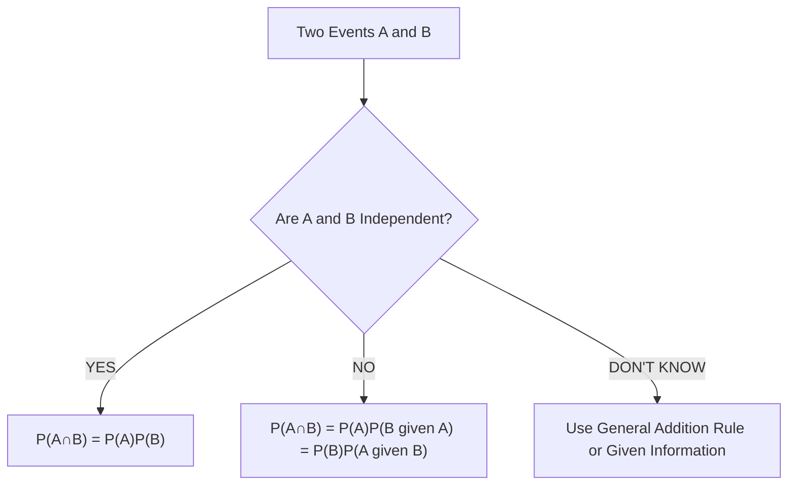
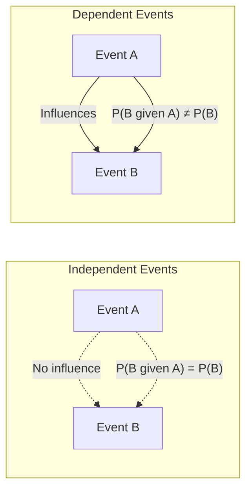
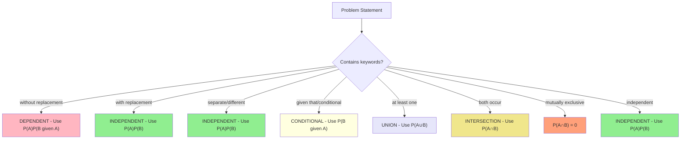

# ST2334 Week 1 Mermaid Syntax Test

## Testing Fixed Diagrams

### Basic Decision Tree

### Independence vs Dependence

### Problem Recognition

All diagrams should now render without syntax errors!
