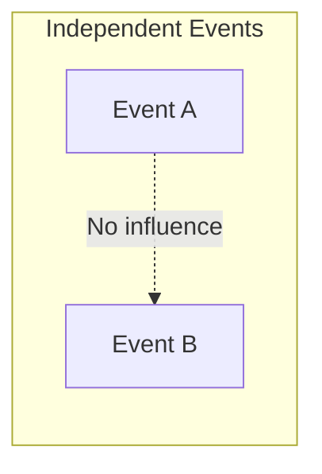
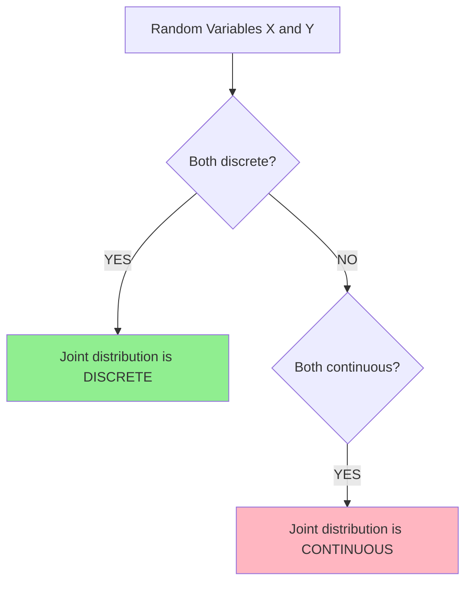

# Mermaid Test

## Test 1: Simple Decision Tree
```mermaid
graph TD
    Events[Two Events A and B] --> Decision{Are A and B Independent?}
    Decision -->|YES| IndepFormula[P(A∩B) = P(A)P(B)]
    Decision -->|NO| DepFormula[P(A∩B) = P(A)P(B|A)]
```

## Test 2: Subgraph Test


## Test 3: Flowchart Test

